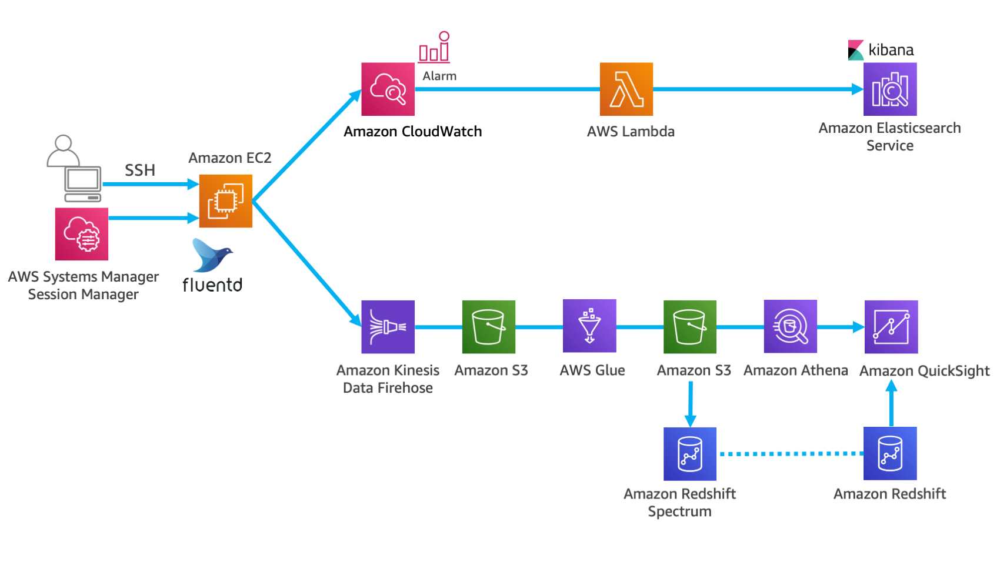
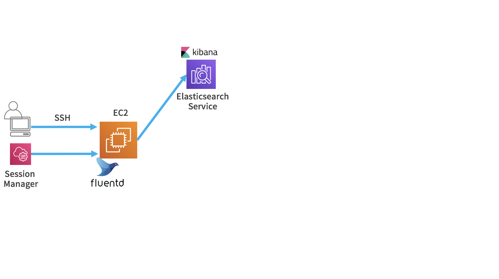
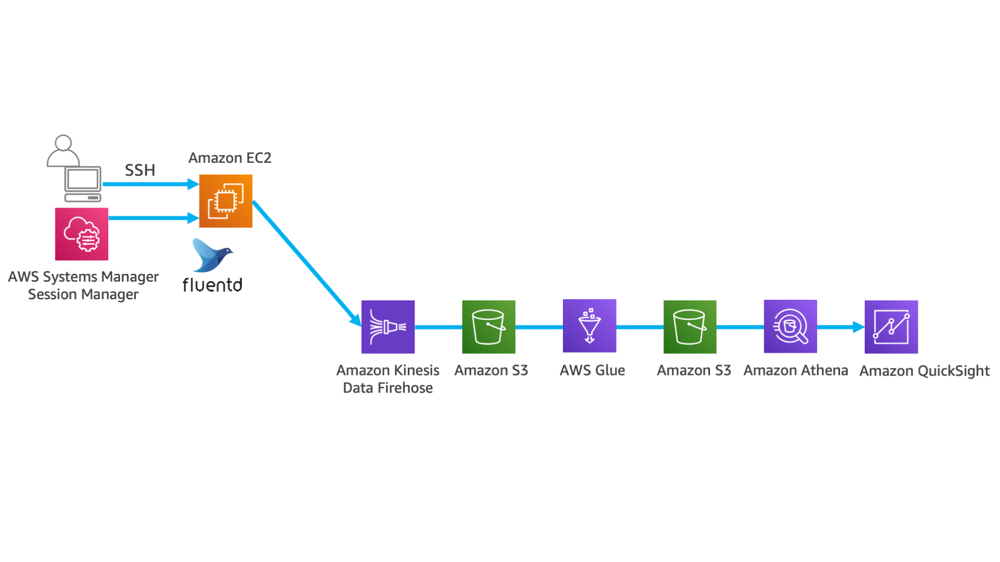

------------------------------------------------------------------------------------
Copyright <first-edit-year> Amazon.com, Inc. or its affiliates. All Rights Reserved.  
SPDX-License-Identifier: MIT-0

------------------------------------------------------------------------------------

# Introduction
## The goal of this hands-on workshop　
The goal of this hands-on workshop
Data Lake is used by many companies  to store and analyze data. Data Lake can be used as a central repository for the both structured and unstructured data taken from variety of data sources.

The goal of this hands-on is to gain knowledge of building an infrastructure to analyze big data with Data Lake by building a pipeline of analysis between AWS Big Data services and other related services.

## Prerequisites
- PC (Windows, Mac OS, Linux and so on) which can be connected to AWS infrastructure
- AWS account prepared in advance
- SSH client (Tera Term is recommended for Windows especially in Japanese.)
- Web browser (Forefox or Chrome is recommended.)

# Overview of this hands-on workshop

## Six labs in this hands-on workshop 
This hands-on workshop consists of six labs.
 
Lab1：Getting started (Required)  
AWS services in the topic：Amazon VPC, Amazon EC2, AWS CloudFormation, AWS IAM 
      
Lab2：Visualization of application logs in real time  
AWS services in the topic：Amazon Elasticsearch Service
  
Lab3：Visualization of application logs in real time and alarm settings  
AWS services in the topic：Amazon CloudWatch, AWS Lambda, Amazon Elasticsearch Service

Lab4：Application log persistence and long-term data analysis and visualization   
AWS services in the topic：Amazon Kinesis Data Firehose, Amazon S3, Amazon Athena, Amazon QuickSight
 
Lab5：Data analysis using DWH on AWS   
AWS services in the topic： Amazon Kinesis Data Firehose, Amazon S3, Amazon Redshift, Amazon Redshift Spectrum, Amazon QuickSight

Lab6：ETL processing of data using serverless  
AWS services in the topic：AWS Glue, Amazon Athena

## Three options of this hands-on workshop

This hands-on can be completed walking through the following path. You have three options.  
（1） Implementation of near real-time data analysis environment (speed layer)：[Lab1](lab1/README.md) → [Lab2](lab2/README.md) → [Lab3](lab3/README.md)  
（2） Implementation of an environment for batch analysis of long-term data (batch layer) and optimization of performance and cost：[Lab1](lab1/README.md) → [Lab4](lab4/README.md) or [Lab5](lab5/README.md) → [Lab6](lab6/README.md)  
（3） All labs：[Lab1](lab1/README.md) → [Lab2](lab2/README.md) → [Lab3](lab3/README.md) → [Lab4](lab4/README.md) → [Lab5](lab5/README.md) → [Lab6](lab6/README.md) 

Once you complete all labs, you can build the following architecture.

With this architecture, you can create a hair close to the complete serverless mechanism that enables you to perform near real-time analysis in the speed layer.
For logging, this architecture can skip alarms at specific conditions, as well as save all log data at low cost for a long time. Regarding data processing, it performs ETL processing as needed, directly executes query log data in ad hoc. It can identify and pick the data to be analyzed, and visualize the evaluated data in DWH using BI tools.

## Outline of each lab
The outline of each lab is as follows.

### Lab1：Getting started (Required)
Build a common environment required to set up in the following five labs. 
Using AWS CloudFormation (CloudFormation), Amazon VPC (VPC) and Amazon EC2 (EC2) are built and the permission for the execution is configured AWS IAM (IAM). Then manually install the log collection software Fluentd.

 - The steps of Lab1 are [here](lab1/README.md)

AWS services in this Lab：VPC, EC2, CloudFormation, IAM

### Lab2：Visualization of application logs in real time
In this Lab, we visualize the log data recorded in EC2 instance which was configured in “Lab1: Getting Started” in real time.
The log output from EC2 is sent to Amazon Elasticsearch Service (Elasticsearch Service) in a stream using Fluentd  (OSS). 
This functionality to visualize using Kibana that comes with Elasticsearch Service.

 - The steps of Lab2 are [here](lab2/README.md)

AWS services in this Lab：Elasticsearch Service

### Lab3：Visualization of application logs in real time and alarm settings

In addition to the visualization performed in "Lab2: Visualization of application logs in real time", in this section, we set an alarm to detect an error.
We add alarm notification before sending from Fluentd to Elasticsearch Service. Amazon CloudWatch (CloudWatch) and AWS Lambda (Lambda) are used for the alarm.

 - The steps of Lab3 are [here](lab3/README.md)

AWS services in this Lab：CloudWatch, Lambda, Elasticsearch Service

### Lab4：Application log persistence and long-term data analysis and visualization

After sending the stream data to Amazon Kinesis Data Firehose (Kinesis Data Firehose), you can save the data to Amazon S3 (S3) for long-term storage. After that, ad hoc analysis is performed using Amazon Athena (Athena). Also you can visualize using Amazon QuickSight (QuickSight).

 - The steps of Lab4 are [here](lab4/README.md)

AWS services in this Lab：Kinesis Data Firehose, S3, Athena, QuickSight

### Lab5：Data analysis using DWH on AWS

After sending the stream data to Kinesis Data Firehose, you can save the data to S3 for long-term storage. After that, use Amazon Redshift Spectrum (Redshift Spectrum) to execute queries and visualize the data with QuickSight

 - The steps of Lab5 are [here](lab5/README.md)

AWS services in this Lab：Kinesis Data Firehose, S3, Athena, Redshift, Redshift Spectrum, QuickSight

### Lab6：ETL processing of data using serverless

After sending the stream data to Kinesis Data Firehose, you can save the data to S3 for long-term storage. After that, use AWS Glue (Glue) and (1) You can convert the file format to Apache Parquet format. (2)You can place the file in a partitioned storage, and save the result in S3.  Then, use Athena or Redshift Spectrum to execute queries and visualize with QuickSight.

 - The steps of Lab6 are [here](lab6/README.md)

AWS services in this Lab：Glue, Athena

## Precautions throughout this hands-on workshop
1. This hands-on workshop is based on the assumption of using resources in the “Tokyo Region”. If you hit the limit of the number of resources in this region, you can create an environment in the Northern Virginia Region instead. In that case, it is necessary to replace all descriptions of “Tokyo Region (ap-northeast-1)” with “Northern Virginia Region(us-east-1)” in each hands-on documentation. In addition, we prepared asset materials for both regions. , so please use the materials for your region of choice.

2. The “supplemental explanation” arranged in each lab is not a mandatory procedure to proceed this hands-on workshop. Please use as reference material.

3. If several people run this hands-on workshop using the same AWS account, please be careful not to overlap names of the resource each other.

4. In each procedure, you can freely change the names of items that are marked as “optional”. With an exception of S3 resources, It is recommended that you name them as it appear in the materials,  so that you will not lose the track.

5. In each procedure, a link to the related Asset material is provided. you reach them via  a browser, it is provided in HTML format. For readability, if  necessary, please download the file and proceed the lab with the material. 

