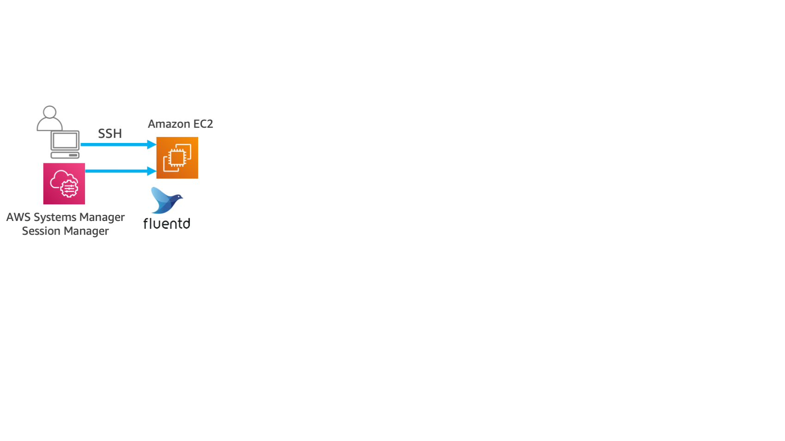

------------------------------------------------------------------------------------
Copyright <first-edit-year> Amazon.com, Inc. or its affiliates. All Rights Reserved.  
SPDX-License-Identifier: MIT-0

------------------------------------------------------------------------------------


# Lab1：Getting started
Build a common environment prerequisite  to the following five labs.
Amazon VPC (VPC) and Amazon EC2 (EC2) are built and the permission is configured appropriately in AWS IAM (IAM), using AWS CloudFormation (CloudFormation). Then we will manually install the Fluentd; the log collection software.

## Section1：Before you start
### Step1：Log in to the AWS Management Console

 1. Log in to the AWS Management Console. After logging in, confirm that **[Tokyo]** is set in the region selection in the header section at the top right of the screen.

    **Note：** If it is not **[Tokyo]**, please change to **[Tokyo]**.

 2. Select **EC2** from the list of services in the AWS Management Console. From the left pane of **[EC2 Dashboard]**, click **[Key Pairs]**, click the **[Create Key Pair]** button, enter any value for **[Key pair name]** (Example: handson) and click **[Create]**. The private key (Example: handson.pem) is downloaded to your PC.  
   **Note：** If you are using an existing key pair, skip this step.

## Section2：EC2 environment
### Step1：Launch an EC2 instance with CloudFormation

Use CloudFormation to create a VPC and launch an EC2 instance which continuously outputs logs to the VPC. About 10 logs appear every 2 minutes, and 300 error logs appear every 10 minutes.

 1. Select **CloudFormation** from the list of services in the AWS Management Console.  

    **Note：** If you cannot find CloudFormation, enter a part of the word, such as “cloudform” in the search window and select it.
  
 2. On the **[CloudFormation]** dashboard, click **[Create stack]** at the top right of the dashboard. 
 
 3. On the **[Create stack]** screen, select **[Template is ready]** in **[Prerequisite - Prepare template]**. 

    **Note：** If it is selected by default, proceed to the next, leaving the default as it is.
 
 4. Then, in **[Specify template]** of **[Create stack]** screen, select **[Upload a template file]**, click **[Choose file]**, specify the downloaded template "**1-minilake_ec2.yaml**" and click **[Next]**. 

    **Asset** resource：[1-minilake_ec2.yaml](asset/ap-northeast-1/1-minilake_ec2.yaml)
  
 5. Specify "**handson-minilake** (optional)" as **[Stack name]**, and "**handson.pem** (optional)" which was created in **Section1** as **[KeyPair]** or the existing keypair name if you already have it, and enter **handson-minilake-role** (optional) for RoleName. Then, click **[Next]**.  
 
 6. In the optional **tag**, enter "**Name**" for **Key** and "**handson-minilake** (optional)" for **Value**, then click **[Next]**.
 
 7. Review the contents of the final confirmation page, check the "**I acknowledge that AWS CloudFormation might create IAM resources with custom names.**", then click **[Create stack]**.After a few minutes, EC2 launches and log starts to output in **/root/es-demo/testapp.log**.  

      **Note：** If you are logged in with SSM, we recommend that you take a break of 10 minutes or so, because there may be a time lag between when the instance starts and when SSM connectivity is available.
 
 8. Log in to EC2 **with SSH and switch to root**. Then, you can check the logs appearing every 2 minutes.
 
    **Note：** See [here](additional_info_lab1.md#EC2へのログイン方法) for EC2 login instructions. For the IP address information of the EC2 connection destination, select the appropriate CloudFormation stack from the **[CloudFormation]** dashboard and click the **[Outputs]** tab. **[AllowIPAddress]** section have IP address information.

 ```
 $ sudo su -
 # tail -f /root/es-demo/testapp.log
 ```
 
 **[Log output example]**

 ``` 
[2019-09-16 15:14:01+0900] WARNING prd-db02 uehara 1001 [This is Warning.]
[2019-09-16 15:14:01+0900] INFO prd-db02 uehara 1001 [This is Information.]
[2019-09-16 15:14:01+0900] INFO prd-web002 uchida 1001 [This is Information.]
[2019-09-16 15:18:01+0900] INFO prd-ap001 uehara 1001 [This is Information.]
[2019-09-16 15:18:01+0900] ERROR prd-db02 uchida 1001 [This is ERROR.]
 ```
 
 ## Section3：Conclusion

Using CloudFormation, we configured the following

   1. You created a VPC and an EC2 that logs about 10 every 2 minutes and continues to log 300 errors every 10 minutes.
   2. You have granted permissions to the EC2 you built in your VPC to access AWS resources. Please see [here](./additional_info_lab1_IAM.md) for details.
   3. I installed the log collection software Fluentd on the EC2 that I built. Please see [here](./additional_info_lab1_Fluentd.md) for details.



That's it for Lab1. Try the following procedure according with the path you have selected.

（1） Implementation of near real-time data analysis environment (speed layer)：[Lab1](../lab1/README.md) → [Lab2](../lab2/README.md) → [Lab3](../lab3/README.md)  
（2） Implementation of an environment for batch analysis of long-term data (batch layer) and optimization of performance and cost：[Lab1](../lab1/README.md) → [Lab4](../lab4/README.md) or [Lab5](../lab5/README.md) → [Lab6](../lab6/README.md)  
（3） All labs：[Lab1](../lab1/README.md) → [Lab2](../lab2/README.md) → [Lab3](../lab3/README.md) → [Lab4](../lab4/README.md) → [Lab5](../lab5/README.md) → [Lab6](../lab6/README.md) 

Please follow [these instructions](../clean-up/README.md) when deleting an environment.