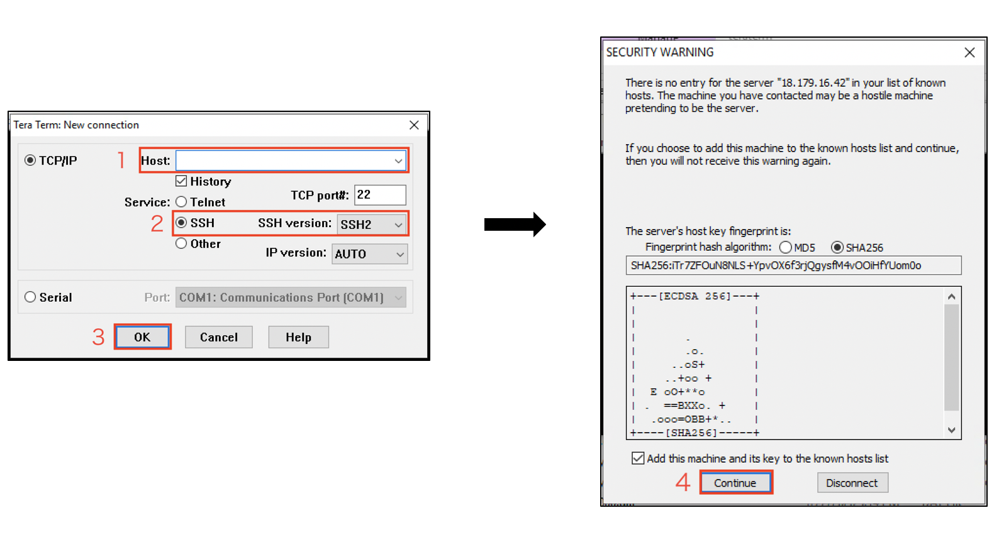

------------------------------------------------------------------------------------
Copyright <first-edit-year> Amazon.com, Inc. or its affiliates. All Rights Reserved.  
SPDX-License-Identifier: MIT-0

------------------------------------------------------------------------------------


# Addendum: How to log in to EC2 
Here are 3 ways to log in to EC2.  

 1. **Windows**: Log in using **Tera Term**

 2. **Mac / Linux**: Log in using **Terminal** 

 3. **Windows / Mac / Linux**: Log in using **AWS Systems Manager Session Manager** (**Session Manager**) 

To log in to EC2 using Windows or Mac, the following information is required.

 - Private key file of the key pair specified when creating the instance (eg: **handson.pem** )  
 
  **Note：** For the creation procedure, see the Lab1 procedure.
  
 - Public IP address assigned to the instance

 ### Addendum: EC2 public IP address confirmation procedure
  1. Log in to the AWS Management Console and select **EC2** from the list of services in the AWS Management Console.

  2. From the left pane of the **[EC2 Dashboard]** screen, select **[Instances]**.

  3. Select the corresponding instance from the instance list, copy the contents described in **[Public DNS (IPv4)]** from the contents of the **[Description]** tab at the bottom of the screen, and put it in a notepad on your computer to use it later.


## 1. For Windows

Log in to EC2 from Windows using the following procedure.

 1. Launch Tera Term（ttssh.exe）   

 **Note：** The module can be downloaded from “https://osdn.net/projects/ttssh2/”.

 2. Type **[Public DNS]** of the instance into **[host]**   

 3. Select **[SSH2]** in the **[SSH version]**, then Click OK 

 4. Upon displaying the view as below, click **[Continue]**
   

 5. Type 「 **ec2-user** 」 for user name  

 6. Select **[Use RSA/DSA/ECDSA/ED255519]** 。 

 7. Click **[Secret file]**, and select the name of the key pair file in your computer, **[key pair name].pem** （Ex：handson.pem), then connect.

 **Note：** Select "All files (\*.\*)" to view all files including the secret key pair file.

## 2.For Mac / Linux 

 Use the following procedure to log in to EC2 from Windows. 

 1. Log in at the command line from the terminal. 

 **Note：** Connection is not possible unless the permission of the private key file (pem file) is set to **600** in advance.
 
 ```
 $ chmod 600 ~/Downloads/handson.pem
 $ ssh -i ~/Downloads/handson.pem ec2-user@[assigned public ip address]
 ```
 
 2. You will be asked "Are you sure you want to continue connecting (yes/no)?". Enter "yes" and log in.

 
## 3. For Session Manager

Log in to EC2 from the Session Manager as follows. 

  **Note：** The required IAM roles between EC2 and Session Manager are already in place when you run AWS CloudFormation.Please see [here](./additional_info_lab1_IAM.md) for details.

 1. Select **Systems Manager** from the list of services in the AWS Management Console, select **[Session Manager]**, and click **[Start session]**.  

 2. Specify the EC2 instance ID to be logged in and click **[Start session]** to log in to EC2.  

  **Note：** It is expected that it takes about 5 minutes until the corresponding instance is displayed.

 3. A command line appears on the web. Execute the following command and switch to **ec2-user** user.    
  **Note：** By default, you are logged in as the user **ssm-user**. 
  
 ```
 $ whoami
 $ sudo su - ec2-user
 ```
 
 
### Supplement: What to do if the target instance is not displayed in the target instance

Select **EC2** from the list of services in the AWS Management Console, and confirm that the **[Status Checks]** of the instance "**handson-minilake** (optional)" created this time is **[2/2 checks passed]**. If it is still initializing, wait for it to complete and check the Systems Manager target instance again.
 
If the corresponding instance is not displayed even though initialization is completed, select **EC2** from the list of services in the AWS Management Console, select **[Instances]** from the left pane of the **[EC2 Dashboard]** screen, check the instance "**handson-minilake** (optional)" created this time, and click **[Actions] → [Instance State] → [Reboot]**.
Then check the target instance of Systems Manager again.


## Check points when SSH login does not work
 - Is the instance fully launched?
 - Are you operating as specified at startup?
 - Is the destination IP address or host name correct?
 - Is the specified Security Group enabled 22 (SSH) or 3389 (RDP)?
 - Is the key file corresponding to the specified Key Pair specified?
 - Is the permission of the private key file 600? (When connecting from Mac / Linux)
 - Is communication established between EC2 and SSM? (When using Session Manager)


