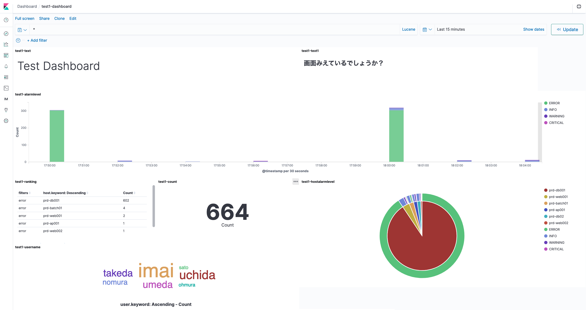

------------------------------------------------------------------------------------
Copyright <first-edit-year> Amazon.com, Inc. or its affiliates. All Rights Reserved.  
SPDX-License-Identifier: MIT-0

------------------------------------------------------------------------------------


# Lab2：Visualization of application logs in real time

In this Lab, we visualize the log data recorded in EC2 instance in real time. We use the EC2 instance we launched in “Lab1: Getting Started”. 
The log output from EC2 is sent to Amazon Elasticsearch Service (Elasticsearch Service) in a stream using Fluentd of OSS.
This functionality to visualize using Kibana that comes with Elasticsearch Service. 
These logs continuously output approximately 10 every 2 minutes, and 300 log entries every 10 minutes are sent to Elasticsearch Service using Fluentd. These logs are visualized with Kibana.

## Section1：Elasticsearch Service settings
### Step1：Launch Elasticsearch Service

 1. Select **Elasticsearch Service** from the list of services in the AWS Management Console and then click **[Create a new domain]**. 
 
 2. Select **[Development and testing]** in **[Choose deployment type]**, select **[6.8]** in **[Version]** and then click **[Next]**.
 
    **Note：** If you select a version other than 6.8, the preconfigured dashboards in Kibana may not work properly. Select 6.8 and perform this Hands-on.
 
 3. Input "**handson-minilake** (optional)" as **[Elasticsearch domain name]** in **[Configure domain]**, select **[t2.small.elasticsearch]** which is for free tier as **[Dedicated master instance type]**, leave the other settings unchanged, and click **[Next]** at the bottom right of the screen.
 
 4. Select **[Public Access]** in **[Network configuration]**. In **[Access policy]**, click **[Select a template]** in **[Set the domain access policy to]** and select **[Allow open access to the domain]**.
 
 5. A **[Confirm]** pop-up will appear. Check **[I accept the risk]** and click **[OK]**.
 
    **Note：** This configuration is not recommended for any production environment. For this hands-on, we do not set security measure strictly, due to the nature of hands-on dealing with no confidential data.
 
 6. Return to the **[Set up access]** screen. Click **[Next]**, confirm the contents on the **[Confirm]** screen, and click **[Confirm]** at the bottom right of the screen. 

    **Note：** At this point, the launch process of Elasticsearch Service has started. It takes about 10 minutes to complete launching. Please proceed to the next step without waiting for completion.
 

## Section2：EC2, Fluentd, Elasticsearch Service settings
### Step1：IAM role settings

Add a policy to the created "**handson-minilake** (optional)" IAM role as follows.

 1. Select **IAM** from the list of services in the AWS Management Console, select **[Roles]** in the left pane of **[Identity and Access Management (IAM)]** dashboard, click the role name "**handson-minilake** (optional)".

 2. Select the tab **[Permissions]** and click **[Attach policies]**.

 3. Search with "**amazones**" in the search window, check **[AmazonESFullAccess]**, and click **[Attach policy]**.

 4. Click the name of the changed role again, select the **[Permissions]** tab, and confirm that **[AmazonESFullAccess]** is attached.


### Step2：Fluentd settings

Configure settings for sending log data from Fluentd to Elasticsearch Service.

 1. Select **Elasticsearch Service** from the list of services in the AWS Management Console, click the domain name "**handson-minilake** (optional)" in **[Amazon Elasticsearch Service dashboard]**, copy and paste the **URL string** in **[Endpoint]** without "**https://**" in a notepad on your computer.

 2. Log in to EC2 and install the Elasticsearch plugin.

    **Asset** resource：[2-cmd.txt](asset/ap-northeast-1/2-cmd.txt)

 ```
 $ sudo su -
 # td-agent-gem install -v 2.6.0 fluent-plugin-elasticsearch
 ```
 
 3. Confirm plugin installation.

    **Asset** resource：[2-cmd.txt](asset/ap-northeast-1/2-cmd.txt)
 
 ```
 # td-agent-gem list | grep plugin-elasticsearch
 ```
 
  **[Execution result example]**
  
 ```
 fluent-plugin-elasticsearch (2.6.0, 2.4.0)
 ```
 
 4. To change the setting of "**/etc/td-agent/td-agent.conf**", delete the contents of "**/etc/td-agent/td-agent.conf**" once. Open it with an editor such as vi and delete it with ":%d".
 
 ```
 # vi /etc/td-agent/td-agent.conf
 ```

 5. Copy the contents of "**2-td-agent.conf**" in **Asset** resource and paste them.

    **Asset** resource：[2-td-agent.conf](asset/ap-northeast-1/2-td-agent.conf)

 6. After pasting, modify some of the contents. Replace the value of **eshost** with the value of the endpoint copied in step 1 and save.  

    **Note：** Do not include "**https://**" as the value of **eshost**.
 
 **[Before change]**
  
 ```
 host eshost
 ``` 
 
 **[Example after change]**
  
 ```
 host search-handson-minilake-ikop2vbusshbf3pgnuqzlxxxxx.ap-northeast-1.es.amazonaws.com
 ``` 

 7. Start the td-agent process.
 
     **Asset** resource：[2-cmd.txt](asset/ap-northeast-1/2-cmd.txt)
 
 ```
 # /etc/init.d/td-agent start
 ```
 
 8. Check the Fluentd log.
 
     **Asset** resource：[2-cmd.txt](asset/ap-northeast-1/2-cmd.txt)
 
 ```
 # tail -f /var/log/td-agent/td-agent.log
 ```
 
   **Note：** Check if there are any errors in the log. If startup is successful, the following text will be in the output.
 
 ```
 [info]: #0 Connection opened to Elasticsearch cluster => {.....
 ```
It may take some time for you to be able to see the output.

### Step3：Elasticsearch Service settings

 1. Select **Elasticsearch Service** from the list of services in the AWS Management Console.  

 2. In **[Amazon Elasticsearch Service dashboard]**, confirm that **[Domain status]** of the created domain "**handson-minilake** (optional)" is **[Active]** and the number of **[Searchable documents]** is more than one, and then click the domain "**handson-minilake** (optional)".

 3. Click the URL to the right of **[Kibana]**.
 
 4. **[Welcome to Kibana]** screen appears. Select **[Explore on my own]** to open **Kibana** screen.

 #### Kibana settings

 5. Click **[Management]** from the left pane of the **Kibana** screen, and then click **[Index Patterns]**.

 6. On the **[Create index pattern]** screen, enter "**testappec2log-***" in **[Index pattern]** and click **[Next step]** on the right.

 7. In **[Time Filter field name]**, select **[@timestamp]** and click **[Create index pattern]** at the bottom right of the screen.

 8. Click **[Management]** from the left pane of the **Kibana** screen, and then click **[Saved Objects]**. Click **[Import]** at the top right of the screen.

 9. On the **[Import saved objects]** screen, click the **[Import]** icon, select "**2-visualization.json**" in **Asset** resource and click the **[Import]** icon to import it. After importing without any errors, click **[Done]** to return to the original screen.

    **Asset** resource：[2-visualization.json](asset/ap-northeast-1/2-visualization.json)
  
    **Note：** In the **[Import saved objects]** screen of import, if **[New index patten]** has an initial value of " -- Skip Import -- ", then "**testappec2log-\***" must be selected.

 10. Next, on the **[Import saved objects]** screen, click the **[Import]** icon again, select "**2-dashboard.json**" in **Asset** resource, and click the **[Import]** icon to import. After importing without any errors, click **[Done]** to return to the original screen.

     **Asset** resource：[2-dashboard.json](asset/ap-northeast-1/2-dashboard.json)

 11. Click **[Dashboard]** from the left pane of the **Kibana** screen, click the imported "**test1-dashboard**", and if the values ​​are displayed as shown below, you have completed this section.  

   

 12. On the **Kibana** screen, you can select the time range in the upper right, so let's set the period to **[Last 1 hour]**. You can confirmthat the graph changes to show the acquired value for 1 hour.

 13. Click **[Discover]** from the left pane of the **Kibana** screen, and click **[alarmlevel]** in the menu on the right to see the percentage for each alarm level. 

 14. Click **[add]** to the right of **[alarmlevel]**. Similarly, if you click **[add]** to the right of **[user]**, you can limit the view to only the target columns (Time, alarmlevel, user).  

     **Note：** **[add]** is displayed only when the cursor is on it.

 15. Enter "**user:"imai"**" in the search window and press Enter to filter by the user "**imai**".


## Section3：Summary

Searching through logs is exhausting task, if you have a large amount of EC2 instances. However, if logs from EC2 instances are sent to Elasticsearch Service as a stream and visualized with Kibana, it is easier to find the error log entry that you are looking for. This architecture make the task efficient.


That's it for Lab2. Try the following procedure according with the path you have selected.

（1） Implementation of near real-time data analysis environment (speed layer)：[Lab1](../lab1/README.md) → [Lab2](../lab2/README.md) → [Lab3](../lab3/README.md)  
（2） Implementation of an environment for batch analysis of long-term data (batch layer) and optimization of performance and cost：[Lab1](../lab1/README.md) → [Lab4](../lab4/README.md) or [Lab5](../lab5/README.md) → [Lab6](../lab6/README.md)  
（3） All labs：[Lab1](../lab1/README.md) → [Lab2](../lab2/README.md) → [Lab3](../lab3/README.md) → [Lab4](../lab4/README.md) → [Lab5](../lab5/README.md) → [Lab6](../lab6/README.md) 

Please follow [these instructions](../clean-up/README.md) when deleting an environment.