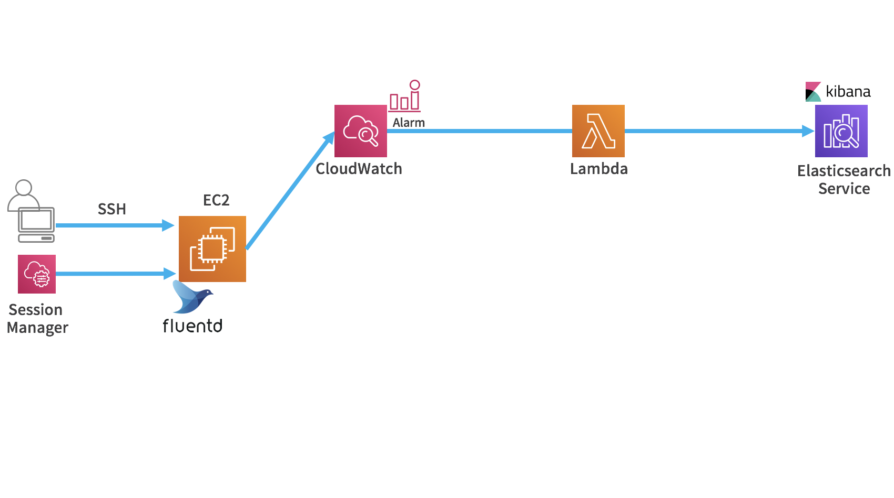

------------------------------------------------------------------------------------
Copyright <first-edit-year> Amazon.com, Inc. or its affiliates. All Rights Reserved.  
SPDX-License-Identifier: MIT-0

------------------------------------------------------------------------------------


# Lab3：Visualization of application logs in real time and alarm settings

In addition to the visualization performed in "Lab2: Visualization of application logs in real time", in this section, we set an alarm detection.
We add alarm notification before sending from Fluentd to Elasticsearch Service. Amazon CloudWatch (CloudWatch) and AWS Lambda (Lambda) are used for the alarm.


## Section1：EC2 settings
### Step1：IAM role settings

Add a policy to the created "**handson-minilake** (optional)" IAM role as follows.

 1. Select **IAM** from the list of services in the AWS Management Console, select **[Roles]** in the left pane of **[Identity and Access Management (IAM)]** dashboard, click the role name "**handson-minilake** (optional)".

 2. Select the tab **[Permissions]** and click **[Attach policies]**.

 3. Check **[CloudWatchLogsFullAccess]** using the search window, and click **[Attach policy]**.

 4. Click the name of the changed role again, select the **[Permissions]** tab, and confirm that **[CloudWatchLogsFullAccess]** is attached.

### Step2：Fluentd settings

Configure settings for sending log data from Fluentd to CloudWatch Logs.

 1. Log in to EC2 and install the CloudWatch Logs plugin.

    **Asset** resource：[3-cmd.txt](asset/ap-northeast-1/3-cmd.txt)

 ```
 $ sudo su -
 # td-agent-gem install fluent-plugin-cloudwatch-logs -v 0.4.4
 ```

 2. Confirm plugin installation.

    **Asset** resource：[3-cmd.txt](asset/ap-northeast-1/3-cmd.txt)

 ```
 # td-agent-gem list | grep cloudwatch-logs
 ```

   **[Execution result example]**

 ```
 fluent-plugin-cloudwatch-logs (0.4.4)
 ```

 3. To change the setting of "**/etc/td-agent/td-agent.conf**", delete the contents of "**/etc/td-agent/td-agent.conf**" once. Open it with an editor such as vi and delete it with ":%d".

 ```
 # vi /etc/td-agent/td-agent.conf
 ```

 4. Copy the contents of "**3-td-agent.conf**" in **Asset** resource and paste them.

    **Asset** resource：[3-td-agent.conf](asset/ap-northeast-1/3-td-agent.conf)

 5. Open the file"**/etc/init.d/td-agent**" and then add the following line around the 13th line.

 ```
 # vi /etc/init.d/td-agent
 ```  

   **[Example of the line to add]**

 ```
 export AWS_REGION="ap-northeast-1"
 ```

　　**Note：** If you change the region, change it accordingly.  

 6. Restart Fluentd.

   **Asset** resource：[3-cmd.txt](asset/ap-northeast-1/3-cmd.txt)

 ```
 # /etc/init.d/td-agent restart
 ```

 7. Check if there are any errors continuously in the log of Fluentd. 

     **Asset** resource：[3-cmd.txt](asset/ap-northeast-1/3-cmd.txt)

 ```
 # tail -f /var/log/td-agent/td-agent.log
 ```

## Section2：CloudWatch, Elasticsearch Service settings
### Step1：CloudWatch Logs settings
 1. Select **CloudWatch** from the list of services in the AWS Management Console and then click **[Logs]** in the left pane of **[CloudWatch]** dashboard

 2. Confirm that the log group "**minilake_group** (optional)" is created and then click it. 

    **Note：** If there is no log after a few minutes, make sure that the IAM role is attached to EC2.

 3. Click the log stream "**testapplog_stream** (optional)" and confirm that the latest log in the output. Click the **[Log Groups]** starting at the top of the screen to return to the log group listing.

 4. Check the log group "**minilake_group** (optional)", click "**[Actions]**" and click **[Stream to Amazon Elasticsearch Service]**.

    **Note：** A Lambda Function is automatically created in the background.

 5. Select "**handson-minilake** (optional)" in **[Amazon ES cluster]**. Select **[Create new IAM role]** in **[Lambda IAM Execution Role]**.  

　　**Note：** If a pop-up block runs in your browser, set the permission to allow, and start over from the previous step.

 6. A role named "**lambda_elasticsearch_execution**" will be created. Click **[Allow]** at the bottom right.  

 7. On the **[Start Streaming minilake_group to Amazon Elasticsearch Service]** screen, simply click **[Next]**.

 8. In **[Log Format]**, select **[Other]**, click **[Next]**, and then click **[Next]**. Click **[Start Streaming]**.


### Step2：Elasticsearch Service settings

 1. Open **Kibana** screen, click **[Management]** from the left pane of the **Kibana** screen, and then click **[Index Patterns]**.  

 2. Click **[Create Index Pattern]**.

 3. Input "**cwl-***" in **[Index pattern]** and then click **[Next step]**.

    **Note：** Since indexing takes some time, it is expected that it takes some time before **[Next step]** can be clicked. 

 4. Select **[@timestamp]** in **[Time Filter field name]** and then click **[Create index pattern]**.

 5. Click **[Discover]** from the left pane of the **Kibana** screen and select "**cwl-***" for Index. 
If the value is collected and the graph is displayed according with the value, you can move forward.

 6. Click **[Management]** from the left pane of the **Kibana** screen, and then click **[Saved Objects]**. Click **[Import]** at the top right of the screen.

 7. On the **[Import saved objects]** screen, click the **[Import]** icon, select "**3-visualization.json**" in **Asset** resource, and click the **[Import]** icon to import the json file. After importing without any problems, click **[Done]** to return to the original screen.

    **Asset** resource：[3-visualization.json](asset/ap-northeast-1/3-visualization.json)

    **Note：** In the **[Import saved objects]** screen of import, if **[New index patten]** has an initial value of " -- Skip Import -- ", then "**cwl-\***" must be selected.

 8. Next, on the **[Import saved objects]** screen, click the **[Import]** icon again, select "**3-dashboard.json**" in **Asset** resource, and click the **[Import]** icon to import. After importing without any errors, click **[Done]** to return to the original screen.

    **Asset** resource：[3-dashboard.json](asset/ap-northeast-1/3-dashboard.json)

### Step3：CloudWatch Alarm settings

 1. Select **CloudWatch** from the list of services in the AWS Management Console, click **[Logs]**, check the log group "**minilake_group** (optional)" and click **[Create Metric Filter]**.

 2. Enter "**ERROR**" in the filter pattern, click **[Test Pattern]**, check the contents, and click **[Assign Metric]** at the bottom right of the screen.  

 3. Enter "**minilake_errlog** (optional)" in **[Metric Name]** and click **[Create Filter]**.

 4. Your filter is created. Click **[Create Alarm]** on the right side of the screen without closing the screen, and then set the alarm.

 5. To change the interval, click **[Edit]**, set **[Period]** to "**1 minute**", and click **[Select metric]**. 

 6. Set as follows and click **[Next]**.  
 
   - Threshold type：Static  
   - Define the alarm condition：Greater/Equal  
   - Define the threshold value：50  
   ▼Additional configuration
   - Datapoints to alarm：1/1

 7. Set as follows and click **[Create topic]** to create a topic.  
 
   - Select an SNS topic：Create new topic
   - Create a new topic…：Default\_CloudWatch\_Alarms\_Topic（Optional）
   - Email endpoints that will receive the notification…：Your email address that can receive email during this hands-on

    **Note：** After registration, a confirmation email will be sent to the email address registered in this procedure. Click **[Confirm subscription]** in the email body.

 8. Now that you have all the settings you need, click **[Next]**.

 9. Enter "**minilake-handson-alarm** (optional)" in **[Alarm name]**, click **[Next]**, and click **[Create alarm]** in the subsequent screen.

 10. Click **[Alarm]** of **[CloudWatch]** and check the graph screen. Initially, the status is displayed as **[Insufficient data]**, but after a while it becomes **[OK]**. If more than 50 **ERROR** occur in one minute, an alert will be raised. Since it is set to output 300 ERRORs every 10 minutes, an alert will be raised every 10 minutes.

### Note: Elasticsearch Service now supports event monitoring and alerts. Alerts are available for domains running Elasticsearch 6.2 or later. Click [here](additional_info_lab3.md) for detailed instructions that replace the applicable instructions in this hands-on.

## Section3：Summary

We were able to build a real-time log monitoring and monitoring environment.

 

That's it for Lab3. Try the following procedure according with the path you have selected.

（1） Implementation of near real-time data analysis environment (speed layer)：[Lab1](../lab1/README.md) → [Lab2](../lab2/README.md) → [Lab3](../lab3/README.md)  
（2） Implementation of an environment for batch analysis of long-term data (batch layer) and optimization of performance and cost：[Lab1](../lab1/README.md) → [Lab4](../lab4/README.md) or [Lab5](../lab5/README.md) → [Lab6](../lab6/README.md)  
（3） All labs：[Lab1](../lab1/README.md) → [Lab2](../lab2/README.md) → [Lab3](../lab3/README.md) → [Lab4](../lab4/README.md) → [Lab5](../lab5/README.md) → [Lab6](../lab6/README.md) 

Please follow [these instructions](../clean-up/README.md) when deleting an environment.
