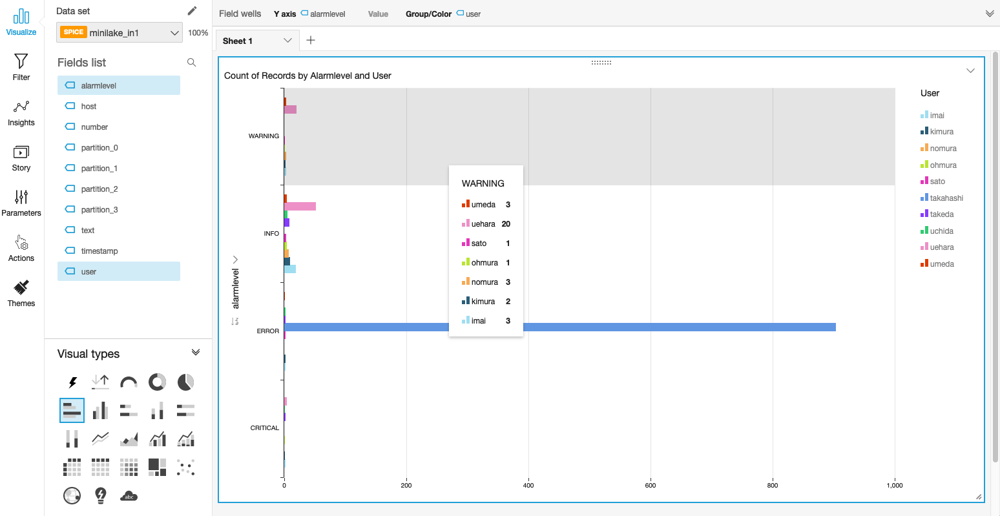
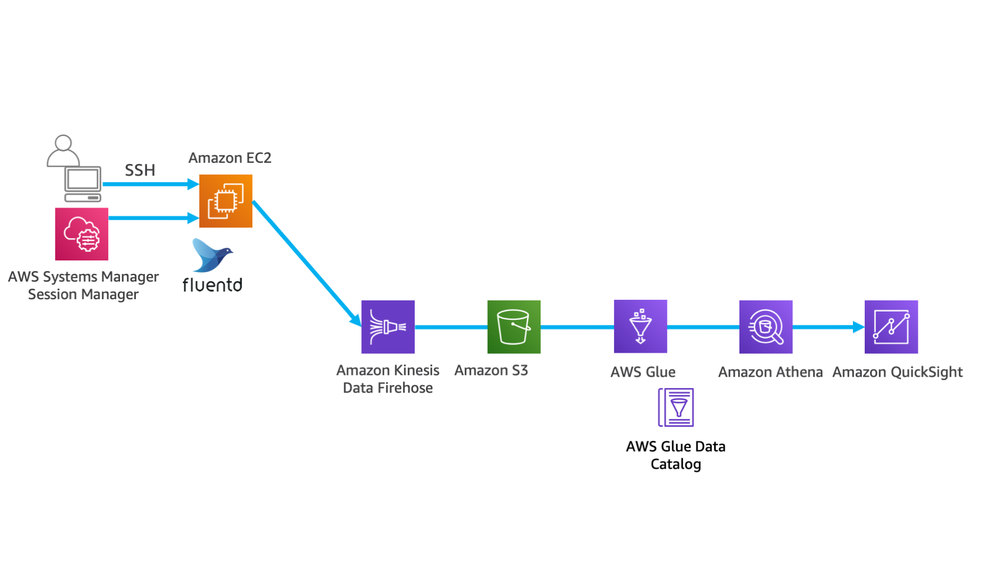

------------------------------------------------------------------------------------
Copyright <first-edit-year> Amazon.com, Inc. or its affiliates. All Rights Reserved.  
SPDX-License-Identifier: MIT-0

------------------------------------------------------------------------------------


# Lab4：Application log persistence and long-term data analysis and visualization
After sending the stream data to Amazon Kinesis Data Firehose (Kinesis Data Firehose), you can save the data to Amazon S3 (S3) for long-term storage. After that, Amazon Athena (Athena) can analyze the data in ad hoc. Also you can visualize it using Amazon QuickSight (QuickSight).

## Section1：S3, Kinesis Data Firehose settings
### Step1：Create S3 bucket

 1. Select **S3** from the list of services in the AWS Management Console and then click **[Create bucket]**. 
 
 2. Enter the bucket name according to the following rules, and click **[Create]** at the bottom left of the screen.  

    - Bucket Name：[YYYYMMDD]-handson-minilake-[Your Name][Your Birthday]
    - [YYYYMMDD]：The date when you go through this hands-on
    - [Your Name]：Your name
    - [Your Birthday]：The date of your birthday


    **Note：** The S3 bucket name must be globally unique, but any bucket name can be used as long as the bucket is created successfully.
  

### Step2：Create Kinesis Data Firehose

 1. Select **Kinesis** from the list of services in the AWS Management Console and then click **[Create delivery stream]** in the delivery stream of Kinesis Data Firehose.
 
 2. Enter "**minilake1** (optional)" in **[Delivery stream name]** and then click **[Next]**.
 
 3. Confirm that **[Data transformation]** is set **[Disabled]** and **[Record format conversion]** is **[Disabled]**, and then click **[Next]**.
 
 4. Select **Amazon S3** in **[Destination]**.
 
 5. Select the S3 bucket which has already been created at **Step1** for **[S3 bucket]**. Enter "**minilake-in1/**" in **[Prefix]**.
 
    **Note：** Be careful not to forget the "**/**" at the end of **[Prefix]**. Prefix acts as a directory when you output to S3. By default, "**YYYY/MM/DD/HH**" is created under the specified prefix.
 
 6. Click **[Next]** at the bottom right of the screen.
 
 7. Set **[Buffer interval]** to "**60** seconds". Buffered data is delivered to S3 when either Buffer size or Buffer interval is met. 

    **Note：** Although we are not going over at this time, data can be compressed and encrypted. Compression is useful for large data, and encryption should be applied for environment with a strict security requirements. 
 
 8. In **[Permissions]**, click **[Create or update IAM role (Automatically assigned IAM role name)]** to create an IAM role for Kinesis Data Firehose to access S3.

 9. Next, the Review screen will appear. If there are no problems with the settings, click **[Create delivery stream]**.
 
 10. **[Status]** will be "**Creating**". It will become "**Active**" in a few minutes, so please proceed to the next step.


## Section2：EC2 settings
### Step1：IAM role settings

Add a policy to the created "**handson-minilake** (optional)" IAM role as follows.

 1. Select **IAM** from the list of services in the AWS Management Console, select **[Roles]** in the left pane of **[Identity and Access Management (IAM)]** dashboard, click the role name "**handson-minilake** (optional)".
 
 2. Select the tab **[Permissions]** and click **[Attach policies]**.
 
 3. Search with "**amazonkinesis**" in the search window, check **[AmazonKinesisFirehoseFullAccess]**, and click **[Attach Policy]**.
 
 4. Click the name of the updated role again, select the **[Permissions]** tab, and confirm that **[AmazonKinesisFirehoseFullAccess]** is attached.

### Step2：Fluentd settings
Configure settings to send log data from Fluentd to Kinesis Data Firehose. 

   1. Install the Kinesis Data Firehose plug-in.
 
      **Asset** resource：[4-cmd.txt](asset/ap-northeast-1/4-cmd.txt)
 
 ```
 $ sudo su -
 # td-agent-gem install fluent-plugin-kinesis -v 2.1.0
 ```
 
   2. Confirm whether the plug-in is successfully installed.

      **Asset** resource：[4-cmd.txt](asset/ap-northeast-1/4-cmd.txt)

 ```
 # td-agent-gem list | grep plugin-kinesis
 ```
   **[Execution result example]**  
   
   ```
  fluent-plugin-kinesis (2.1.0)
   ```
 
   3. 	For this procedure, the configuration file you should apply differs depending on which lab you started, so change the Fluentd setting according to the procedure you have performed.
#### (a) In case of performing Lab4 after Lab1, 2 and 3
      **Asset** resource：[4-td-agent1.conf](asset/ap-northeast-1/4-td-agent1.conf) 

 3-1. To change the setting of "**/etc/td-agent/td-agent.conf**", delete the contents of "**/etc/td-agent/td-agent.conf**" once. Open it with an editor such as vi and delete it with ":%d". Copy the contents of "**4-td-agent.conf**" in **Asset** resource and paste them.
 
 ```
 # vi /etc/td-agent/td-agent.conf
 ```    

 #### (b) In case of performing Lab4 after Lab1
      **Asset** resource：[4-td-agent2.conf](asset/ap-northeast-1/4-td-agent2.conf) 

 3-1. Delete the contents of "**/etc/td-agent/td-agent.conf**" once. Open it with an editor such as vi and delete it with ":%d". Copy the contents of "**4-td-agent2.conf**" in **Asset** resource and paste them.  
 
 ```
 # vi /etc/td-agent/td-agent.conf
 ```    
 
 3-2. Open the file"**/etc/init.d/td-agent**" and then add the following line around the 14th line.
 
 ```
 # vi /etc/init.d/td-agent
 ```  
 
 **[Example of the line to add]**
 
 **Asset** resource：[4-cmd.txt](asset/ap-northeast-1/4-cmd.txt)
 
 ```
 export AWS_REGION="ap-northeast-1"
 ```
 
  **Note：** If you change the region, change it accordingly.
  

 #### From the following procedure, perform in both cases above.
 
   4. Restart Fluentd.
 
       **Asset** resource：[4-cmd.txt](asset/ap-northeast-1/4-cmd.txt)
 
 ```
 # /etc/init.d/td-agent restart
 ```
 
   5.	Check if the data output to the S3 as expected.

    **Note：** You might have to wait a few minutes before confirming the data.（Example of S3 path：20190927-handson-minilake-test01/minilake-in1/2019/09/27/13）

   6. On the Kinesis Data Firehose screen, select "**minilake1** (optional)" as the created **Delivery stream**, click the **[Monitoring]** tab. It will take some time to show the result, so proceed to the next step.


## Section3：Glue Crawler and Athena settings
### Step1：IAM role settings
Add a policy to the created "**handson-minilake** (optional)" IAM role as follows.  

 1. Select **IAM** from the list of services in the AWS Management Console, select **[Roles]** in the left pane of **[Identity and Access Management (IAM)]** dashboard, and click the role name "**handson-minilake** (optional)".
 
 2. Select the tab **[Permissions]** and click **[Attach policies]**.
 
 3. Search with "**awsglue**" in the search window, and check **[AWSGlueServiceRole]**. Search with "**amazons3**" in the search window, and check **[AmazonS3ReadOnlyAccess]**. Click **[Attach policy]**.
 
 4. Click the name of the changed role again, select the **[Access policies]** tab, and confirm that **[AWSGlueServiceRole]** and **[AmazonS3ReadOnlyAccess]** are attached.
 
 5. Click the **[Trust relationships]** tab and click the **[Edit trust relationship]** button.
 
 6. On the **[Edit Trust Relationship]** screen, add the setting of **glue** in addition to ”Service”: “ec2.amazonaws.com” as follows. Click **[Update Trust Policy]**.
  
    **Asset** resource：[4-policydocument.txt](asset/ap-northeast-1/4-policydocument.txt) 
 
 **[Example]**
 
 ```
 {
 		"Version": "2012-10-17",
 		"Statement": [
			{
      		"Effect": "Allow",
      		"Principal": {
        		"Service": [             
          		"glue.amazonaws.com",
          		"ec2.amazonaws.com"
        		]                        
      		},
      		"Action": "sts:AssumeRole"
    		}
  		]
}
 ```
 
 
### Step2：Automatic schema creation with Glue Crawler

 1. Select **AWS Glue** in the AWS Management Console service list, select **[Crawlers]** in the left pane of the **[AWS Glue]** screen, and click **[Add crawler]**.

 2. Enter "**minilake-in1** (optional)" in **[Crawler name]**, click **[Next]**, and click **[Next]** on the next screen.

 3. On the **[Add a data store]** screen, choose the "**s3://[S3 BUCKET NAME]/minilake-in1** (optional)" created in **[Include path]** and click **[Next]**.

	**Note：** In **[S3 BUCKET NAME]**, choose the name of the S3 bucket you created.
 
 4. On the **[Add another data store]** screen, click **[Next]**.
 
 5. On the **[Choose an IAM role]** screen, check **[Choose an existing IAM role]**, select the created role "**handson-minilake** (optional)", and click **[Next]**.
 
 6. On the next screen, keep **[Run on demand]** for **[Frequency]** and click **[Next]**.

 7. On the **[Configure the crawler's output]** screen, click **[Add database]**. In the pop-up screen, select "**minilake** (optional)" and click **[Create]**.

 8. Go back to the screen **[Configure the crawler's output]** and click **[Next]**.

 9. Check the contents of the next screen and click **[Finish]**.

 10. On the **[Crawlers]** screen, check “**minilake-in1** (optional)” for the crawler you created and click **[Run crawler]**. Wait a few minutes after the status is **[Starting]**. When the status returns to **[Ready]** again, click **[Tables]** in the left pane.

 11. Check that the "**minilake_in1** (optional)" table has been created, click the table name, and check the schema definition.
 

### Step3：Query execution with Athena

 1. Select **Athena** from the list of services in the AWS Management Console.
 
 2. If this is the first time to use Athena by your AWS account, click **[Settings]**, ipnut "**s3://[S3 BUCKET NAME]/result/** (optional)" for **[Query result location]** and click **[Save]**.

 3. Choose "**minilake** (optional)" for **[Database]**, select the created table "**minilake_in1** (optional)", click **[：]** at the right end of the table name and click **[Preview table]**.

 4. Confirm that the query results are displayed at the bottom of the screen.

 5. Execute the following SQL in the query editor.
 
    **Asset** resource：[4-cmd.txt](asset/ap-northeast-1/4-cmd.txt)
 
 ```
 SELECT * FROM "minilake"."minilake_in1";

 ```

 **[Execution result example]**
 
 ``` 
 (Run time: 4.84 seconds, Data scanned: 135.22 KB)

 ```

 6. Try running a query with a Where clause.

    **Asset** resource：[4-cmd.txt](asset/ap-northeast-1/4-cmd.txt)

 ```
 SELECT * FROM "minilake"."minilake_in1" where partition_0 = '2019' AND partition_1 = '09' AND partition_2 = '27' AND partition_3 = '14';
 ```

   **Note：** Enter the date of the Where clause that has data.

**Reference**：[Additional guidance of query execution in Athena](additional_info_lab4.md)


### Step4：QuickSight settings

 1. Select **QuickSight** from the list of services in the AWS Management Console. If you are using QuickSight for the first time, the sign-up screen will appear because you have not signed up yet. Click **[Sign up for QuickSight]**.  

    **Note：** If you are already registered outside of the Tokyo region, execute **[Unsubscribe]** by the step "**[Manage QuickSight]** → **[Account settings]**". After a few minutes, you will be able to sign up again.

 2. Confirm that the language setting icon in the upper right of the screen is **[English]**.

 3. In **[Create your QuickSight account]**, select **[Enterprise]** and click **[Continue]**.

    **Note：** Up to 1GB usage is included in a free tier, but if the free usage period is  expired,, it costs $24 per month, so if you are worried about the cost of usage of the QuickSight, you can skip the QuickSight procedure.
 
 4. In **[Select a region.]**, select **[Asia Pacific (Tokyo)]**. Input any name for **[QuickSight account name]**, enter your email address for **[Notification email address]** and click **[Finish]**.  

 5. Click **[Go to Amazon QuickSight]** and clear the dialog that appears only on the first login. After that, click the icon with the account name on the top right of the screen and click **[Manage QuickSight]**.  

 6. Click **[Security & permissions]**.  

 7. Click **[Add or remove]** in **[QuickSight access to AWS services]**.

 8. Check **[Amazon Athena]**. (If it is already checked, leave it as is.)

 9. Click **[Details]** for **[Amazon S3]** and click **[Select S3 buckets]**.
   
 10. Check the S3 bucket name created in **Step1** of **Section1** (If it is already checked, leave it as is.) and click **[Finish]**.  

 11. Click **[Update]**. 
  
 12. Click the **[QuickSight]** logo at the top left of the screen.  

 13. Click **[New analysis]**.  

 14. Click **[New data set]**.  

 15. Click **[Athena]**, enter "**minilake1** (optional)" in **[Data source name]** and click **[Validate connection]**. Click **[Create data source]** when validation is successful.

 16. Select "**minilake** (optional)" for **[Database]**, select "**minilake-in1** (optional)" for **[Tables]**, click **[Select]**, select **[Import to SPICE for quicker analytics]**, and click **[Visualize]**.  

 17. When **[Import complete]** pops up, you are ready to use QuickSight. Choose **[Fields list]** or **[Visual types]** and make sure that the data is visible.  

 **[Dashboard example]**
   
 

## Section4：Summary

We saved persisted streaming data directly in the data store for long-term purpose. At the same time we have created a foundation to analyze streaming data in ad hoc, and visualized it.



That's it for Lab4. Try the following procedure according with the path you have selected.

（1） Implementation of near real-time data analysis environment (speed layer)：[Lab1](../lab1/README.md) → [Lab2](../lab2/README.md) → [Lab3](../lab3/README.md)  
（2） Implementation of an environment for batch analysis of long-term data (batch layer) and optimization of performance and cost：[Lab1](../lab1/README.md) → [Lab4](../lab4/README.md) or [Lab5](../lab5/README.md) → [Lab6](../lab6/README.md)  
（3） All labs：[Lab1](../lab1/README.md) → [Lab2](../lab2/README.md) → [Lab3](../lab3/README.md) → [Lab4](../lab4/README.md) → [Lab5](../lab5/README.md) → [Lab6](../lab6/README.md) 

Please follow [these instructions](../clean-up/README.md) when deleting an environment.