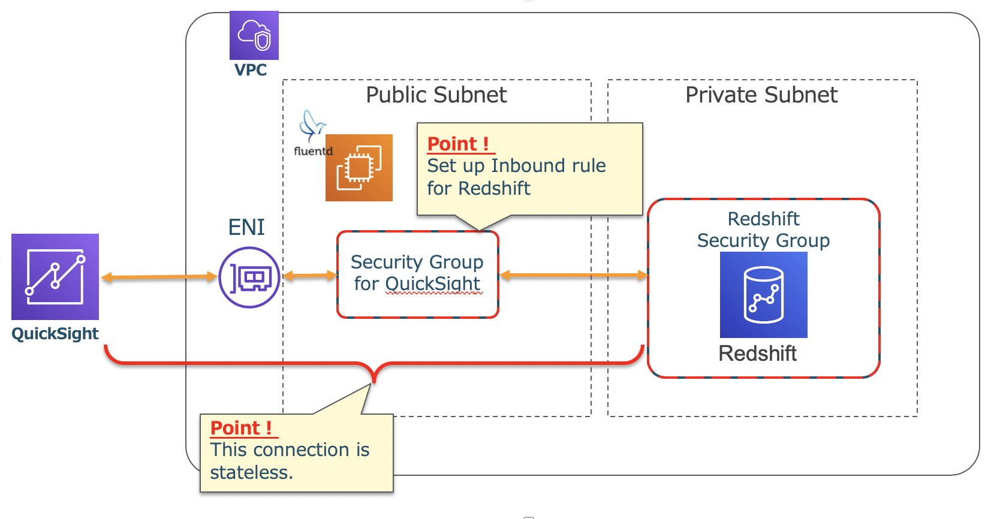

------------------------------------------------------------------------------------
Copyright <first-edit-year> Amazon.com, Inc. or its affiliates. All Rights Reserved.  
SPDX-License-Identifier: MIT-0

------------------------------------------------------------------------------------


# Lab5：Data analysis using DWH on AWS 

After sending the stream data to Kinesis Data Firehose, you can save the data to S3 for long-term storage. After saving the data, you can use Amazon Redshift Spectrum (Redshift Spectrum) to execute queries and visualize with QuickSight.


## Section1：Redshift cluster settings
### Step1：Network settings with CloudFormation

Build a network for Redshift using CloudFormation.
Create a private subnet in the VPC created so far, and create a security group for Redshift in it.

 1. Select **CloudFormation** from the list of services in the AWS Management Console and click **[Create stack]**. 

 2. On the **[Create stack]** screen, select **[Template is ready]** in **[Prerequisite - Prepare template]**. 
 
 3. In **[Specify template]** of **[Create stack]** screen, select **[Upload a template file]**, click **[Choose file]**, specify the downloaded template "**5-minilake_privatesubnet.yaml**" and click **[Next]**.  
 
     **Asset** resource：[5-minilake_privatesubnet.yaml](asset/ap-northeast-1/5-minilake_privatesubnet.yaml)

 4. Specify "**handson-minilake-private-subnet** (optional)" as **[Stack name]**, select the created security group for **[EC2SecurityGroupId]**, select the created VPC for **[VpcId]** and click **[Next]**.

 5. On the optional **[Tags]** screen, set **[Key]** to "**Name**" and **[Value]** to "**handson-minilake-private** (optional)" and click **[Next]**.
 
 6. Check the contents on the last confirmation page and click **[Create stack]**. Wait a few minutes and a private subnet will be created.


### Step2：Create a Redshift cluster

It takes time before a Redshift cluster becomes available, so you should work on this earlier in the process.

 1. Check the VPC to create Redshift and the destination subnet.  
Go to the **VPC** console and note the "**VPC ID**" that you created at the beginning of this hands-on and the "**Subnet ID**" that you created with CloudFormation at the beginning of this chapter.

 2. Select **Amazon Redshift** from the list of services in the AWS Management Console and select **[Security]** in the left pane of the **[Redshift dashboard]** screen.

 3. Click the **[Subnet Groups]** tab and click **[Create Cluster Subnet Group]**.

 4. Enter the following values and click **[Create]**.

    - Name：**handson-minilake-dwh** (optional)
    - handson-minilake-dwh：**dwh in my vpc** (optional)
    - VPC ID：Select "**VPC ID**" which you created
    - dwh in my vpc：**ap-northeast-1a**
    - dwh in my vpc：Select "**Subnet ID**" which you created and click **[Add]**
 
 5. Select **[Redshift dashboard]** and click **[Quick launch cluster]**.

 6. Click **[Switch to advanced settings]**.

 7. Enter the following values and click **[Continue]**.
 
    - Cluster identifier：**handson-minilake-dwh** (optional)
    - Database name：**db** (optional)
    - Database port：**5439** (default)
    - Master user name：**admin** (optional)
    - Master user password：**MyPassword1** (optional)
 
 8. Leave all contents by default and click **[Continue]**.

 9. Select "**VPC ID**" which you created for **[Choose a VPC]** and select **[No]** for **[Publicly accessible]**.
 
 10. Select "**handson-minilake-sg-private** (optional)" for **[VPC security groups]**.

 11. Leave all contents by default and click **[Continue]**.

 12. You will be charged for using Redshift. Read the note at the bottom of the page carefully and continue. Click **[Launch cluster]**. Since it takes time to complete the cluster startup, continue with the next task.  

     **Note：** Please be sure to read the content of the note regarding the billing to your account.


#### If you have already implemented "Lab4：Application log persistence and long-term data analysis and visualization", skip Section2 and Section3 since they have already been implemented.


## Section2：S3, Kinesis Data Firehose settings
### Step1：Create S3 bucket

 1. Select **S3** from the list of services in the AWS Management Console and then click **[Create bucket]**. 
 
 2. Enter the bucket name according to the following rules, and click **[Create]** at the bottom left of the screen.  

    - Bucket Name：[YYYYMMDD]-handson-minilake-[Your Name][Your Birthday]
    - [YYYYMMDD]：The date when you go through this hands-on
    - [Your Name]：Your name
    - [Your Birthday]：The date of your birthday


**Note：** The S3 bucket name must be globally unique, but any bucket name can be used as long as the bucket can be created.
  

### Step2：Create Kinesis Data Firehose

 1. Select **Kinesis** from the list of services in the AWS Management Console and then click **[Create delivery stream]** in the delivery stream of Kinesis Data Firehose.
 
 2. Enter "**minilake1** (optional)" in **[Delivery stream name]** and then click **[Next]**.
 
 3. Confirm that **[Data transformation]** is set **[Disabled]** and **[Record format conversion]** is **[Disabled]**, and then click **[Next]**.
 
 4. Select **Amazon S3** in **[Destination]**.
 
 5. Select the S3 bucket which has already been created at **Step1** for **[S3 bucket]**. Enter "**minilake-in1/**" in **[Prefix]**.
 
    **Note：** Be careful not to forget the "**/**" at the end of **[Prefix]**. This is the directory in case of outputting to S3. By default, "**YYYY/MM/DD/HH**" is created under the specified prefix.
 
 6. Click **[Next]** at the bottom right of the screen.
 
 7. Set **[Buffer interval]** to "**60** seconds". Buffering is delivered to S3 when either Buffer size or Buffer interval is met. 

    **Note：** Although not set this time, data can be compressed and encrypted. Works well for large data and security requirements. 
 
 8. In **[IAM role]**, click **[Create new or choose]** to create an IAM role for Kinesis Data Firehose to access S3.
 
 9. The information of the IAM role to be created is displayed. Click **[View Policy Document]** to check the policy contents. After confirming, click **[Allow]**.
 
 10. Confirm that you have returned to the original screen and click **[Next]**.

 11. Next, the Review screen will appear. If there are no problems with the settings, click **[Create delivery stream]**.
 
 12. **[Status]** will be "**Creating**". It will become "**Active**" in a few minutes, so please proceed to the next step.
 

## Section3：EC2 settings
### Step1：IAM role settings

Add a policy to the created "**handson-minilake** (optional)" IAM role as follows.

 1. Select **IAM** from the list of services in the AWS Management Console, select **[Roles]** in the left pane of **[Identity and Access Management (IAM)]** dashboard, click the role name "**handson-minilake** (optional)".
 
 2. Select the tab **[Permissions]** and click **[Attach policies]**.
 
 3. Search with "**amazonkinesis**" in the search window, check **[AmazonKinesisFirehoseFullAccess]**, and click **[Attach Policy]**.
 
 4. Click the name of the updated role again, select the **[Permissions]** tab, and confirm that **[AmazonKinesisFirehoseFullAccess]** is attached.

### Step2：Fluentd settings
Configure settings to send log data from Fluentd to Kinesis Data Firehose. 

   1. Install the Kinesis Data Firehose plug-in.
 
      **Asset** resource：[5-cmd.txt](asset/ap-northeast-1/5-cmd.txt)
 
 ```
 $ sudo su -
 # td-agent-gem install fluent-plugin-kinesis -v 2.1.0
 ```
 
   2. Confirm whether the plug-in is successfully installed.

      **Asset** resource：[5-cmd.txt](asset/ap-northeast-1/5-cmd.txt)

 ```
 # td-agent-gem list | grep plugin-kinesis
 ```
   **[Execution result example]**  
   
   ```
  fluent-plugin-kinesis (2.1.0)
   ```
 
   3. For this procedure, the setting file you should apply differs depending on which lab you started, so change the Fluentd setting according to the procedure you have performed.
#### (a) In case of performing Lab4 after Lab1, 2 and 3
   **Asset** resource：[5-td-agent1.conf](asset/ap-northeast-1/5-td-agent1.conf) 

 3-1. To change the setting of "**/etc/td-agent/td-agent.conf**", delete the contents of "**/etc/td-agent/td-agent.conf**" once. Open it with an editor such as vi and delete it with ":%d". Copy the contents of "**4-td-agent.conf**" in **Asset** resource and paste them.

 #### (b) In case of performing Lab4 after Lab1
   **Asset** resource：[5-td-agent2.conf](asset/ap-northeast-1/5-td-agent2.conf) 

 3-1. Delete the contents of "**/etc/td-agent/td-agent.conf**" once. Open it with an editor such as vi and delete it with ":%d". Copy the contents of "**4-td-agent2.conf**" in **Asset** resource and paste them.  
 
 3-2. Open the file"**/etc/init.d/td-agent**" and then add the following line around the 13th line.
 
 ```
 # vi /etc/init.d/td-agent
 ```  
 
 **[Example of the line to add]**
 
 **Asset** resource：[5-cmd.txt](asset/ap-northeast-1/5-cmd.txt)
 
 ```
 export AWS_REGION="ap-northeast-1"
 ```
 
  **Note：** If you change the region, change it accordingly.
  

 #### From the following procedure, perform in both cases above.
 
   4. Restart Fluentd.
 
       **Asset** resource：[5-cmd.txt](asset/ap-northeast-1/5-cmd.txt)
 
 ```
 # /etc/init.d/td-agent restart
 ```
 
   5. Check if the  data  output to the S3 as expected. 
   
      **Note：** It will take a few minutes.（Example of S3 path：20190927-handson-minilake-test01/minilake-in1/2019/09/27/13）

   6. On the Kinesis Data Firehose screen, select "**minilake1** (optional)" as the created **Delivery stream**, click the **[Monitoring]** tab. It will take some time to show the result, so proceed to the next step.
   

## Section4：Connect to Redshift

Check if you can connect to Redshift.  

### Step1：Connect to Redshift

 1. Select **[Query editor]** from the left pane of **[Redshift dashboard]**.
 
 2. Enter the connection information of the created instance and click **[Connect]**.

    - Cluster：**handson-minilake-dwh** (optional)
    - Database：**db** (optional)
    - Database user：**admin** (optional)
    - Password：Your password
 
 3. If the table list is displayed in the left pane, login is successful.


### Step2：Load data into Redshift

Load data into Redshift.

 1. Create an IAM role to access S3 from Redshift and load the data. Select **IAM** from the list of services in the AWS Management Console, click **[Roles]** from the left pane of the **[Identity and Access Management (IAM)]** dashboard and click **[Create role]**.

 2. Click **[AWS services]**, click **[Redshift]**, and select **[Redshift-Customizable]** for **[Select your use case]**. Then click **[Next: Permissions]**.

 3. Select **[AmazonS3ReadOnlyAccess]** and click **[Next: Tags]**. On the next screen, click **[Next: Review]**.
 
 4. Enter "**handson-minilake-dwh-role** (optional)" for **[Role name]** and click **[Create role]**.

 5. Take a note of the ARN of the created role for later use.

 6. Return to **[Redshift dashboard]**, select **[Clusters]** in the left pane of the screen, and click the name of the Redshift cluster you created (eg: handson-minilake-dwh). Click **[See IAM roles]** in **[IAM Roles]**.

 7. Select the "**handson-minilake-dwh** (optional)" IAM role that you just created and click **[Apply changes]** to close the sub window. **[Cluster Status]** is now **[modifying]**, so wait until it becomes **[available]**.

 8. When the **[Cluster Status]** changed to **[available]**, select **[Query editor]** from the left pane, connect to Redshift, and create the table to be loaded first. Enter the following query and click **[Run query]** to run the query.

    **Asset** resource：[5-cmd.txt](asset/ap-northeast-1/5-cmd.txt) 
 
 ```
 create table ec2log ( timestamp varchar, alarmlevel varchar, host varchar, number int2, text varchar );
 ```
 
   **Note：** For hands-on convenience, this table definition is not based on the best practices. Refer to [here](https://docs.aws.amazon.com/redshift/latest/dg/c_designing-tables-best-practices.html) in order to define tables based on the best practice.  
   
 9. COPY data from S3. Enter the following query and click **[Run query]** to run the query.  

   **Asset** resource：[5-cmd.txt](asset/ap-northeast-1/5-cmd.txt) 
 
 ```
 copy ec2log from 's3://[S3 BUCKET NAME]/minilake-in1' format as json 'auto' iam_role '[IAM ROLE ARN]'
 ```
 
   **Note：** Enter names you used in this lab in **[S3 BUCKET NAME]** and **[IAM ROLE ARN]** and execute.
 
 10. Let's run various queries against the table **ec2log**.
 
  **（Example 1）** This query returns the total number of tables.
  
 ```
 select count(timestamp) from ec2log;
 ```
 
  **（Example 2）** This query returns the total value for each alarm level.

 ```
 select alarmlevel, count(alarmlevel) from ec2log group by alarmlevel;
 ```
 
  **[An example of executeion result]**
  
  ```
  alarm alarmlevel | count  
  -----------------+-------  
  INFO             |   560  
  ERROR            |  5511  
  CRITICAL         |    92  
  WARNING          |   175  
  (4 rows)  
 ```
 

### Step3：Use Redshift Spectrum

 1. Add a policy to the previously created IAM role so that you can create the Redshift Spectrum schema and database. Select **IAM** from the list of services in the AWS Management Console, select **[Roles]** in the left pane of **[Identity and Access Management (IAM)]** dashboard, click the role name "**handson-minilake** (optional)".

 2. Select the **[Permissions]** tab and click **[Attach policies]**.

 3. Check **[AWSGlueServiceRole]** and click **[Attach policy]**.  

    **Note：** When you are creating an external schema and database in Redshift Spectrum, AWS Glue is used for the data catalog. Therefore, AWS Glue operation authorization (strictly glue: CreateDatabase only for resource *) is required.

 4. Since external tables cannot be created inside of Redshift's schema and DB, create an external schema and DB for the external tables separately.  

    **Asset** resource：[5-cmd.txt](asset/ap-northeast-1/5-cmd.txt) 

 ```
 create external schema my_first_external_schema from data catalog database 'spectrumdb' iam_role '[IAM ROLE ARN]' create external database if not exists;
 ```
 **Note：** In **[IAM ROLE ARN]**, enter the value noted in Step 2 of Section 4.

 5. Create an external table.  

    **Asset** resource：[5-cmd.txt](asset/ap-northeast-1/5-cmd.txt) 

 ```
 create external table my_first_external_schema.ec2log_external ( timestamp varchar(max), alarmlevel varchar(max), host varchar(max), number int2, text varchar(max) ) partitioned by (year char(4), month char(2), day char(2), hour char(2)) ROW FORMAT SERDE 'org.openx.data.jsonserde.JsonSerDe' WITH SERDEPROPERTIES ( 'paths'='timestamp,alarmlevel,host,number,text') STORED AS INPUTFORMAT 'org.apache.hadoop.mapred.TextInputFormat' OUTPUTFORMAT 'org.apache.hadoop.hive.ql.io.HiveIgnoreKeyTextOutputFormat'  location 's3://[S3 BUCKET NAME]/minilake-in1/';
 ```

 **Note：** For **[S3 BUCKET NAME]**, enter the name of the S3 bucket you have created.

 6. Execute the following commands to check the schema, DB, and table.  

    **Asset** resource：[5-cmd.txt](asset/ap-northeast-1/5-cmd.txt) 

 **[Check schemas]**

 ```
 select * from svv_external_schemas;
 ```
 
 **[Check databases]** 
 
 ```
 select * from svv_external_databases;
 ```
 
 **[Check tables]** 
 
 ```
 select * from svv_external_tables;
 ```

 7. Execute the following SQL to add a partition to the external table.  

    **Asset** resource：[5-cmd.txt](asset/ap-northeast-1/5-cmd.txt) 

 ```
 ALTER TABLE my_first_external_schema.ec2log_external ADD PARTITION (year='2019', month='09', day='27', hour='14') LOCATION 's3://[S3 BUCKET NAME]/minilake-in1/2019/09/27/14';

 ```
 
  **Note：** The value of each partition in the **ADD PARTITION** clause must match the value of the partition in the path of the S3 bucket in the **LOCATION** clause.  
For details on partition types and how to add partitions, see [here](https://image.slidesharecdn.com/aws-blackbeltathena20170301-170301101854/95/aws-black-belt-online-seminar-2017-amazon-athena-29-638.jpg?cb=1498216689) in Japanese.     

 8. Select **Athena** from the list of services in the AWS Management Console and select “**spectrumdb** (optional)” created earlier as the database. You can confirm that the previously created table “**ec2log_external** (optional)” is there.   

    **Note：** You can also query from Athena here.

 9. Select **AWS Glue** from the list of services in the AWS Management Console and click **[Tables]** in the left pane of the screen. You can confirm that the previously created table "**ec2log_external** (optional)" is there.  

    **Note：** The information how to define a table using AWS Glue is described in "Lab4: Application log persistence and long-term data analysis and visualization".

 10. Use the Redshift query editor to query external tables (ec2log_external table) such as shown in examples below.  

 **[Example 1]** 
 
 ```
 select count(*) from my_first_external_schema.ec2log_external;
 ```
 
 **[Example 2]**  
 
 ```
 select count(*) from ec2log;
 ```


### Step4：QuickSight settings
Connect to the Redshift and Redshift Spectrum tables from QuickSight for visualization.

#### Skip the procedure from 1 to 11 if you have already done.

 1. Select **QuickSight** from the list of services in the AWS Management Console. If you are using QuickSight for the first time, the sign-up screen will appear because you have not signed up yet. Click **[Sign up for QuickSight]**.  

    **Note：** If you are already registered outside of the Tokyo region, execute **[Unsubscribe]** by the step "**[Manage QuickSight]** → **[Account settings]**". After a few minutes, you will be able to sign up again.

 2. Confirm that the language setting icon in the upper right of the screen is **[English]**.

 3. In **[Create your QuickSight account]**, select **[Enterprise]** and click **[Continue]**.

    **Note：** Up to 1GB usage is included in a free tier, but if the free usage period is expired, it costs $24 per month, so if you are worried about the cost of usage of the QuickSight, you can skip the QuickSight procedure.
 
 4. In **[Select a region.]**, select **[Asia Pacific (Tokyo)]**. Input any name for **[QuickSight account name]**, enter your email address for **[Notification email address]** and click **[Finish]**.  

 5. Click **[Go to Amazon QuickSight]** and clear the dialog that appears only on the first login. After that, click the icon with the account name on the top right of the screen and click **[Manage QuickSight]**.  

 6. Click **[Security & permissions]**.  

 7. Click **[Add or remove]** in **[QuickSight access to AWS services]**.  

 8. Check **[Amazon Athena]**. (If already checked, leave it as is.)    

 9. Click **[Details]** for **[Amazon S3]** and click **[Select S3 buckets]**.
   
 10. Check the S3 bucket name created in **Step1** of **Section1** (If it is already checked, leave it as is.) and click **[Finish]**.  

 11. Click **[Update]**. 

#### If you have already set up QuickSight, start here.
	 - Set up Redshift on the private subnet so that QuickSight can connect to it.  
	 - Security groups are used to configure access to resources in QuickSight's private subnet, but the usability is different from security groups configured for EC2, etc. Inbound settings are used as access control settings for return communication from the destination Redshift. 
	 - An ENI that connects QuickSight and VPC is created, and the above security group is attached to the ENI. By allowing communication with the Redshift security group, a private connection starts to work. 

  
	 

 12. Create a security group for the ENI for QuickSight. Select **[Security Groups]** from the left pane of **[EC2 Dashboard]** and click **[Create Security Group]**.

 13. On the **[Create Security Group]** screen, enter the following values:
 
	 - Security group name：qs-rs-private-conn (optional)
	 - Description：optional
	 - VPC：VPC created with this hands-on

 14. Open the **[Inbound]** tab, click **[Add Rule]**, enter the following values, and click **[Create]**.

	 - Type：All TCP
	 - Protocol：TCP
	 - Port Range：0 - 65535
	 - Source：Custom | [Security group set in Redshift] (eg：handson-minilake-sg-private）

 15. Add the setting that allows inbound access from the security group that was created earlier to the ENI for QuickSight to the security group that is set to Redshift. From the left pane of the **[EC2 dashboard]** screen, click **[Security Groups]**, select the security group configured in Redshift (eg: handson-minilake-sg-private), click **[Edit]** on the **[Inbound]** tab, click **[Add Rule]**, enter the following values, and click **[Create]**.

	 - Type：Redshift
	 - Protocol：TCP
	 - Port Range：5439
	 - Source：Custom | Security group set in ENI for QuickSight created earlier (eg: qs-rs-private-conn)

 16. Set up a connection from the QuickSight console to Redshift in the private subnet. Click the icon with the account name in the upper right corner of the screen and click **[Manage QuickSight]**.  

  **Note：** If it is not the Tokyo region, select the Tokyo region.

 17. Click **[Manage VPC connections]** in the left pane of the screen.

 18. In **[Manage VPC connections]**, click **[Add VPC connections]**.

 19. Set the following on the **[Adding VPC connection]** screen and click **[Create]**.

	 - VPC connection name：private-vpc (optional)
	 - VPC ID：VPC ID of VPC created with this hands-on (eg: handson-minilake) 
	 - Subnet ID：Public subnet ID where EC2 exists
	 - Security group ID：Security group ID created earlier (eg: Security group ID of qs-rs-private-conn)

 20. Click the **[QuickSight]** logo at the top left of the screen, click **[New analysis]** at the top left of the screen, click **[New data set]**, and then click **[Redshift Auto-discovered]**.

 21. On the **[New Redshift data source]** screen, enter the following values, and click **[Verify Connection???]**. it is ready to connect once the button name changes to **[Verified???]**.

	- Data source name：private-redshift (optional)
	- Instance ID：handson-minilake-dwh (optional)
	- Connection type：Select the VPC connection created earlier (eg: private-vpc)
	- Database name：db (optional)
	- Username：admin (optional)
	- Password：Password set for Redshift

  **Note：** If the connection validation fails, first review the steps for creating a VPC connection.

 22.After confirming that the connection is valid, click **[Create data source]**.  

 23. In **[Schema: contain sets of tables.]**, click the **[Select ...]** box to display a list of schemas created with Redshift so far. You can check the schema “public” in Redshift and the external schema “my\_first\_external\_schema (optional)” created in Redshift Spectrum. Here, click “**public**”.  

 24. Select **[ec2log]** and click **[Select]**.  

 25. Select **[Import to SPICE for quicker analytics]** and click **[Visualize]**. Once **[Import complete]** pop-up come up, it is ready to visualize the data. Choose **[Fields list]** or **[Visual types]** and make sure that the data is visible.  

 **[Example]**
   


# Section5：Summary
Streaming data is directly persisted to the data store, enabling long-term storage, and then loading into DWH to analyze. Now ready to visualize.


That's it for Lab5. Try the following procedure according with the path you have selected.

（1） Implementation of near real-time data analysis environment (speed layer)：[Lab1](../lab1/README.md) → [Lab2](../lab2/README.md) → [Lab3](../lab3/README.md)  
（2） Implementation of an environment for batch analysis of long-term data (batch layer) and optimization of performance and cost：[Lab1](../lab1/README.md) → [Lab4](../lab4/README.md) or [Lab5](../lab5/README.md) → [Lab6](../lab6/README.md)  
（3） All labs：[Lab1](../lab1/README.md) → [Lab2](../lab2/README.md) → [Lab3](../lab3/README.md) → [Lab4](../lab4/README.md) → [Lab5](../lab5/README.md) → [Lab6](../lab6/README.md) 

Please follow [these instructions](../clean-up/README.md) when deleting an environment.