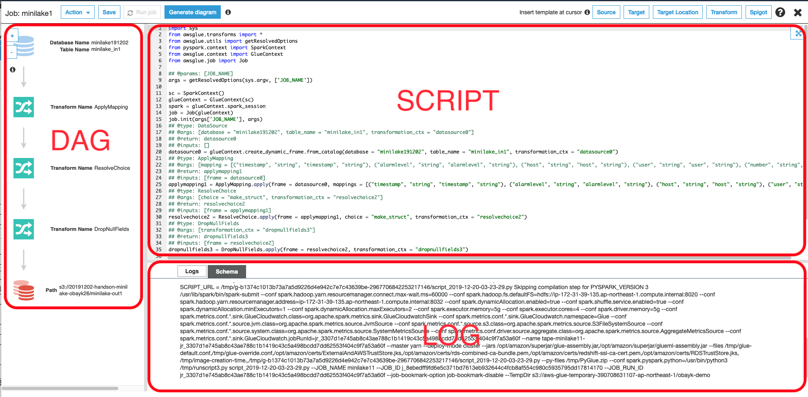

------------------------------------------------------------------------------------
Copyright <first-edit-year> Amazon.com, Inc. or its affiliates. All Rights Reserved.  
SPDX-License-Identifier: MIT-0

------------------------------------------------------------------------------------


# Lab6：ETL processing of data using serverless 

After sending the stream data to Kinesis Data Firehose, you can save the data to S3 for long-term storage. After that, use AWS Glue (Glue) and (1) You can convert the file format to Apache Parquet format. (2) You can process to place the file to partitioned storage, then save the result in S3. Then, use Athena or Redshift Spectrum to execute queries and visualize with QuickSight.

## Section1：Glue's ETL processing
### Step1：Add a policy to an IAM role

Add a policy to the created "**handson-minilake** (optional)" IAM role as follows.

 1. Select **IAM** from the list of services in the AWS Management Console, select **[Roles]** in the left pane of **[Identity and Access Management (IAM)]** dashboard, click the role name "**handson-minilake** (optional)".
 
 2. Select the tab **[Permissions]** and click **[Attach policies]**.
 
 3. Search with "**amazons3**" in the search window, check **[AmazonS3FullAccess]**, and click **[Attach Policy]**.
 
 4. Click the name of the changed role again, select the **[Permissions]** tab, and confirm that **[AmazonS3FullAccess]** is attached.
 

### Step2：Create and run ETL jobs in Glue

 1. Select **S3** from the list of services in the AWS Management Console, and select the bucket created in this hands-on. Click **[Create folder]**, enter "**minilake-out1** (optional)" for the folder name, and click **[Save]**.

 2. Select **AWS Glue** from the list of services in the AWS Management Console. Click **[Jobs]** from the left pane of the screen, and then click **[Add job]**.

 3. Enter "**minilake1** (optional)" for **[Name]** and "**handson-minilake** (optional)" for **[IAM role]**, click **[Advanced properties]**, click **[Monitoring options]**, and click **[Security configuration, script libraries, and job parameters (optional)]**.

 4. Check **[Job metrics]** in the **[Monitoring options]** section.    

    **Note：** Now that you can monitor your resources.

 5. In the section **[Security configuration, script libraries, and job parameters (optional)]**, enter **[Maximum capacity]** as "**2**", and click **[Next]** at the bottom of the screen.

    **Note：** Maximum capacity (DPU) is the processing power of Glue and the default value is 10. (1DPU = 4vCPU, 16GB memory)

 
 6. On the **[Choose a data source]** screen, check “**minilake_in** (optional)” and click **[Next]**.
 
 7. Keep **[Choose a transform type]** screen unchanged and click **[Next]** to proceed.

 8. On the **[Choose a data target]** screen, set as follows and click **[Next]**.

	- Check **[Create tables in your data target]**
	- **Data store** ： Amazon S3
	- **Format** ： Parquet
	- **Target path** ： Select "s3://**[S3 BUCKET NAME]**/minilake-out1 (optional)"
	
	**Note：** In **[S3 BUCKET NAME]**, enter the name of the S3 bucket you created.
　　　　 
 9. On the screen **[Map the source columns to target columns.]**, you can eliminate unnecessary columns and change the data type. This time, click **[Save job and edit script]**.

 10. In the following screen, click **[Run job]** and click **[Run job]** in the pop-up screen.

 

 11. Select **AWS Glue** from the list of services in the AWS Management Console, select **[Jobs]** from the left pane of the **[AWS Glue]** screen, and check the job "**minilake1** (optional)". It may take about 10 minutes, but if there is no problem, **[Run status]** will be **[Succeeded]**.
 
     **Note：** If you have time, check resource monitoring in the **[Metrics]** tab. It takes a while to display. Click **[View additional metrics]** to see more details, but in this hands-on value may be too small to see.

12. Check that the file is output to “s3://**[S3 BUCKET NAME]**/minilake-out1/” of S3.

    **Note：** In **[S3 BUCKET NAME]**, enter the name of the S3 bucket you created.

### Step3：Create and run the Glue Crawler

 Create a crawler for output data in Glue.

 1. From the left pane of the **[AWS Glue]** screen, click **[Crawlers]**, and then click **[Add crawler]**.

 2. Enter "**minilake-out1** (optional)" for **[Crawler name]** and click **[Next]**.

 3. Click **[Next]** on the next screen.

 4. In the **[Add a data store]** screen, set "s3://**[S3 BUCKET NAME]**/minilake-out1 (optional)" to **[Include path]** and click **[Next]**.

    **Note：** In **[S3 BUCKET NAME]**, enter the name of the S3 bucket you created.

 5. Click **[Next]** on the next screen without any change.

 6. Check **[Choose an existing IAM role]**, select “**handson-minilake** (optional)” for the created role, and click **[Next]**.

 7. On the **[Create a schedule for this crawler]** screen, leave **[Run on demand]** and click **[Next]**.

 8. Select "**minilake** (optional)" for **[Database]**, click **[Next]**, check the contents of the confirmation screen, and click **[Finish]**.

 9. Check “**minilake-out1** (optional)” and click **[Run crawler]** to run the crawler.

 10. Click **[Tables]** in the left pane, click the table name "**minilake_out1** (optional)", and check the schema information.


### Step4：Query comparison with Athena

   1. Execute the following query and compare input data and output data.

      **Asset** resource：[6-cmd.txt](asset/ap-northeast-1/6-cmd.txt) 

   **[Input data]** ：Partition by date in CSV format  

   ```
SELECT count(user) FROM "minilake"."minilake_in1" where user='uchida' and timestamp >= '2019-09-27 13%' AND timestamp <= '2019-09-27 21%';
   ```
   
   **Note：** This is a query that counts data "uchida (optional)" data. Set it so that all the timestamps of logs today are included. The example here is when data has accumulated over a period of time. The above query is an example that does not use the columns specifying any a partition, since its purpose is to compare the clause with the “minilake_out1 (optional)” table. However, using columns specifying a partition reduces the amount of scanned data, so you can confirm quicker execution.
	
   **Execution result example:**

   ```
(Run time: 4.3 seconds, Data scanned: 27.01 MB)
   ```

 
  

  **[Output data]** ：Parquet format 

   ```
SELECT count(user) FROM "minilake"."minilake_out1" where user='uchida' and timestamp >= '2019-09-27 13%' AND timestamp <= '2019-09-27 21%';
   ```
   
   **Note：** As the input data, set it so that all the timestamps of today's logs are included. This is also a query that counts data “uchida (optional)”. The  result from the execution is the example when data has accumulated over a period of time.
	
   **Execution result example:**

   ```
 (Run time: 3.09 seconds, Data scanned: 787.93 KB)
   ```

   **Note：**  Since logs in Parquet format does not load unnecessary columns, the capacity to scan can be set smaller. Please refer to [here](additional_info_lab6.md) for additional information.


#### Comparing the above two patterns, you can see that the amount of scanned data is smaller in Parquet format because unnecessary columns are not loaded.

||Run time|Data scanned|
|---|:---:|:---:|
|(1) Partition by date in CSV format | 4.3 seconds| 27.01 MB|
|(2) Parquet format | 3.09 seconds| 787.93 KB|

### Step5：Make the data partitioning and converting to Parquet in Glue job

 1. Select **S3** from the list of services in the AWS Management Console, and select the bucket you just created. Click **[Create folder]**, enter "**minilake-out2** (optional)" as the folder name, and click **[Save]**.
 
 2. Select **AWS Glue** from the list of services in the AWS Management Console, select **[Jobs]** from the left pane of the **[AWS Glue]** screen, check the “**minilake1** (optional)” job on  the **[Jobs]** screen and click **[Edit script]** from **[Action]**.

 3. In the script editing part on the right side of the screen, edit "**applymapping1**" and "**datasink4**". Comment out the existing "**applymapping1**" and "**datasink4**" lines, put the "###1" line in the placeholder, and copy and paste the command reference code below each line.  
 
    **Note：** Since the code is long, please refer to **Asset** resource if necessary.
   
   **Asset** resource：[6-cmd.txt](asset/ap-northeast-1/6-cmd.txt)  

  - **applymapping1** ：Since partition_0 and etc are difficult to understand, it is converted to year and month by applymapping function.  

 	 **[Commented out]**
 
	 ```
	 #applymapping1 = ApplyMapping.apply(frame = datasource0, mappings = [("timestamp", "string", "timestamp", "string"), ("alarmlevel", "string", "alarmlevel", "string"), ("host", "string", "host", "string"), ("user", "string", "user", "string"), ("number", "string", "number", "string"), ("text", "string", "text", "string")], transformation_ctx = "applymapping1")
	 ```

	 **[Additional information]**
 
	 ```
	 applymapping1 = ApplyMapping.apply(frame = datasource0, mappings = [("timestamp", "string", "timestamp", "string"), ("alarmlevel", "string", "alarmlevel", "string"), ("host", "string", "host", "string"), ("user", "string", "user", "string"), ("number", "string", "number", "string"), ("text", "string", "text", "string"),("partition_0", "string", "year", "string"), ("partition_1", "string", "month", "string"), ("partition_2", "string", "day", "string"), ("partition_3", "string", "hour", "string")], transformation_ctx = "applymapping1")
	 ```

  - **datasink4** ：  
	   - Modify the bucket name to suit your name.
	   - Specify the output with partitioning using the partitionKeys option of write\_dynamic\_frame.
     

 	 **[Commented out]**
 
	 ```
	 #datasink4 = glueContext.write_dynamic_frame.from_options(frame = dropnullfields3, connection_type = "s3", connection_options = {"path": "s3://[S3 BUCKET NAME]/minilake-out"}, format = "parquet", transformation_ctx = "datasink4")
	 ```
	 

	 **[Additional information]**
	  
	  ```
	 datasink4 = glueContext.write_dynamic_frame.from_options(frame = dropnullfields3, connection_type = "s3", connection_options = {"path": "s3://[S3 BUCKET NAME]/minilake-out2", "partitionKeys": ["user", "year", "month", "day", "hour"]},format = "parquet", transformation_ctx = "datasink4")
	 ```

 4. Click **[Run job]** at the top of the Glue job screen, click **[Save now and run job]** in the pop-up screen, and click **[Run job]**.

 5. Select **AWS Glue** from the list of services in the AWS Management Console. From the left pane of the **[AWS Glue]** screen, select **[Crawlers]** and click **[Add crawler]**.

 6. Enter "**minilake-out2** (optional)" in **[Crawler name]** and click **[Next]**. Click **[Next]** on the next screen.

 7. Set **[Include path]** to "s3://**[S3 BUCKET NAME]**/minilake-out2 (optional)" and click **[Next]**.

	 **Note：** In **[S3 BUCKET NAME]**, enter the name of the S3 bucket you created.

 8. Click **[Next]** on the **[Add another data store]** screen without any change.

 9. On the **[Choose an IAM role]** screen, check **[Choose an existing IAM role]**, select “**handson-minilake** (optional)” for the created role, and click **[Next]**.

 10. On the **[Create a schedule for this crawler]** screen, leave **[Run on demand]** and click **[Next]**.

 11. Select "**minilake** (optional)" for **[Database]**, click **[Next]**, check the contents on the following screen, and click **[Finish]**.

 12. On the **[AWS Glue]** screen, click **[Crawlers]** from the left pane, and check “**minilake-out2** (optional)” for the created crawler and click **[Run crawler]** to run the crawler.

 13. Click **[Tables]** in the left pane, click the table name "**minilake_out2** (optional)", and check the schema information.


### Step6：Query comparison with Athena

  1. Run a query against the partitioned table in Parquet format.

     **Asset** resource：[6-cmd.txt](asset/ap-northeast-1/6-cmd.txt)  
   
  **[Execution query example]**
  
  ```
  SELECT count(user) FROM "minilake"."minilake_out2" where user='uchida' and timestamp >= '2019-09-27 13%' AND timestamp <= '2019-09-27 21%';
  ```

  **Note：** Set it so that all the times of today's logs are included.

  **[Execution result example]**
  
  ```
  (Run time: 3.94 seconds, Data scanned: 267.32 KB)
  ```
  
  **Note：** In this example, when the partition is set in Parquet format, we could observe the amount of scanned data are obviously smaller. In this case, you might not see significant improvement, since each files are too small to prove the efficiency of this architecture. Please refer to [here] (additional_info_lab6.md) for additional information.

## Section2：Summary

A serverless ETL processing pipeline was executed to convert the query to be executed into the optimal data format.

  
  

That's it for Lab6.

This is the end of all hands-on. To delete the environment, see the procedure [here](../clean-up/README.md).
