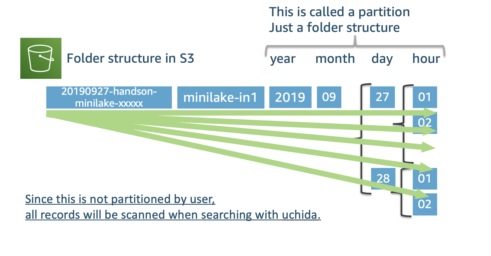
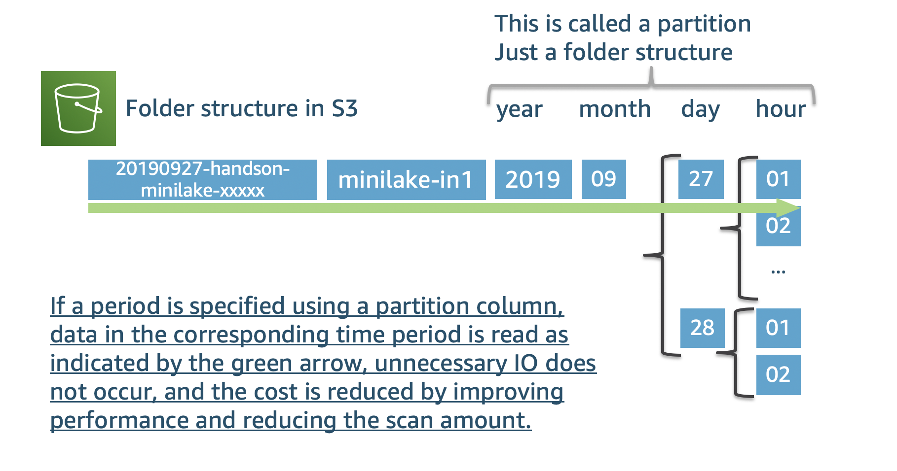
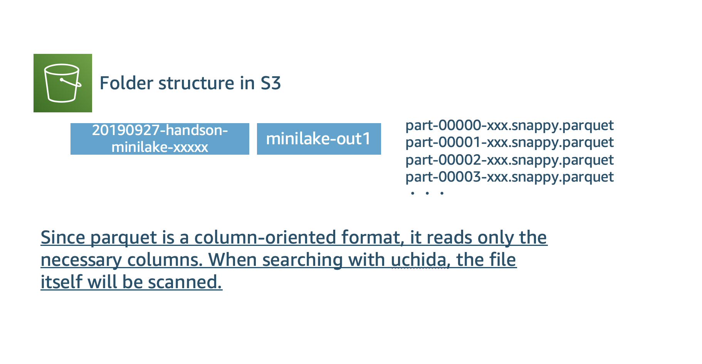
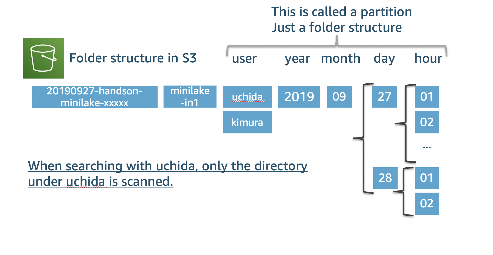

------------------------------------------------------------------------------------
Copyright <first-edit-year> Amazon.com, Inc. or its affiliates. All Rights Reserved.  
SPDX-License-Identifier: MIT-0

------------------------------------------------------------------------------------


# Additional guidance of query comparison in Athena
## CSV format vs CSV format (partition) vs Parquet format vs Parquet format (partition)

### 1. CSV format

  

 **[Query example]**
 
 ```
 SELECT count(user) FROM "minilake"."minilake_in1" where user = 'uchida' and timestamp >= '2019-09-27 13%' AND timestamp <= '2019-09-27 21%';
 ```
 
    
### 2. CSV format (Partitioned by year, month, day and time)

  

 **[Query example]**
 
 ```
 SELECT count(user) FROM "minilake"."minilake_in1" where user = 'uchida' and partition_0 = '2019' AND partition_1 = '09' AND partition_2 = '27' AND partition_3 >= '13' AND partition_3 <= '21';
 ```
 
      
### 3. Parquet format

  

  
  **[Query example]**
 
 ```
 SELECT count(user) FROM "minilake"."minilake_out1" where user = 'uchida' and timestamp >= '2019-09-27 13%' AND timestamp <= '2019-09-27 21%';
 ```


### 4. Parquet format (Partitioned by user, year, month, day and time)

  
  
  **[Query example]**
 
 ```
 SELECT count(user) FROM "minilake"."minilake_out2" where user = 'uchida' and timestamp >= '2019-09-27 13%' AND timestamp <= '2019-09-27 21%';
 ```

**Athena charges you for the amount of data scanned, so if you don't scan too much, you can keep costs low. In many cases, small scans can improve performance.**  
 Use partition, compression, and columnar formats to reduce the amount of reading. Click [here](https://aws.amazon.com/jp/blogs/big-data/top-10-performance-tuning-tips-for-amazon-athena/) for reference information.


