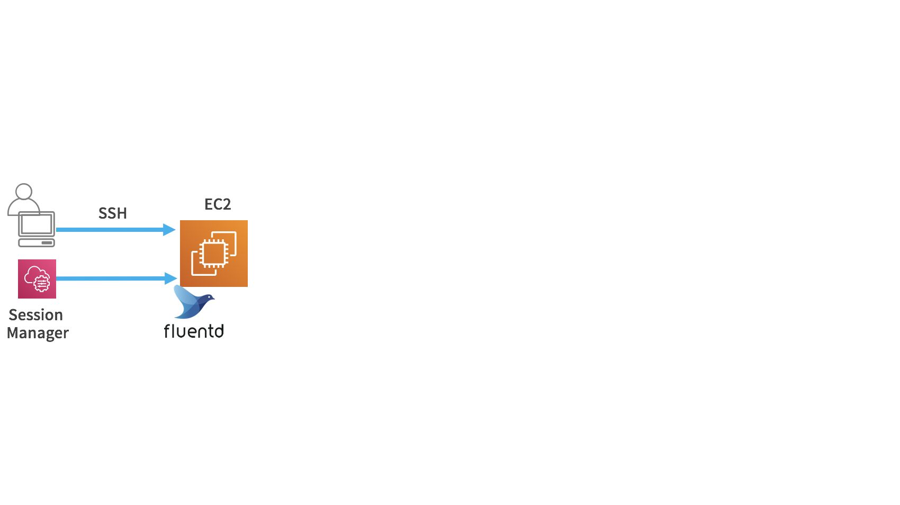
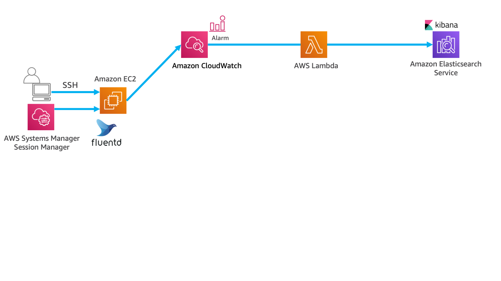
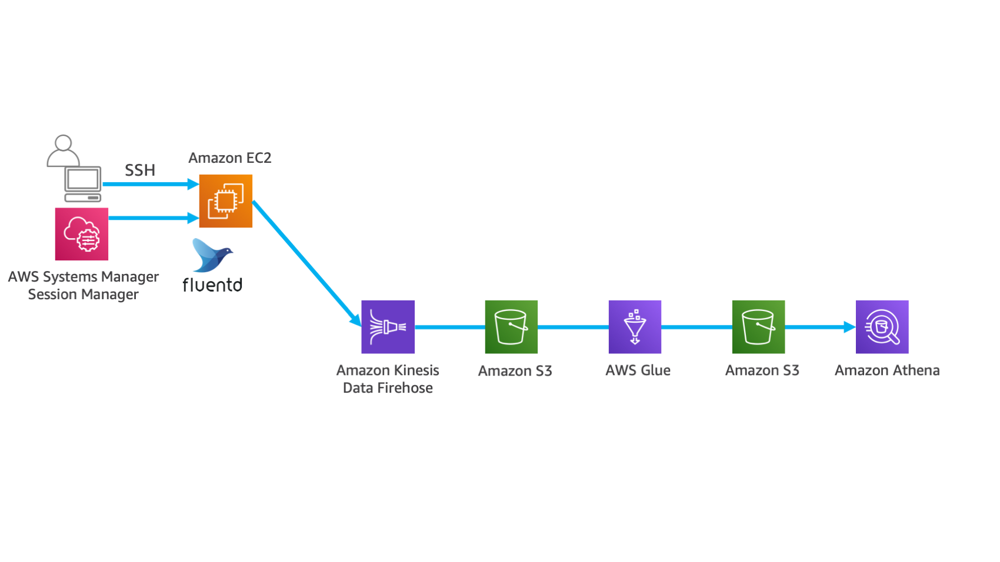

------------------------------------------------------------------------------------
Copyright <first-edit-year> Amazon.com, Inc. or its affiliates. All Rights Reserved.  
SPDX-License-Identifier: MIT-0

------------------------------------------------------------------------------------

# はじめに
## 本ハンズオンのゴール　
幅広いデータソースからの構造化データまたは非構造化データの集中リポジトリとして使用できる Data Lake は、データの保存と分析の方法として多くの企業に取り入れられています。

AWS のビッグデータ関連サービスを使用して実際に分析パイプラインを構築することを通して、 Data Lake とビッグデータ分析基盤構築の実感を持って頂くことをゴールとしています。

## 準備事項
- AWS を利用可能なネットワークに接続された PC（Windows, Mac OS, Linux等）
- 事前に用意していただいたAWSアカウント
- SSH クライアント（Windows 環境では Tera Term を推奨）
- ブラウザ（Firefox もしくは Chrome を推奨）

# ハンズオンの概要

## ハンズオンの構成
本ハンズオンは6つのラボで構成されています。   
 
Lab1：はじめの準備（必須）  
主に使用するAWSサービス：Amazon VPC, Amazon EC2, AWS CloudFormation, AWS IAM 
      
Lab2：アプリケーションログをリアルタイムで可視化  
主に使用するAWSサービス：Amazon Elasticsearch Service
  
Lab3：アプリケーションログのリアルタイム可視化とアラーム  
主に使用するAWSサービス：Amazon CloudWatch, AWS Lambda, Amazon Elasticsearch Service

Lab4：アプリケーションログの永続化と長期間データの分析と可視化   
主に使用するAWSサービス：Amazon Kinesis Data Firehose, Amazon S3, Amazon Athena, Amazon QuickSight
 
Lab5：クラウドDWHを使用したデータ分析  
主に使用するAWSサービス： Amazon Kinesis Data Firehose, Amazon S3, Amazon Redshift, Amazon Redshift Spectrum, Amazon QuickSight

Lab6：サーバーレスでデータのETL処理   
主に使用するAWSサービス：AWS Glue, Amazon Athena

## ハンズオン実施パターン（3つ）

各 Lab を組み合わせることにより、以下3パターンのハンズオンを実施することが可能です。  
（1） ニアリアルタイムデータ分析環境（スピードレイヤ）の構築：[Lab1](lab1/README.md) → [Lab2](lab2/README.md) → [Lab3](lab3/README.md)  
（2） 長期間のデータをバッチ分析する環境（バッチレイヤ）の構築と、パフォーマンスとコストの最適化：[Lab1](lab1/README.md) → [Lab4](lab4/README.md) or [Lab5](lab5/README.md) → [Lab6](lab6/README.md)  
（3） すべて実施：[Lab1](lab1/README.md) → [Lab2](lab2/README.md) → [Lab3](lab3/README.md) → [Lab4](lab4/README.md) → [Lab5](lab5/README.md) → [Lab6](lab6/README.md) 

ハンズオン Lab1 〜 Lab6 まで完了すると、下記のような仕組みが構築できます。

スピードレイヤでニアリアルタイム分析を行いながら、特定の条件時にアラームを飛ばしつつ、すべてのログデータを安価に長期保存しながら、必要に応じて ETL 処理を行った上で、アドホックにログデータに直接クエリしながら分析すべきデータを見極めつつ、 DWH で細かく分析を行うと同時に、 BI ツールで可視化する構成を、ほぼサーバレスで実現することが可能です。

## 各Labの概要
各 Lab の概要について、以下に示します。

### Lab1：はじめの準備
残りの5つの Lab で必要となる共通の環境を構築します。  
AWS CloudFormation（以降、CloudFormation）にて、 Amazon VPC（以降、VPC）、 Amazon EC2（以降、EC2）の構築、そして AWS IAM（以降、IAM）の権限設定を行います。CloudFormation を実行することで、FluentdがインストールされたEC2が起動します。

 - Lab1 の手順は[こちら](lab1/README.md)

主に使用する AWS サービス：VPC, EC2, CloudFormation, IAM

### Lab2：アプリケーションログをリアルタイムで可視化
「Lab1：はじめの準備」で構築した EC2 のログデータをリアルタイムで可視化するために、 EC2 で出力されるログを OSS の Fluentd を使ってストリームで Amazon Elasticsearch Service（以降、Elasticsearch Service）に送信し、 Elasticsearch Service に付属している Kibana を使って、可視化を行います。

 - Lab2 の手順は[こちら](lab2/README.md)

主に使用する AWS サービス：Elasticsearch Service

### Lab3：アプリケーションログのリアルタイム可視化とアラーム
「Lab2：アプリケーションログをリアルタイムで可視化」で実施した可視化に加え、アラーム検知を実施します。
Fluentd から Elasticsearch Service に送信する前段に Amazon CloudWatch（以降、CloudWatch）、 AWS Lambda（以降、Lambda）を配置して、アラーム通知をする処理を追加します。

 - Lab3 の手順は[こちら](lab3/README.md)

主に使用するサービス：CloudWatch, Lambda, Elasticsearch Service

### Lab4：アプリケーションログの永続化と長期間データの分析と可視化
ストリームデータを Amazon Kinesis Data Firehose（以降、Kinesis Data Firehose）に送信後、 Amazon S3（以降、S3）に保存することで長期保存します。その後、 Amazon Athena（以降、Athena）を用いて、アドホックな分析を行い、 Amazon QuickSight（以降、QuickSight）で可視化します。

 - Lab4 の手順は[こちら](lab4/README.md)

主に使用するサービス：Kinesis Data Firehose, S3, Athena, QuickSight

### Lab5：クラウドDWHを使用したデータ分析
ストリームデータを Kinesis Data Firehose に送信後、 S3 に保存することで長期保存します。その後、 Amazon Redshift Spectrum（以降、Redshift Spectrum）を用いて、クエリを実行し、 QuickSight で可視化します。

 - Lab5 の手順は[こちら](lab5/README.md)

主に使用するサービス：Kinesis Data Firehose, S3, Athena, Redshift, Redshift Spectrum, QuickSight

### Lab6：サーバーレスでデータのETL処理
ストリームデータを Kinesis Data Firehose に送信後、 S3 に保存することで長期保存します。その後、 AWS Glue（以下、Glue）を使って、①ファイルフォーマットを Apache Parquet 形式に変換します。②ファイルをパーティショングした配置するための処理、を実行し、その結果を S3 に保存します。その後、 Athena や Redshift Spectrum を用いて、クエリを実行し、 QuickSight で可視化します。

 - Lab6 の手順は[こちら](lab6/README.md)

主に使用するサービス：Glue, Athena

## ハンズオン全体を通しての注意事項
1. 本ハンズオンは、基本的に「東京リージョン」を前提に記載されています。リソースなどの上限に引っかかってしまった場合は、「バージニア北部リージョン」での環境を作成することも可能です。その場合、各ハンズオン資料の「東京リージョン（ap-northeast-1）の記載をすべて「バージニア北部（us-east-1）」に読み替える必要があります。また、asset資料については、両リージョンのものが用意されておりますので、該当のリージョンのものをご利用ください。

2. 各章で配置されている「補足説明」につきましては、本ハンズオンを進めていただく上では必須手順ではありません。参考資料としてください。

3. 同じ AWS アカウントで複数人が同時に本ハンズオンを実施される場合、適宜名前などが重複しないようにご留意ください。

4. 各手順において、「任意」と記載のあるものについては自由に名前を変更いただくことができますが、ハンズオン中に指定した名前がわからなくならないように、ハンズオン実施中はS3の名前以外、基本的にはそのままの名前で進めることを推奨いたします。

5. 各手順において、関連するAsset資料のリンクが配置されています。ブラウザから参照する場合、HTML形式での参照となります。必要に応じて、ファイルをダウンロードいただき、手順を進めてください。 

