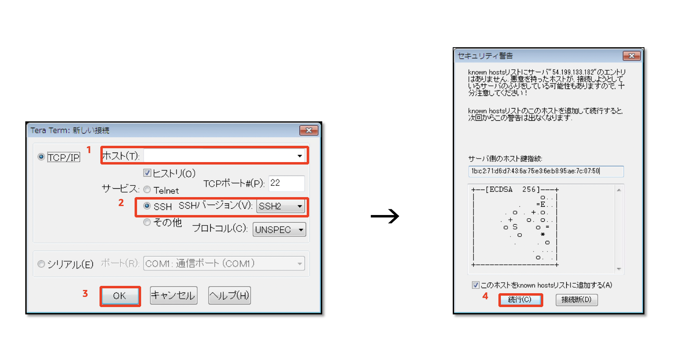

------------------------------------------------------------------------------------
Copyright <first-edit-year> Amazon.com, Inc. or its affiliates. All Rights Reserved.  
SPDX-License-Identifier: MIT-0

------------------------------------------------------------------------------------


# 補足説明：EC2へのログイン方法 
EC2へのログイン方法を3つ説明します。  

 1. **Windows** の場合：**Tera Term** を使用して、ログイン  

 2. **Mac / Linux** の場合：**ターミナル** を使用して、ログイン  

 3. **Windows / Mac / Linux** いずれも可能：**AWS Systems Manager Session Manager**（以下、 **Session Manager** ）を使用して、ログイン  

Windows または Macを用いて、 EC2 にログインする場合、以下の情報が必要となります。

 - インスタンス作成時に指定したキーペアの秘密鍵ファイル（例：**handson.pem** ）  
 
  **Note：** 作成手順については、 Lab1 の手順を参照ください。
  
 - インスタンスに割り当てられたパブリック IP アドレス

 ### 補足：EC2 のパブリック IP アドレスの確認手順
  1. AWS マネジメントコンソールにログインし、 AWS マネジメントコンソールのサービス一覧から **EC2** を選択します。

  2. **[EC2 ダッシュボード]** 画面の左ペインから、 **[インスタンス]** を選択します。

  3. インスタンス一覧から該当のインスタンスを選択し、画面下部の **[説明]** タブの内容から、 **[パブリック DNS (IPv4)
]** に記載の内容をコピーし、パソコンのメモ帳などに情報を記録します。


## 1.Windows の場合

以下の手順で、 Windows から EC2 にログインします。  

 1. Tera Term（ttssh.exe）を起動します。   

 **Note：** 「http://sourceforge.jp/projects/ttssh2/」からモジュールはダウンロード可能です。

 2. **[ホスト]** に対して、接続するインスタンスの **[パブリック DNS 名]** を入力します。  

 3. **[SSH バージョン]** に対して、**[SSH2]** を指定し、 **[OK]** をクリックします。  

 4. 下記画面が出たら、 **[続行]** をクリックします。  
   

 5. ユーザー名を 「 **ec2-user** 」 と入力します。  

 6. **[RSA/DSA/ECDSA/ED255519 鍵を使う]** を選択します。  

 7. **[秘密鍵ファイル]** をクリックし、パソコン上に配置しているキーペアのファイル **[キーペアの鍵の名前].pem** （例：handson.pem）を選択して、接続します。  

 **Note：** ファイルを選択する際、「すべてのファイル(*.*)」を選択しないと秘密鍵のファイルが表示されません。


## 2.Mac / Linux の場合

以下の手順で、WindowsからEC2にログインします。  

 1. ターミナルからコマンドラインでログインします。  

 **Note：** 事前に秘密鍵のファイル（pemファイル）のパーミッションを **600** にしないと接続できません。
 
 ```
 $ chmod 600 ~/Downloads/handson.pem
 $ ssh -i ~/Downloads/handson.pem ec2-user@[割当てられたパブリックIPアドレス]
 ```
 
 2. 「Are you sure you want to continue connecting (yes/no)?」と確認されるため、「yes」と入力し、ログインします。 

 
## 3.Session Manager の場合

以下の手順で、 Session Manager から EC2 にログインします。  
EC2 と Session Manager 間で必要な IAM ロールをアタッチし、 AWS マネジメントコンソール経由で EC2 にログインします。  

 1. AWS マネジメントコンソールのサービス一覧から **IAM** を選択し、 **[ロール]** を選択します。  

 2. **[ロールの作成]** をクリックします。  

 3. **[AWS サービス]** をクリックし、 **[EC2]** をクリック、 **[次のステップ：アクセス権限]** をクリックします。  

 4. **[Attach アクセス権限ポリシー]** の画面で、**[AmazonEC2RoleforSSM]** を選択し、 **[次のステップ：タグ]** をクリックします。  

  **Note：** フィルターに **SSM** と入力すると見つけやすいです。

 5. **[タグの追加（オプション）]** 画面で、そのまま **[次のステップ：確認]** をクリックします。

 6. **[ロール名]** に「 **handson-minilake** （任意）」と入力し、 **[ロールの作成]** をクリックします。

 7. AWS マネージメントコンソールのサービス一覧から **EC2** を選択し、 **[インスタンス]** をクリックし、今回作成したインスタンス「 **handson-minilake**（任意）」にチェックを入れ、 **[アクション] → [セキュリティ] → [IAM ロールを変更]** をクリックします。

 8. **[IAM ロールの割り当て/置換]** の画面で、 **[IAM ロール]** に「 **handson-minilake** （任意）」を選択し、 **[適用]** をクリックします。

 9. AWS マネジメントコンソールのサービス一覧から **Systems Manager** を選択し、左ペインから **[セッションマネージャー]** を選択し、 **[セッションを開始する]** をクリックします。  

 10. ログイン対象の EC2 インスタンスIDを指定し、 **[セッションを開始する]** をクリックし、 EC2 にログインします。  

  **Note：** 該当インスタンスが表示されるまで、5分程度かかることが想定されます。

 11. ウェブ上にコマンドラインが表示されます。下記コマンドを実行し、 **ec2-user** ユーザーににスイッチしておきます。    
  **Note：** デフォルトでは **ssm-user** というユーザーでログインされます。 
  
 ```
 $ whoami
 $ sudo su - ec2-user
 ```
 
 
### 補足：ターゲットインスタンスに対象インスタンスが表示されない場合の対処方法  

AWS マネジメントコンソールのサービス一覧から、 **EC2** を選択し、今回作成したインスタンス「 **handson-minilake** （任意）」の **[ステータスチェック]** が、**[2/2のチェックに合格した]** となっているか確認します。まだ初期化中の場合、完了するまで待って、再度、もう一度 Systems Manager のターゲットインスタンスを確認します。  
 
初期化が終了しているにも関わらず、該当のインスタンスが表示されない場合、 AWS マネージメントコンソールのサービス一覧から **EC2** を選択し、 **[EC2ダッシュボード]** 画面の左ペインから **[インスタンス]** を選択し、今回作成したインスタンス「 **handson-minilake** （任意）」にチェックを入れ、 **[アクション] → [インスタンスの状態] → [再起動]** をクリックします。  
その後、もう一度 Systems Manager のターゲットインスタンスを確認します。


## SSH ログインがうまくいかない場合の確認ポイント
 - インスタンスは完全に起動完了していますか？
 - 起動時に指定した内容どおりに起動していますか？
 - 接続先の IP アドレス あるいは ホスト名は正しいですか？
 - 指定した Security Group は 22（SSH） や 3389 （RDP）を有効にしていますか？
 - 指定した Key Pair と対応する鍵ファイルを指定していますか？
 - 秘密鍵ファイルのパーミッションは 600 になっていますか？（Mac / Linux から接続する場合）
 - EC2 と SSM 間の通信が確立されているか？（Session Manager を利用する場合）


