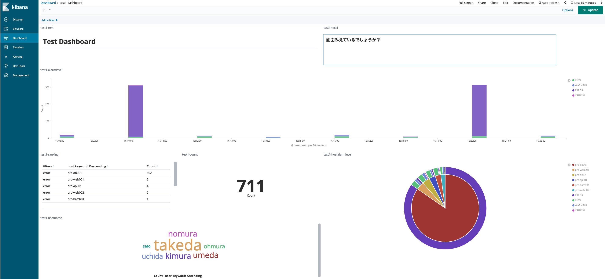
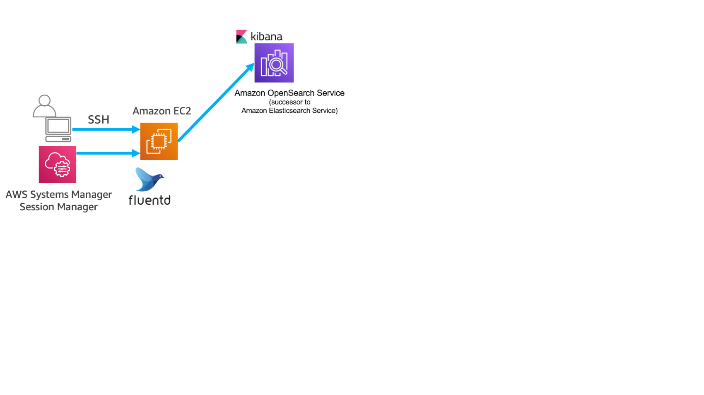

------------------------------------------------------------------------------------
Copyright <first-edit-year> Amazon.com, Inc. or its affiliates. All Rights Reserved.  
SPDX-License-Identifier: MIT-0

------------------------------------------------------------------------------------


# Lab2：アプリケーションログをリアルタイムで可視化
「Lab1：はじめの準備」で構築したEC2のログデータをリアルタイムで可視化するために、 EC2 で出力されるログを OSS の Fluentd を使ってストリームで Amazon Elasticsearch Service（以降、Elasticsearch Service）に送信し、 Elasticsearch Service に付属している Kibana を使って、可視化を行います。
2分おきに10件前後、10分おきに300件出力され続けるログを、 Fluentd を使って Elasticsearch Service に転送し、 Kibana で可視化します。

## Section1：Elasticsearch Service の設定
### Step1：Elasticsearch Service の起動

 1. AWS マネージメントコンソールのサービス一覧から **Elasticsearch Service** を選択し、 **[新しいドメインの作成]** をクリックします。
 
 2. **[デプロイタイプの選択]** にて、 **[開発およびテスト]** を選択し、 **[バージョン]** にて、 **[6.8]** を選択し、 **[次へ]** をクリックします。  
 
    **Note：** **6.8** 以外のバージョンを選択した場合、Kibanaの準備済み画面などが正常に動作しない可能性がありますので、 **6.8** を選択して本ハンズオンは実施ください。
 
 3. **ドメインの設定** にて、 **[Elasticsearch ドメイン名]** を「 **handson-minilake**（任意）」と入力し、 **[インスタンスタイプ]** は無料枠対象である **[t2.small.elasticsearch]** を選び、他の設定は変更せず、画面右下の **[次へ]** をクリックします。
 
 4. **[ネットワーク構成]** にて、 **[パブリックアクセス]** を選択し、 **[アクセスポリシー]** の **[ドメインアクセスポリシー]** において **[カスタムアクセスポリシー]** 選択し、 直下の要素について以下を入力します。
 
   - タイプに **[IAM ARN]** を選択, プリンシパルに「 **\*** 」を入力, アクションに **[許可]** を選択
   - タイプに **[IPv4 アドレス]** を選択, プリンシパルに「 **\*** 」を入力, アクションに **[許可]** を選択

    **Note：** この設定は本番環境では推奨いたしません。今回はハンズオンであり機密データも取り扱わない為、セキュリティを厳しく設定しておりません。 
 
 5. **[アクセスの設定]** 画面に戻ります。 **[次へ]** をクリックし、 **[確認]** 画面において内容を確認し、画面右下の **[確認]** をクリックします。  

    **Note：** Elasticsearch Service の作成が始まります。構築完了には10分ほどかかりますが完了を待たずに次の手順を進めてください。
 

## Section2：EC2, Fluentd, Elasticsearch Service の設定
### Step1：IAM ロールの設定

作成済の「 **handson-minilake**（任意）」の IAM ロールに以下のようにポリシーを追加します。

 1. AWS マネジメントコンソールのサービス一覧から **IAM** を選択し、 **[Identity and Access Management (IAM)]** 画面の左ペインから **[ロール]** を選択し、「 **handson-minilake**（任意）」のロール名をクリックします。

 2. **[アクセス権限]** タブを選択し、 **[ポリシーをアタッチします]** をクリックします。

 3. 検索窓で「 **amazones** 」と入れ検索し、 **[AmazonESFullAccess]** にチェックを入れ、 **[ポリシーのアタッチ]** をクリックします。

 4. 変更実施したロール名を再びクリックし、 **[アクセス権限]** タブを選択し、 **[AmazonESFullAccess]** がアタッチされたことを確認します。


### Step2：Fluentd の設定

Fluentd から Elasticsearch Service にログデータを送信するための設定を行います。

 1. AWS マネジメントコンソールのサービス一覧から **Elasticserach Service** を選択し、 **[Amazon Elasticsearch Service ダッシュボード]** 画面から作成したドメイン名「 **handson-minilake**（任意）」をクリックし、 **[エンドポイント]** にある **URL の文字列** を **https://を含めない形** でパソコンのメモ帳などにメモしておきます。

 2. EC2 にログインし、 Elasticsearch のプラグインをインストールします。

    **Asset** 資料：[2-cmd.txt](asset/ap-northeast-1/2-cmd.txt)

 ```
 $ sudo su -
 # td-agent-gem install -v 2.6.0 fluent-plugin-elasticsearch
 ```
 
 3. プラグインのインストールを確認します。

    **Asset** 資料：[2-cmd.txt](asset/ap-northeast-1/2-cmd.txt)
 
 ```
 # td-agent-gem list | grep plugin-elasticsearch
 ```
 
  **[実行結果例]**
  
 ```
 fluent-plugin-elasticsearch (2.6.0, 2.4.0)
 ```
 
 4. 「 **/etc/td-agent/td-agent.conf** 」の設定を変更するために、一旦 「**/etc/td-agent/td-agent.conf** 」の中身を削除します。 vi 等のエディタで開き、「:%d」などで削除を行います。
 
 ```
 # vi /etc/td-agent/td-agent.conf
 ```

 5. **Asset** 資料の「 **2-td-agent.conf** 」の内容をコピーして、貼り付けます。

    **Asset** 資料：[2-td-agent.conf](asset/ap-northeast-1/2-td-agent.conf)

 6. 貼り付けたあと、内容を一部修正します。 **eshost** の値を手順1でコピーしておいたエンドポイントの値と置き換え、保存します。  

    **Note：** **eshost** の値として、 **https://** は含めません。
 
 **[変更前]**
  
 ```
 host eshost
 ``` 
 
 **[変更後の例]**
  
 ```
 host search-handson-minilake-ikop2vbusshbf3pgnuqzlxxxxx.ap-northeast-1.es.amazonaws.com
 ``` 

 7. td-agent のプロセスを起動します。
 
     **Asset** 資料：[2-cmd.txt](asset/ap-northeast-1/2-cmd.txt)
 
 ```
 # /etc/init.d/td-agent start
 ```
 
 8. Fluentd のログを確認します。
 
     **Asset** 資料：[2-cmd.txt](asset/ap-northeast-1/2-cmd.txt)
 
 ```
 # tail -f /var/log/td-agent/td-agent.log
 ```
 
   **Note：** ログの中にエラーが出続けることがないかを確認します。起動に成功した場合、以下の文言が出力されます。
 
 ```
 [info]: #0 Connection opened to Elasticsearch cluster => {.....
 ```
 ログ出力まで少し時間がかかる場合があります。

### Step3：Elasticsearch Service の設定

 1. AWS マネジメントコンソールのサービス一覧から **Elasticsearch Service** を選択します。  

 2. **[Amazon Elasticsearch Service ダッシュボード]** が開きます。作成した「 **handson-minilake**（任意）」ドメインの **[ドメインのステータス]** が **[アクティブ]** で、 **[検索可能なドキュメント]** の件数が1件以上になっていることを確認し、「 **handson-minilake**（任意）」ドメインをクリックします。  

 3. **[Kibana]** の右のURLをクリックします。  
 
 4. **[Welcome to Kibana]** 画面が表示されるため、 **[Explore on my own]** を選択し、 **Kibana** の画面を開きます。

 #### Kibana での操作

 5. **Kibana** の画面の左ペインから **[Management]** をクリックし、 **[Index Patterns]** をクリックします。

 6. **[Create index pattern]** 画面において、 **[Index pattern]** に「 **testappec2log-*** 」を入力し、右側の **[Next step]** をクリックします。

 7. **[Time Filter field name]** において、 **[@timestamp]** を選択し、画面右下の **[Create index pattern]** をクリックします。

 8. **Kibana** の画面の左ペインから **[Management]** をクリックし、 **[Saved Objects]** をクリックします。画面右上の **[Import]** をクリックします。

 9. **[Import saved objects]** 画面において、**[Import]** アイコンをクリックし、 **Asset** 資料の「 **2-visualization.json** 」を選択し、 **[Import]** アイコンをクリックし、インポートします。問題なくインポートが完了したら、 **[Done]** をクリックすると、元の画面に戻ります。

    **Asset** 資料：[2-visualization.json](asset/ap-northeast-1/2-visualization.json)
  
    **Note：** インポートの **[Import saved objects]** 画面で、 **[New index patten]** において、初期値が「 -- Skip Import -- 」だった場合、「 **testappec2log-\*** 」を選択する必要があります。

 10. 続いて、再度 **[Import saved objects]** 画面において、**[Import]** アイコンをクリックし、 **Asset** 資料の「 **2-dashboard.json** 」を選択し、 **[Import]** アイコンをクリックし、インポートします。問題なくインポートが完了したら、 **[Done]** をクリックすると、元の画面に戻ります。

     **Asset** 資料：[2-dashboard.json](asset/ap-northeast-1/2-dashboard.json)

 11. **Kibana** の画面の左ペインから **[Dashboard]** をクリックし、インポートした「 **test1-dashboard** 」をクリックし、以下のように値が表示されていれば完了です。  

   

 12. **Kibana** の画面にて、右上でタイムレンジが選べるため、期間を **[Last 1 hour]** にしてみます。グラフ表示が1時間の間の取得値に変化していることが確認できます。  

 13. **Kibana** の画面の左ペインから **[Discover]** をクリックし、その右のメニューの **[alarmlevel]** をクリックすると、アラームレベルごとの割合を見ることができます。  

 14. **[alarmlevel]** の右の **[add]** をクリックします。同じように **[user]** の右側の **[add]** をクリックすると、対象のカラム（Time, alarmlevel, user）だけが表示されます。  

     **Note：** **[add]** はカーソルがある時にだけ表示されます。

 15. 検索窓に「 **user:"imai"** 」と入力し、Enterを押すと、「 **imai** 」というユーザーでフィルタリングされます。  


## Section3：まとめ

EC2 からのログをストリームで Elasticsearch Service に送り、 Kibana で可視化してエラーログなどを探しやすくなりました。大量の EC2 がある場合、ログを探すのは大変なのでさらに高い効果が見込めます。



Lab2 は以上です。選択されているパターンに合わせて次の手順を実施ください。

（1） ニアリアルタイムデータ分析環境（スピードレイヤ）の構築：[Lab1](../lab1/README.md) → [Lab2](../lab2/README.md) → [Lab3](../lab3/README.md)  
（2） 長期間のデータをバッチ分析する環境（バッチレイヤ）の構築と、パフォーマンスとコストの最適化：[Lab1](../lab1/README.md) → [Lab4](../lab4/README.md) or [Lab5](../lab5/README.md) → [Lab6](../lab6/README.md)  
（3） すべて実施：[Lab1](../lab1/README.md) → [Lab2](../lab2/README.md) → [Lab3](../lab3/README.md) → [Lab4](../lab4/README.md) → [Lab5](../lab5/README.md) → [Lab6](../lab6/README.md) 

環境を削除される際は、[こちら](../clean-up/README.md)の手順をご覧ください。
