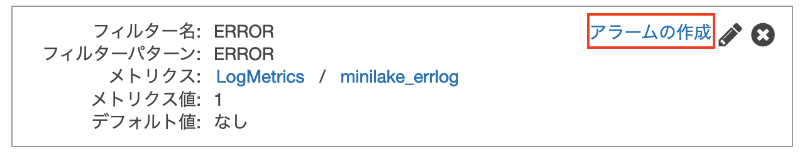

------------------------------------------------------------------------------------
Copyright <first-edit-year> Amazon.com, Inc. or its affiliates. All Rights Reserved.  
SPDX-License-Identifier: MIT-0

------------------------------------------------------------------------------------


# Lab3：アプリケーションログのリアルタイム可視化とアラーム
「Lab2：アプリケーションログをリアルタイムで可視化」で実施した可視化に加え、アラーム検知を実施します。
Fluentd から Elasticsearch Service に送信する前段に Amazon CloudWatch（以降、CloudWatch）、 AWS Lambda（以降、Lambda）を配置して、アラーム通知をする処理を追加します。

## Section1：EC2 の設定変更
### Step1：IAM ロールの設定

作成済の「 **handson-minilake**（任意）」の IAM ロールに以下のようにポリシーを追加します。

 1. AWS マネジメントコンソールのサービス一覧から **IAM** を選択し、 **[Identity and Access Management (IAM)]** 画面の左ペインから **[ロール]** を選択し、「 **handson-minilake**（任意）」のロール名をクリックします。

 2. **[アクセス権限]** タブを選択し、 **[ポリシーのアタッチ]** をクリックします。

 3. 検索などを使いながら、 **[CloudWatchLogsFullAccess]** のポリシーにチェックを入れ、 **[ポリシーのアタッチ]** をクリックします。

 4. 変更実施したロールの **[アクセス権限]** タブを選択し、 **[CloudWatchLogsFullAccess]** がアタッチされたことを確認します。

### Step2：Fluentd の設定

Fluentd から CloudWatch Logs にログデータを送信するための設定を行います。

 1. EC2 にログインし、 CloudWatch Logs のプラグインをインストールします。

    **Asset** 資料：[3-cmd.txt](asset/ap-northeast-1/3-cmd.txt)

 ```
 $ sudo su -
 # td-agent-gem install fluent-plugin-cloudwatch-logs -v 0.4.4
 ```

 2. プラグインのインストールを確認します。

    **Asset** 資料：[3-cmd.txt](asset/ap-northeast-1/3-cmd.txt)

 ```
 # td-agent-gem list | grep cloudwatch-logs
 ```

 **[実行結果例]**

 ```
 fluent-plugin-cloudwatch-logs (0.4.4)
 ```

 3. 「 **/etc/td-agent/td-agent.conf** 」の設定を変更するために、一旦「 **/etc/td-agent/td-agent.conf** 」の中身を削除します。 vi 等のエディタで開き、「:%d」などで削除を行います。

 ```
 # vi /etc/td-agent/td-agent.conf
 ```

 4. **Asset** 資料の「 **3-td-agent.conf** 」の内容をコピーして、貼り付けます。

    **Asset** 資料：[3-td-agent.conf](asset/ap-northeast-1/3-td-agent.conf)

 5. 「 **/etc/init.d/td-agent** 」ファイル（「 **/etc/td-agent/td-agent.conf** 」とは異なるファイル）を開き、14 行目辺りに以下の行を追加します。

 ```
 # vi /etc/init.d/td-agent
 ```  

 **[追記する行の例]**

 ```
 export AWS_REGION="ap-northeast-1"
 ```

　　 **Note：** リージョンを変更した場合は、適宜変更します。

 6. Fluentd を再起動します。

    **Asset** 資料：[3-cmd.txt](asset/ap-northeast-1/3-cmd.txt)

 ```
 # /etc/init.d/td-agent restart
 ```

 7. Fluentd のログを確認し、ログの中にエラーが出続けることがないかを確認します。

     **Asset** 資料：[3-cmd.txt](asset/ap-northeast-1/3-cmd.txt)

 ```
 # tail -f /var/log/td-agent/td-agent.log
 ```

## Section2：CloudWatch, Elasticsearch Service の設定変更
### Step1：CloudWatch Logs の設定

 1. AWS マネジメントコンソールのサービス一覧から **CloudWatch** を選択し、 **[CloudWatch]** の画面の左側ペインから **[ロググループ]** をクリックします。  

 2. ロググループ「 **minilake_group**（任意）」が出力されていることを確認し、クリックします。

    **Note：** 数分待ってもログが出ない場合は、 EC2 に IAM ロールがアタッチされてるか確認します。

 3. ログストリーム「 **testapplog_stream**（任意）」をクリックします。直近のログが出力されていることを確認します。画面上部の **[ロググループ]** の文字列をクリックし、ロググループに戻ります。  

 4. ロググループ「 **minilake_group**（任意）」にチェックを入れ、 **[アクション]** をクリックし、 **[Amazon Elasticsearch Service へのストリーム]** をクリックします。  

    **Note：** 裏側では自動で Lambda Function が作られます。**[Amazon Elasticsearch Service へのストリーム]** という項目が見つからない場合、2020年10月現在、新しい CloudWatch ダッシュボードを参照されている可能性があります。画面上部のリンクから、CloudWatch ダッシュボードを以前のバージョンに切り替えていただいて、お試しください。

 5. **"ステップ 1: 送信先の選択"** において、 **[アカウントの選択]** で **[このアカウント]** を選択し、 **[Amazon ES クラスター]** において、作成済みの「 **handson-minilake**（任意）」を選択し、 **[Lambda IAM 実行ロール]** において、 **[新しい IAM ロールの作成]** を選択します。  

　　**Note：** ブラウザでポップアップブロックが走ったら、許可して、1つ前の手順からやり直して下さい。

 6. 「 **lambda\_elasticsearch\_execution** 」という名前のロールが作られるので、そのまま右下の **[許可]** をクリックします。  

 7. **"ステップ 1: 送信先の選択"** 画面において、そのまま **[次へ]** をクリックします。

 8. **"ステップ 2: ログ形式とフィルターの設定"** 画面において、　**[ログの形式]** に **[その他]** を選択し、　**[次へ]** をクリックし、 **"ステップ 3: 確認"** 画面においても、 **[次へ]** をクリックし、 **"ステップ 4: 確認"** 画面において、 **[ストリーミングの開始]** をクリックします。


### Step2：Elasticsearch Service の設定

 1. **Kibana** の画面を開き、 **Kibana** の画面の左ペインからアイコンをクリックし、 **[Index Patterns]** をクリックします。  

 2. **[Create index pattern]** をクリックします。

 3. **[Index pattern]** に「 **cwl-*** 」を入力し、右側の **[Next step]** をクリックします。

    **Note：** インデックス作成に多少の時間がかかるため、 **[Next step]** がクリックできるようになるまで、少し時間がかかることが想定されます。  

 4. **[Time Filter field name]** に **[@timestamp]** を選択し、右下の **[Create index pattern]** をクリックします。

 5. **Kibana** の画面の左ペインからアイコンをクリックし、その右の Index を選ぶ箇所で「 **cwl-*** 」を選択します。値が取得されグラフが表示されていればOKです。

 6. **Kibana** の画面の左ペインからアイコンをクリックし、 **[Saved Objects]** をクリックします。画面右上の **[Import]** アイコンをクリックします。

 7. **[Import saved objects]** 画面において、**[Import]** アイコンをクリックし、 **Asset** 資料の「 **3-visualization.json** 」を選択し、 **[Import]** をクリックします。続いての画面において、 **[New index patten]** に対して、「 **cwl-\*** 」を選択し、 **[Confirm all changes]** をクリックし、インポートを完了します。問題なくインポートが完了したら、 **[Done]** をクリックすると、元の画面に戻ります。

    **Asset** 資料：[3-visualization.json](asset/ap-northeast-1/3-visualization.json)

 8. 続いて、再度 **[Saved Objects]** 画面において、**[Import]** アイコンをクリックし、 **Asset** 資料の「 **3-dashboard.json** 」を選択し、 **[Import]** をクリックし、インポートします。問題なくインポートが完了したら、 **[Done]** をクリックすると、元の画面に戻ります。

    **Asset** 資料：[3-dashboard.json](asset/ap-northeast-1/3-dashboard.json)

### Step3：CloudWatch アラームの設定

 1. AWS マネジメントコンソールのサービス一覧から **CloudWatch** を選択し、**[ロググループ]** をクリックし、「 **minilake_group**（任意）」のロググループにチェックを入れ、 **[メトリクスフィルターの作成]** をクリックします。

 2. フィルターパターンに「 **ERROR** 」を入力し、 **[パターンのテスト]** をクリックすることで内容を確認し、画面右下の **[メトリクスの割り当て]** をクリックします。  

 3. **[メトリクス名]** を「 **minilake_errlog**（任意）」と入力し、 **[フィルターの作成]** をクリックします。

 4. フィルタが作成されます。画面を閉じずにそのままの画面の右側の **[アラームの作成]** をクリックし、続けてアラーム設定を行います。
 
    

 5. 間隔を変更するために、 **[編集]** をクリックし、 **[期間]** を「 **1 分** 」に設定し、 **[メトリクスの選択]** をクリックします。

 6. 下記を設定し、 **[次へ]** をクリックします。  
 
   - しきい値の種類：静的  
   - アラーム条件を定義：以上  
   - しきい値：50  
   ▼その他の設定
   - アラームを実行するデータポイント：1/1

 7. 下記を設定し、 **[トピックの作成]** をクリックし、トピックを作成します。  
 
   - SNS トピックの選択：新しいトピックの作成
   - 新規トピックの作成中：任意の文字列（例：Default\_CloudWatch\_Alarms\_Topic）
   - 通知を受け取るEメールエンドポイント：ハンズオン実施中に受信可能なメールアドレス

     **Note：** 登録後、この手順で登録したメールアドレスに確認メールが飛びますので、メール本文の **[Confirm subscription]** をクリックし確認ください。

 8. 必要な設定は完了したため、 **[次へ]** をクリックします。

 9. **[アラーム名]** に「 **minilake-handson-alarm**（任意）」と入力し、 **[次へ]** をクリックし、続いての画面で、 **[アラームの作成]** をクリックします。

 10. **[CloudWatch]** の **[アラーム]** をクリックし、 「**minilake-handson-alarm** 」をクリックし、グラフ画面を確認します。最初は状態が **[データ不足]** と表示されていますが、しばらくすると **[OK]** になります。1分間で50件以上  **ERROR** が発生するとアラートが上がります。10分ごとに ERROR が300件出る設定になっている為、10分毎にアラートが上がります。

### 補足：Elasticsearch Service で、イベント監視およびアラートのサポートを開始しました。アラートは、 Elasticsearch 6.2 以降を実行しているドメインで利用可能です。本ハンズオンの該当する手順を置き換えた詳細な手順は[こちら](additional_info_lab3.md)をご覧ください。

## Section3：まとめ

リアルタイムなログのモニタリングと監視の環境を構築することができました。

 

Lab3 は以上です。選択されているパターンに合わせて次の手順を実施ください。

（1） ニアリアルタイムデータ分析環境（スピードレイヤ）の構築：[Lab1](../lab1/README.md) → [Lab2](../lab2/README.md) → [Lab3](../lab3/README.md)  
（2） 長期間のデータをバッチ分析する環境（バッチレイヤ）の構築と、パフォーマンスとコストの最適化：[Lab1](../lab1/README.md) → [Lab4](../lab4/README.md) or [Lab5](../lab5/README.md) → [Lab6](../lab6/README.md)  
（3） すべて実施：[Lab1](../lab1/README.md) → [Lab2](../lab2/README.md) → [Lab3](../lab3/README.md) → [Lab4](../lab4/README.md) → [Lab5](../lab5/README.md) → [Lab6](../lab6/README.md)

環境を削除される際は、[こちら](../clean-up/README.md)の手順をご覧ください。
