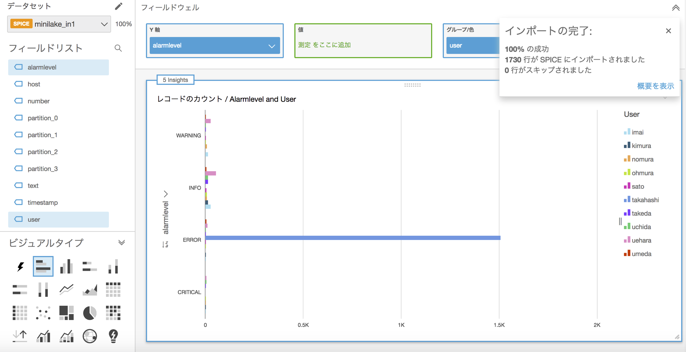

------------------------------------------------------------------------------------
Copyright <first-edit-year> Amazon.com, Inc. or its affiliates. All Rights Reserved.  
SPDX-License-Identifier: MIT-0

------------------------------------------------------------------------------------


# Lab4：アプリケーションログの永続化と長期間データの分析と可視化
ストリームデータを Amazon Kinesis Data Firehose（以降、Kinesis Data Firehose）に送信後、 Amazon S3（以降、S3）に保存することで長期保存します。その後、 Amazon Athena（以降、Athena）を用いて、アドホックな分析を行い、 Amazon QuickSight（以降、QuickSight）で可視化します。


## Section1：S3, Kinesis Data Firehose の設定
### Step1：S3 バケットの作成

 1. AWS マネジメントコンソールのサービス一覧から **S3** を選択し、画面の **[バケットを作成する]** をクリックします。
 
 2. バケット名を以下のルールに従って入力し、画面左下の **[作成]** をクリックします。  

    - バケット名：[YYYYMMDD]-handson-minilake-[Your Name][Your Birthday]
    - [YYYYMMDD]：ハンズオン実施日
    - [Your Name]：ご自身のお名前
    - [Your Birthday]：ご自身の誕生日の日にち


**Note：** S3 バケット名はグローバルで一意である必要がありますが、バケット作成ができればバケット名は任意でも構いません。
  

### Step2：Kinesis Data Firehose の作成

 1. AWS マネジメントコンソールのサービス一覧から **Kinesis** を選択し、 Kinesis Data Firehose 配信ストリームの **[配信ストリームの作成]** をクリックします。
 
 2. **[Delivery stream name]** に「 **minilake1**（任意）」と入力し、 **[Next]** をクリックします。
 
 3. **[Data transformation]** を **[Disabled]** 、 **[Record format conversion]** を **[Disabled]** のまま、 **[Next]** をクリックします。
 
 4. **[Destination]** で、「 **Amazon S3** 」を選択します。
 
 5. **[S3 bucket]** は **Step1** で作成したバケットを選択します。 **[Prefix]** に「 **minilake-in1/** 」を入力します。
 
    **Note：** **[Prefix]** の最後の「 **/** 」を忘れないように注意してください。 S3 への出力時のディレクトリとなり、デフォルトの場合、指定プレフィックス配下に「 **YYYY/MM/DD/HH** 」が作られます。
 
 6. 画面右下の **[Next]** をクリックします。
 
 7. **[Buffer interval]** を「 **60** seconds」に設定します。バッファリングは、 Buffer size か Buffer interval のいずれかの条件がみたされるとS3に配信されます。  

    **Note：** 今回は設定しませんが、データの圧縮、暗号化も可能です。大規模データやセキュリティ要件に対して、有効に働きます。 
 
 8. **[IAM role]** で **[Create new or choose]** をクリックし、 Kinesis Data Firehose が S3 にアクセスするための IAM ロールを作成します。
 
 9. 作成する IAM ロールの情報が表示され、 **[ポリシードキュメントを表示]** をクリックするとポリシー内容が確認できます。確認後、 **[許可]** をクリックします。
 
 10. 元の画面に戻ったことを確認し、 **[Next]** をクリックします。

 11. 続いて、 Review 画面になるので設定値に問題なければ、 **[Create delivery stream]** をクリックします。
 
 12. **[Status]** が「 **Creating** 」となります。数分で「 **Active** 」になるので次の手順に進めてください。


## Section2：EC2 の設定変更
### Step1：IAM ロールのポリシー追加

作成済の「 **handson-minilake**（任意）」の IAM ロールに以下のようにポリシーを追加します。 

 1. AWS マネジメントコンソールのサービス一覧から **IAM** を選択し、 **[Identity and Access Management (IAM)]** 画面の左ペインから **[ロール]** を選択し、「 **handson-minilake**（任意）」のロール名をクリックします。
 
 2. **[アクセス権限]** タブを選択し、 **[ポリシーのアタッチ]** をクリックします。
 
 3. 検索窓で「 **amazonkinesis** 」と入れ検索し、  **[AmazonKinesisFirehoseFullAccess]** にチェックを入れ、 **[ポリシーのアタッチ]** をクリックします。  
    **Note：** **[AmazonKinesisAnalyticsFullAccess]** ではなく、 **[AmazonKinesisFirehoseFullAccess]** となります。
 
 4. 変更実施したロールの **[アクセス権限]** タブを選択し、 **[AmazonKinesisFirehoseFullAccess]** がアタッチされたことを確認します。

### Step2：Fluentd の設定
Fluentd から Kinesis Data Firehose にログデータを送信するための設定を行います。  

   1. Kinesis Data Firehose のプラグインをインストールします。
 
      **Asset** 資料：[4-cmd.txt](asset/ap-northeast-1/4-cmd.txt)
 
 ```
 $ sudo su -
 # td-agent-gem install fluent-plugin-kinesis -v 2.1.0
 ```
 
   2. プラグインのインストールを確認します。

      **Asset** 資料：[4-cmd.txt](asset/ap-northeast-1/4-cmd.txt)

 ```
 # td-agent-gem list | grep plugin-kinesis
 ```
   **[実行結果例]**  
   
   ```
  fluent-plugin-kinesis (2.1.0)
   ```
 
   3. 本手順については、どの Lab から開始したかによって、適用する設定ファイルが異なる為、ご自身が実施された手順に応じて、 Fluentd の設定を変更してください。
#### (a) Lab1, 2, 3 から続けて、 Lab4 を実施している場合（**Asset** 資料：[4-td-agent1.conf](asset/ap-northeast-1/4-td-agent1.conf)）
 
 3-1. 「 **/etc/td-agent/td-agent.conf** 」の中身を削除（vi のコマンドの「:%d」などで削除）し、 **Asset** 資料の「 **4-td-agent1.conf** 」ファイルをエディタで開き中身をコピーして貼り付けます。

 #### (b) Lab1 を実施し、その後　Lab4 を実施している場合（**Asset** 資料：[4-td-agent2.conf](asset/ap-northeast-1/4-td-agent2.conf) ）

 3-1. 「 **/etc/td-agent/td-agent.conf** 」の中身を削除（vi のコマンドの「:%d」などで削除）し、**Asset** 資料の「 **4-td-agent2.conf** 」ファイルをエディタで開き中身をコピーして貼り付けます。  
 
 3-2. 「 **/etc/init.d/td-agent** 」ファイルを開き、13行目辺りに以下の行を追加します。
 
 ```
 # vi /etc/init.d/td-agent
 ```  
 
 **[追記する行の例]**
 
 **Asset** 資料：[4-cmd.txt](asset/ap-northeast-1/4-cmd.txt)
 
 ```
 export AWS_REGION="ap-northeast-1"
 ```
 
  **Note：** リージョンを変更した場合は、適宜変更します。
  

 #### 以下の手順からは、上記両方の場合において実施します。
 
   4. Fluentd を再起動します。
 
       **Asset** 資料：[4-cmd.txt](asset/ap-northeast-1/4-cmd.txt)
 
 ```
 # /etc/init.d/td-agent restart
 ```
 
   5. S3 にデータが出力されていることを確認します。  
   
      **Note：** 数分かかります。（S3 のパスの例：20190927-handson-minilake-test01/minilake-in1/2019/09/27/13）

   6. Kinesis Data Firehose の画面において、作成した **Delivery stream** の「 **minilake1**（任意）」を選択し、 **[Monitoring]** タブをクリック、表示に時間がかかる為、次の手順に進みます。


## Section3：Glue Crawler, Athena の設定変更
### Step1：IAM ロールのポリシー追加
作成済の「 **handson-minilake**（任意）」の IAM ロールにポリシーを追加します。  

 1. AWS マネジメントコンソールのサービス一覧から **IAM** を選択し、 **[Identity and Access Management (IAM)]** 画面の左ペインから **[ロール]** を選択し、「 **handson-minilake**（任意）」のロール名をクリックします。
 
 2. **[アクセス権限]** タブを選択し、 **[ポリシーのアタッチ]** をクリックします。
 
 3. 検索窓で「 **awsglue** 」と入れ検索し、 **[AWSGlueServiceRole]** にチェック、検索窓で「 **amazons3** 」と入れ検索し、 **[AmazonS3ReadOnlyAccess]** にチェックを入れ、 **[ポリシーのアタッチ]** をクリックします。
 
 4. **[AWSGlueServiceRole]** と **[AmazonS3ReadOnlyAccess]** がアタッチされたことを確認します。
 
 5. **[信頼関係]** タブをクリックし、 **[信頼関係の編集]** ボタンをクリックします。
 
 6. **[信頼関係の編集]** 画面において、**”Service”: “ec2.amazonaws.com”** の箇所に **glue** を追記します。 **[]**でくくり、 **カンマ** で区切り、 **glue.amazonaws.com** を追記し、**[信頼ポリシーの更新]** をクリックします。
  
    **Asset** 資料：[4-policydocument.txt](asset/ap-northeast-1/4-policydocument.txt) 
 
 **[記入例]**
 
 ```
 {
 		"Version": "2012-10-17",
 		"Statement": [
			{
      		"Effect": "Allow",
      		"Principal": {
        		"Service": [             
          		"glue.amazonaws.com",
          		"ec2.amazonaws.com"
        		]                        
      		},
      		"Action": "sts:AssumeRole"
    		}
  		]
}
 ```
 
 
### Step2：Glue Crawler を使ったスキーマの自動作成

 1. AWS マネジメントコンソールのサービス一覧で **AWS Glue** を選択し、 **[AWS Glue]** 画面の左ペインにおいて、 **[クローラ]** を選択し、 **[クローラの追加]** をクリックします。

 2. **[クローラの名前]** に「 **minilake-in1**（任意）」と入力し、 **[次へ]** をクリックし、続いての画面もそのまま **[次へ]** をクリックします。

 3. **[データストアの追加]** 画面において、 **[インクルードパス]** に作成した「 **s3://[S3 BUCKET NAME]/minilake-in1**（任意）」を入力し、 **[次へ]** をクリックします。

	**Note：** **[S3 BUCKET NAME]** には、ご自身で作成されたS3バケットの名前を入力ください。
 
 4. **[別のデータストアの追加]** 画面においても、 **[次へ]** をクリックします。
 
 5. **[IAM ロールの選択]** 画面において、 **[既存の IAM ロールを選択]** にチェックを入れ、作成したロール「 **handson-minilake**（任意）」を選択し、 **[次へ]** をクリックします。
 
 6. 続いての画面も **[頻度]** も **[オンデマンドで実行]** のままにし、 **[次へ]** をクリックします。

 7. **[クローラの出力を設定する]** 画面において、 **[データベースの追加]** をクリックし、ポップアップした画面で **[データベース名]** に「 **minilake**（任意）」と入力し、 **[作成]** をクリックします。

 8. **[クローラの出力を設定する]** 画面に戻り、 **[次へ]** をクリックします。

 9. 続いての画面の内容を確認し、 **[完了]** をクリックします。

 10. **[クローラ]** の画面において、作成したクローラの「 **minilake-in1**（任意）」にチェックを入れ、 **[クローラの実行]** をクリックします。ステータスが **[Starting]** になってから、数分待ちます。ステータスが再度 **[Ready]** に戻ったら、左ペインの **[テーブル]** をクリックします。

 11. 「 **minilake_in1**（任意）」のテーブルが作成されていることを確認し、テーブル名の箇所をクリックし、スキーマ定義を確認します。
 

### Step3：Athena でクエリ実行

 1. AWS マネジメントコンソールのサービス一覧で、 **Athena** を選択します。

 2. **[設定]** を選択し **[クエリの結果の場所]** に「 **s3://[S3 BUCKET NAME]/result/**（任意）」を入力し、**[保存]** をクリックします。

	**Note：** **[S3 BUCKET NAME]** には、ご自身で作成されたS3バケットの名前を入力ください。

 3. **[データベース]** において「 **minilake**（任意）」を選び、テーブルは先程作成した「 **minilake_in1**（任意）」を選び、テーブル名の右端の **[点マーク]** をクリックし、 **[テーブルのプレビュー]** をクリックします。

 4. クエリ結果が画面下部に表示されることを確認します。

 5. クエリエディタで下記 SQL を実行します。
 
    **Asset** 資料：[4-cmd.txt](asset/ap-northeast-1/4-cmd.txt)
 
 ```
 SELECT * FROM "minilake"."minilake_in1";

 ```

 **[実行結果例]**
 
 ``` 
 (実行時間: 4.84 秒, スキャンしたデータ: 135.22 KB)

 ```

 6. Where 句をつけたクエリを実行してみます。

    **Asset** 資料：[4-cmd.txt](asset/ap-northeast-1/4-cmd.txt)

 ```
 SELECT * FROM "minilake"."minilake_in1" where partition_0 = '2019' AND partition_1 = '09' AND partition_2 = '27' AND partition_3 = '14';
 ```

   **Note：** Where 句の日付はデータが存在するものを入力してください。

**参考**：[Athena におけるクエリ実行の補足説明](additional_info_lab4.md)


### Step4：QuickSight の設定

 1. AWS マネジメントコンソールのサービス一覧から **QuickSight** を選択します。 QuickSight を初めて使う方はサインアップがまだされていない為、サインアップの画面が出るため、 **[Sign up for QuickSight]** をクリックします。  

    **Note：** すでに東京リージョン以外で登録されている場合、 **[QuickSight の管理]** → **[アカウント設定]** で、 **[サブスクリプション解除]** 実施後、数分待つと、再度 Sign up することが可能になります。 

 2. 画面右上の **[English]** アイコンをクリックし、 **[日本語]** に変更します。  

 3. **[QuickSight アカウントの作成]** で **[エンタープライズ版]** を選び、 **[続行]** をクリックします。

    **Note：** 1GB までは無料利用枠ですが、無料利用期間が終わってる場合は、1ヶ月単位で $24 かかるので、費用が気になる場合、 QuickSight の手順は飛ばしていただいても構いません。 
 
 4. **[リージョンを選択]** で **[Asia Pacific (Tokyo)]** を選択し、 **[QuickSight アカウント名]** に任意の名前、 **[通知のEメールアドレス]** にご自身のメールアドレスを入力し、 **[完了]** をクリックします。  

 5. **[Amazon QuickSight に移動する]** をクリックし、初回ログイン時のみ表示されるダイアログを消去します。その後、画面右上のアカウント名が書かれたアイコンをクリックし、 **[QuickSight の管理]** をクリックします。  

 6. **[セキュリティとアクセス権限]** をクリックします。  

 7. **[接続された製品とサービス]** の **[追加または削除する]** をクリックします。  

 8. **[Amazon Athena]** にチェックを入れます（すでにチェックが入っている場合はそのままとします）。    

 9. **[Amazon S3]** の **[詳細]** をクリックし、 **[S3 バケットを選択する]** をクリックします。
   
 10. **Section1** の **Step1** で作成したS3のバケット名にチェックを入れ（すでにチェックが入っている場合はそのままとします）、 **[バケットの選択]** をクリックします。  

 11. **[更新]** をクリックします。 
  
 12. 画面左上の **[QuickSight]** のロゴをクリックします。  

 13. **[新しい分析]** をクリックします。  

 14. **[新しいデータセット]** をクリックします。  

 15. **[Athena]** をクリックし、ポップアップ画面で **[データソース名]** に「 **minilake1**（任意）」と入力し、 **[接続を検証]** をクリックし、成功したら **[データソースを作成]** をクリックします。  

 16. **[データベース]** を「 **minilake**（任意）」、 **[テーブル]** を「 **minilake-in1**（任意）」を選び、 **[選択]** をクリックし、 **[迅速な分析のために SPICE へインポート]** を選択し、 **[Visualize]** をクリックします。  

 17. **[インポートの完了]** がポップアップされたら準備完了です。 **[フィールドリスト]** や **[ビジュアルタイプ]** を適当に選び、データが可視化されていることを確認してください。  

 **[完了想定画面]**
   
 

## Section4：まとめ

ストリーミングデータを直接データストアに永続化し、長期間の保存を可能にした上で、アドホックな分析・可視化を行う基盤ができました。


Lab4 は以上です。選択されているパターンに合わせて次の手順を実施ください。

（1） ニアリアルタイムデータ分析環境（スピードレイヤ）の構築：[Lab1](../lab1/README.md) → [Lab2](../lab2/README.md) → [Lab3](../lab3/README.md)  
（2） 長期間のデータをバッチ分析する環境（バッチレイヤ）の構築と、パフォーマンスとコストの最適化：[Lab1](../lab1/README.md) → [Lab4](../lab4/README.md) or [Lab5](../lab5/README.md) → [Lab6](../lab6/README.md)  
（3） すべて実施：[Lab1](../lab1/README.md) → [Lab2](../lab2/README.md) → [Lab3](../lab3/README.md) → [Lab4](../lab4/README.md) → [Lab5](../lab5/README.md) → [Lab6](../lab6/README.md) 

環境を削除される際は、[こちら](../clean-up/README.md)の手順をご覧ください。
