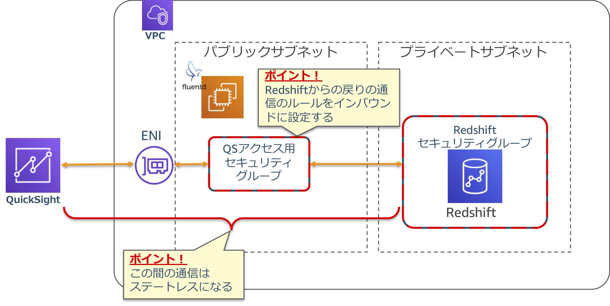
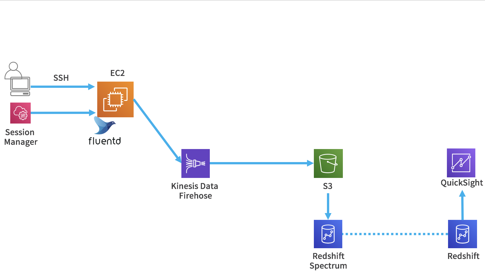

------------------------------------------------------------------------------------
Copyright <first-edit-year> Amazon.com, Inc. or its affiliates. All Rights Reserved.  
SPDX-License-Identifier: MIT-0

------------------------------------------------------------------------------------


# Lab5：クラウド DWH を使用したデータ分析

ストリームデータを Kinesis Data Firehose に送信後、 Amazon S3（以下、S3）に保存することで長期保存します。その後、 Amazon Redshift Spectrum（以降、Redshift Spectrum）を用いて、クエリを実行し、 QuickSight で可視化します。


## Section1：Redshift の環境構築
### Step1：CloudFormation でネットワークの設定

Redshift 用のネットワークを CloudFormation を用いて、構築します。
これまでに作成した VPC にプライベートサブネットを作成し、 Redshift に設定するセキュリティグループも同時に作成します。

 1. AWS マネジメントコンソールのサービス一覧から **CloudFormation** を選択し、 **[スタックの作成]** をクリックし、 **[新しいリソースを使用（標準）]** を選択します。 

 2. **[スタックの作成]** 画面の **[前提条件 - テンプレートの準備]** において、 **[テンプレートの準備完了]** を選択します。 
 
 3. 続いて、 **[スタックの作成]** 画面の **[テンプレートの指定]** において、 **[テンプレートファイルのアップロード]** を選択し、 **[ファイルの選択]** をクリックし、ダウンロードしたテンプレート「 **5-minilake_privatesubnet.yaml** 」を指定し、 **[次へ]** をクリックします。 
 
     **Asset** 資料：[5-minilake_privatesubnet.yaml](asset/ap-northeast-1/5-minilake_privatesubnet.yaml)

 4. **[スタックの名前]** に「 **handson-minilake-private-subnet**（任意）」、 **[EC2SecurityGroupId]** 、 **[VpcId]** には、これまでに作成したセキュリティグループと VPC を選択して、 **[次へ]** をクリックします。

 5. オプションの **[タグ]** の画面で、 **[キー]** に「 **Name** 」、 **[値]** に「 **handson-minilake-private**（任意）」と入力し、 **[次へ]** をクリックします。
 
 6. 最後の確認ページで内容を確認し、 **[スタックの作成]** をクリックします。数分ほど待つとプライベートサブネットが作成されます。


### Step2：Redshift の構築

Redshift は利用可能になるまで時間がかかるので、最初に作業を行います。

 1. Redshift を作成するVPCと配置先サブネットを確認します。  
 **VPC** のコンソールに移動し、このハンズオンの最初に作った「 **VPC ID** 」と、この章の最初に CloudFormation で作成した「 **サブネット ID** 」をメモします。

 2. AWS マネジメントコンソールのサービス一覧から **Amazon Redshift** を選択し、左ペインの **[設定]** を選択します。

 3. **[サブネットグループ]** タブをクリックし、 **[クラスターサブネットグループの作成]** をクリックします。

 4. 以下の値を入力し、**[作成]** をクリックします。

    - 名前：**handson-minilake-dwh**（任意）
    - 説明：**dwh in my vpc**（任意）
    - VPC ID：メモした「 **VPC ID** 」を選択
    - アベイラビリティゾーン：**ap-northeast-1a**
    - サブネットID：メモした「 **サブネット ID** 」を選択し、 **[追加]** をクリック
 
 5. 左ペインから **[ダッシュボード]** を選択し、 **[クラスターを作成]** をクリックします。

 6. 以下の値を入力します。

    - クラスター識別子：**handson-minilake-dwh**（任意）
    - ノードの種類 : **dc2.large** を選択
    - データベース名：**db**（任意）
    - データベースポート：**5439** （デフォルト）
    - マスターユーザー名：**admin**（任意）
    - マスターユーザーのパスワード：**MyPassword1**（任意）

 7. **[追加設定]** の **[デフォルトを使用]** のラジオボタンをオフにし、**[ネットワークとセキュリティ]** にて以下の値を入力します。

    - Virtual Private Cloud (VPC) : 以前メモした「 **VPC ID** 」を選択
    - VPC セキュリティグループ : **handson-minilake-sg-private**（任意）

 8. Redshift の利用には課金が発生します。**[設定の概要]** において推定コンピューティング料金を確認し、先に進みます。 **[クラスターを作成]** をクリックします。クラスターの起動完了までに時間がかかる為、次の作業を続けます。  

     **Note：** 課金に関する注意事項は必ずご確認ください。


#### 「Lab4：アプリケーションログの永続化と長期間データの分析と可視化」を実施済みの場合、 Section2 と Section3 は実施済みの為、スキップしてください。


## Section2：S3, Kinesis Data Firehose の設定
### Step1：S3 バケットの作成

 1. AWS マネジメントコンソールのサービス一覧から **S3** を選択し、画面の **[バケットを作成する]** をクリックします。
 
 2. バケット名を以下のルールに従って入力し、画面左下の **[作成]** をクリックします。
 
    - バケット名：[YYYYMMDD]-handson-minilake-[Your Name][Your Birthday]
    - [YYYYMMDD]：ハンズオン実施日
    - [Your Name]：ご自身のお名前
    - [Your Birthday]：ご自身の誕生日の日にち

    **Note：** S3 バケット名はグローバルで一意である必要がありますが、バケット作成ができればバケット名は任意でも構いません。
  

### Step2：Kinesis Data Firehose の作成

 1. AWS マネジメントコンソールのサービス一覧から **Kinesis** を選択し、 Kinesis Data Firehose 配信ストリームの **[配信ストリームの作成]** をクリックします。
 
 2. **[Delivery stream name]** に「 **minilake1**（任意）」と入力し、 **[Next]** をクリックします。
 
 3. **[Data transformation]** を **[Disabled]** 、 **[Record format conversion]** を **[Disabled]** のまま、 **[Next]** をクリックします。
 
 4. **[Destination]** で、「 **Amazon S3** 」を選択します。
 
 5. **[S3 bucket]** は **Step1** で作成したバケットを選択します。 **[Prefix]** に「 **minilake-in1/** 」を入力します。
 
    **Note：** **[Prefix]** の最後の「 **/** 」を忘れないように注意してください。 S3 への出力時のディレクトリとなり、デフォルトの場合、指定プレフィックス配下に「 **YYYY/MM/DD/HH** 」が作られます。
 
 6. 画面右下の **[Next]** をクリックします。
 
 7. **[Buffer interval]** を「 **60** seconds」に設定します。バッファリングは、 Buffer size か Buffer interval のいずれかの条件がみたされるとS3に配信されます。  

    **Note：** 今回は設定しませんが、データの圧縮、暗号化も可能です。大規模データやセキュリティ要件に対して、有効に働きます。 
 
 8. **[IAM role]** で **[Create new or choose]** をクリックし、 Kinesis Data Firehose が S3 にアクセスするための IAM ロールを作成します。
 
 9. 作成する IAM ロールの情報が表示され、 **[ポリシードキュメントを表示]** をクリックするとポリシー内容が確認できます。確認後、 **[許可]** をクリックします。
 
 10. 元の画面に戻ったことを確認し、 **[Next]** をクリックします。

 11. 続いて、 Review 画面になるので設定値に問題なければ、 **[Create delivery stream]** をクリックします。
 
 12. **[Status]** が「 **Creating** 」となります。数分で「 **Active** 」になるので次の手順に進めてください。
 

## Section3：EC2 の設定変更
### Step1：IAM ロールのポリシー追加

作成済の「 **handson-minilake**（任意）」の IAM ロールに以下のようにポリシーを追加します。 

 1. AWS マネジメントコンソールのサービス一覧から **IAM** を選択し、 **[Identity and Access Management (IAM)]** 画面の左ペインから **[ロール]** を選択し、「 **handson-minilake**（任意）」のロール名をクリックします。
 
 2. **[アクセス権限]** タブを選択し、 **[ポリシーのアタッチ]** をクリックします。
 
 3. 検索窓で「 **amazonkinesis** 」と入れ検索し、  **[AmazonKinesisFirehoseFullAccess]** にチェックを入れ、 **[ポリシーのアタッチ]** をクリックします。
 
 4. 変更実施したロールの **[アクセス権限]** タブを選択し、 **[AmazonKinesisFirehoseFullAccess]** がアタッチされたことを確認します。

### Step2：Fluentd の設定
Fluentd から Kinesis Data Firehose にログデータを送信するための設定を行います。  

   1. Kinesis Data Firehose のプラグインをインストールします。
 
       **Asset** 資料：[5-cmd.txt](asset/ap-northeast-1/5-cmd.txt)
 
 ```
 $ sudo su -
 # td-agent-gem install fluent-plugin-kinesis -v 2.1.0
 ```
 
   2. プラグインのインストールを確認します。

       **Asset** 資料：[5-cmd.txt](asset/ap-northeast-1/5-cmd.txt)

 ```
 # td-agent-gem list | grep plugin-kinesis
 ```
   **[実行結果例]**  
   
   ```
  fluent-plugin-kinesis (2.1.0)
   ```
 
   3. 本手順については、どの Lab から開始したかによって、適用する設定ファイルが異なる為、ご自身が実施された手順に応じて、Fluentdの設定を変更してください。
#### (a) Lab1, 2, 3 から続けて、 Lab4 を実施している場合（**Asset** 資料：[5-td-agent1.conf](asset/ap-northeast-1/5-td-agent1.conf) ）

 3-1. 「 **/etc/td-agent/td-agent.conf** 」の中身を削除（vi のコマンドの「:%d」などで削除）し、 **Asset** 資料の「 **5-td-agent1.conf** 」ファイルをエディタで開き中身をコピーして貼り付けます。

 #### (b) Lab1 を実施し、その後　Lab4 を実施している場合（**Asset** 資料：[5-td-agent2.conf](asset/ap-northeast-1/5-td-agent2.conf)）

 3-1. 「 **/etc/td-agent/td-agent.conf** 」の中身を削除（vi のコマンドの「:%d」などで削除）し、**Asset** 資料の「 **5-td-agent2.conf** 」ファイルをエディタで開き中身をコピーして貼り付けます。  
 
 3-2. 「 **/etc/init.d/td-agent** 」ファイルを開き、13行目辺りに以下の行を追加します。
 
 ```
 # vi /etc/init.d/td-agent
 ```  
 
 **[追記する行の例]**
 
  **Asset** 資料：[5-cmd.txt](asset/ap-northeast-1/5-cmd.txt)
 
 ```
 export AWS_REGION="ap-northeast-1"
 ```
 
  **Note：** リージョンを変更した場合は、適宜変更します。
  

 #### 以下の手順からは、上記両方の場合において実施します。
 
   4. Fluentd を再起動します。
 
       **Asset** 資料：[5-cmd.txt](asset/ap-northeast-1/5-cmd.txt)
 
 ```
 # /etc/init.d/td-agent restart
 ```
 
   5. S3 にデータが出力されていることを確認します。  
   
      **Note：** 数分かかります。（S3のパスの例：20190927-handson-minilake-test01/minilake-in1/2019/09/27/13）

   6. Kinesis Data Firehose の画面において、作成した **Delivery stream** の「 **minilake1**（任意）」を選択し、 **[Monitoring]** タブをクリック、表示に時間がかかる為、次の手順に進みます。
   

## Section4：Redshift への接続

Redshift に接続できるか確認します。  

### Step1：Redshift への接続

 1. **[Redshift]** の 左ペインから **[エディタ]** を選択します。
 
 2. 作成したインスタンスへの接続情報を入力し、 **[データベースに接続]** をクリックします。

    - クラスター：**handson-minilake-dwh**（任意）
    - データベース名：**db**（任意）
    - データベースユーザー：**admin**（任意）
    - パスワード：設定済みパスワード
 
 3. 左ペインにテーブル一覧が表示されれば、ログイン成功です。


### Step2：Redshift にデータロード

Redshift にデータをロードします。

 1. Redshift から S3 にアクセスして、データをロードするための IAM ロールを作成します。 AWS マネジメントコンソールのサービス一覧から **IAM** を選択し、 **[Identity and Access Management (IAM)]** 画面の左ペインから **[ロール]** を選択し、 **[ロールの作成]** をクリックします。

 2. **[AWSサービス]** をクリックし、 **[Redshift]** をクリック、 **[ユースケースの選択]** では、 **[Redshift - Customizable]** を選択します。続いて、 **[次のステップ：アクセス権限]** をクリックします。

 3. **[AmazonS3ReadOnlyAccess]** を選択して、 **[次のステップ：タグ]** をクリックします。次の画面で **[次のステップ：確認]** をクリックします。
 
 4. **[ロール名]** に「 **handson-minilake-dwh-role**（任意）」と入力し、 **[ロールの作成]** をクリックします。

 5. 作成したロールの ARN は後で使用するのでメモしておきます。

 6. **[Redshift]** に戻り、画面左ペインの **[クラスター]** を選択し、作成した Redshift クラスター名（例：handson-minilake-dwh）をクリックします。 **[アクション]** から **[IAMロールの管理]** をクリックします。

 7. さきほど作成した IAM ロール「 **handson-minilake-dwh**（任意）」を選択 **[IAMロールを追加]** をクリックし **[Done]** をクリックします。次の画面で **[クラスターステータス]** が **[変更中]** となっているため、 **[使用可能]** になるまで待ちます。

 8. **[使用可能]** となったら、左ペインから **[エディタ]** を選択し、 Redshift に接続し、先にロード対象のテーブルを作成します。以下のクエリを入力し、 **[実行]** をクリックし、クエリを実行します。

    **Asset** 資料：[5-cmd.txt](asset/ap-northeast-1/5-cmd.txt) 
 
 ```
 create table ec2log ( timestamp varchar, alarmlevel varchar, host varchar, number int2, text varchar );
 ```
 
   **Note：** ハンズオンの都合上、このテーブル定義はベストプラクティスに沿ったものでは
 ありません。ベストプラクティスに沿ってテーブル定義するには、[こちら](https://docs.aws.amazon.com/ja_jp/redshift/latest/dg/c_designing-tables-best-practices.html)を参照してください。  
   
 9. S3 からデータを COPY します。以下のクエリを入力し、 **[実行]** をクリックし、クエリを実行します。  

   **Asset** 資料：[5-cmd.txt](asset/ap-northeast-1/5-cmd.txt) 
 
 ```
 copy ec2log from 's3://[S3 BUCKET NAME]/minilake-in1' format as json 'auto' iam_role '[IAM ROLE ARN]';
 ```
 
   **Note：** **[S3 BUCKET NAME]** と **[IAM ROLE ARN]** には、実際の値を入力し、実行します。
 
 10. **ec2log** テーブルに対して、自由にクエリを実行してみましょう。
 
  **（例1）** テーブルの全件数が返ってくるクエリです。
  
 ```
 select count(timestamp) from ec2log;
 ```
 
  **（例2）** アラームレベル毎の集計値が返ってくるクエリです。

 ```
 select alarmlevel, count(alarmlevel) from ec2log group by alarmlevel;
 ```
 
  **[実行結果例]**
  
  ```
  alarm alarmlevel | count  
  -----------------+-------  
  INFO             |   560  
  ERROR            |  5511  
  CRITICAL         |    92  
  WARNING          |   175  
  (4 rows)  
 ```
 

### Step3：Redshift Spectrum の使用

 1. Redshift Spectrum のスキーマとデータベースを作成することができるように、以前作成した IAM ロールにポリシーを追加します。 AWS マネジメントコンソールのサービス一覧から **IAM** を選択し、 **[Identity and Access Management (IAM)]** 画面の左ペインから **[ロール]** を選択し、「 **handson-minilake-dwh**（任意）」のロール名をクリックします。

 2. **[アクセス権限]** タブを選択し、 **[ポリシーのアタッチ]** をクリックします。

 3. **[AWSGlueServiceRole]** にチェックを入れ、 **[ポリシーのアタッチ]** をクリックします。  

    **Note：** Redshift Spectrum で外部スキーマとDBを作成する際、データカタログには AWS Glue のデータカタログが使用されます。そのため、 AWS Glue の操作認可（厳密には resource * に対する glue:CreateDatabase のみ）が必要となります。

 4. Redshift に腹持ちしているスキーマとDB内には外部テーブルを作成することはできないため、別途、外部テーブル用の外部スキーマと、 DB を作成します。  

    **Asset** 資料：[5-cmd.txt](asset/ap-northeast-1/5-cmd.txt) 

 ```
 create external schema my_first_external_schema from data catalog database 'spectrumdb' iam_role '[IAM ROLE ARN]' create external database if not exists;
 ```
**Note：** **[IAM ROLE ARN]** には、 Section4 の Step2 でメモした値を入力します。

 5. 外部テーブルを作成します。  

    **Asset** 資料：[5-cmd.txt](asset/ap-northeast-1/5-cmd.txt) 

 ```
 create external table my_first_external_schema.ec2log_external ( timestamp varchar(max), alarmlevel varchar(max), host varchar(max), number int2, text varchar(max) ) partitioned by (year char(4), month char(2), day char(2), hour char(2)) ROW FORMAT SERDE 'org.openx.data.jsonserde.JsonSerDe' WITH SERDEPROPERTIES ( 'paths'='timestamp,alarmlevel,host,number,text') STORED AS INPUTFORMAT 'org.apache.hadoop.mapred.TextInputFormat' OUTPUTFORMAT 'org.apache.hadoop.hive.ql.io.HiveIgnoreKeyTextOutputFormat'  location 's3://[S3 BUCKET NAME]/minilake-in1/';
 ```

   **Note：** **[S3 BUCKET NAME]** には、作成済みの S3 バケット名を入力します。

 6. 下記コマンドを実行し、スキーマ 、DB、テーブルを確認します。  

    **Asset** 資料：[5-cmd.txt](asset/ap-northeast-1/5-cmd.txt) 

 **[スキーマの確認]**

 ```
 select * from svv_external_schemas;
 ```
 
 **[DBの確認]** 
 
 ```
 select * from svv_external_databases;
 ```
 
 **[テーブルの確認]** 
 
 ```
 select * from svv_external_tables;
 ```

 7. 下記 SQL を実行して、外部テーブルにパーティションを追加します。  

    **Asset** 資料：[5-cmd.txt](asset/ap-northeast-1/5-cmd.txt) 

 ```
 ALTER TABLE my_first_external_schema.ec2log_external ADD PARTITION (year='2019', month='09', day='27', hour='14') LOCATION 's3://[S3 BUCKET NAME]/minilake-in1/2019/09/27/14';

 ```
 
  **Note：** **ADD PARTITION** 句の各パーティションの値は、 **LOCATION** 句の S3 バケットのパスのパーティションの値と合わせてください。  
また、パーティションのタイプ、およびパーティションの追加方法については、[こちら](https://image.slidesharecdn.com/aws-blackbeltathena20170301-170301101854/95/aws-black-belt-online-seminar-2017-amazon-athena-29-638.jpg?cb=1498216689)を参照してください。     

 8. AWS マネジメントコンソールのサービス一覧から **Athena** を選択し、データベースとして先程作成した「 **spectrumdb**（任意）」を選択すると、先程作成したテーブル 「**ec2log_external**（任意）」が存在することが確認できます。    

    **Note：** このまま Athena からクエリすることもできます。

 9. AWS マネジメントコンソールのサービス一覧から **AWS Glue** を選択し、画面左ペインの **[テーブル]** をクリックすると、先程作成したテーブル「 **ec2log_external**（任意）」が存在することが確認できます。  

    **Note：** AWS Glue を使用してテーブル定義を行う方法は、「Lab4：アプリケーションログの永続化と長期間データの分析と可視化」にて解説しています。

 10. Redshift のクエリエディタを使って、外部テーブル（ec2log_externalテーブル）に対して、自由にクエリしてみてください。  

 **[実行例①]** 
 
 ```
 select count(*) from my_first_external_schema.ec2log_external;
 ```
 
 **[実行例②]**  
 
 ```
 select count(*) from ec2log;
 ```


### Step4：QuickSight の設定
QuickSight から Redshift、Redshift Spectrum のテーブルに接続し、可視化を行います。

#### これまでの手順で、1~11を実施している場合はスキップ

 1. AWSマネジメントコンソールのサービス一覧から **QuickSight** を選択します。 QuickSight を初めて使う方はサインアップがまだされていない為、サインアップの画面が出るため、 **[Sign up for QuickSight]** をクリックします。  

    **Note：** すでに東京リージョン以外で登録されている場合、 **[QuickSight の管理]** → **[アカウント設定]** で、 **[サブスクリプション解除]** 実施後、数分待つと、再度 Sign up することが可能になります。 

 2. 画面右上の **[English]** アイコンをクリックし、 **[日本語]** に変更します。  

 3. **[QuickSight アカウントの作成]** で **[エンタープライズ版]** を選び、 **[続行]** をクリックします。

    **Note：** 1GB までは無料利用枠ですが、無料利用期間が終わってる場合は、1ヶ月単位で $24 かかるので、費用が気になる場合、 QuickSight の手順は飛ばしていただいても構いません。 
 
 4. **[リージョンを選択]** で **[Asia Pacific (Tokyo)]** を選択し、 **[QuickSightアカウント名]** に任意の名前、 **[通知のEメールアドレス]** にご自身のメールアドレスを入力し、 **[完了]** をクリックします。  

 5. **[Amazon QuickSight に移動する]** をクリックし、初回ログイン時のみ表示されるダイアログを消去します。その後、右上のアカウント名をクリックし、 **[QuickSight の管理]** をクリックします。  

 6. **[セキュリティとアクセス権限]** をクリックします。  

 7. **[接続された製品とサービス]** の **[追加または削除する** をクリックします。  

 8. **[Amazon Athena]** にチェックを入れます（すでにチェックが入っている場合はそのままとします）。    

 9. **[Amazon S3]** の **[詳細]** をクリックし、 **[S3 バケットを選択する]** をクリックします。
   
 10. **Section1** の **Step1** で作成したS3のバケット名にチェックを入れ（すでにチェックが入っている場合はそのままとします）、 **[バケットの選択]** をクリックします。  

 11. **[更新]** をクリックします。 

 #### 既に QuickSight を設定済みであれば、ここからスタート
	 - プライベートサブネットに配置している Redshift に、 QuickSight から接続できるよう設定していきます。  
	 - QuickSight のプライベートサブネット内のリソースへのアクセス設定にはセキュリティグループを使用しますが、 EC2 などに設定するセキュリティグループとは使用感が異なり、インバウンド設定がアクセス先 Redshift からの戻り通信に対するアクセスコントロール設定として扱われます。  
	 - QuickSight と VPC を接続する ENI が作成され、それに対して上記セキュリティグループをアタッチし、 Redshift のセキュリティグループとの通信を許可することによってプライベート接続を実現します。 

  
	 

 12. QuickSight 用の ENI に設定するセキュリティグループを作成します。 **[EC2 ダッシュボード]** の左ペインから **[セキュリティグループ]** を選択し、 **[セキュリティグループの作成]** をクリックします。

 13. **[セキュリティグループの作成]** 画面にて、以下の値を入力します。
 
	 - セキュリティグループ名：qs-rs-private-conn（任意）
	 - 説明：任意
	 - VPC：このハンズオンで作成した VPC

 14. **[インバウンド]** タブを開き、 **[ルールの追加]** をクリックし、以下の値を入力し、 **[作成]** をクリックします。

	 - タイプ：すべての TCP
	 - プロトコル：TCP
	 - ポート範囲：0 - 65535
	 - ソース：カスタム | [Redshift に設定しているセキュリティグループ]（例：handson-minilake-sg-private）

 15. Redshift に設定しているセキュリティグループに、先程作成した、 QuickSight 用の ENI に設定するセキュリティグループからのインバウンドアクセスを許可する設定を追加します。 **[EC2ダッシュボード]** 画面の左ペインから **[セキュリティグループ]** をクリックし、 Redshift に設定しているセキュリティグループ（例：handson-minilake-sg-private）を選択し、 **[インバウンド]** タブで **[編集]** をクリックし、**[ルールの追加]** をクリックし、以下の値を入力して、 **[保存]** します。

	 - タイプ：Redshift
	 - プロトコル：TCP
	 - ポート範囲：5439
	 - ソース：カスタム | 先程作成した QuickSight 用の ENI に設定したセキュリティグループ（例：qs-rs-private-conn）

 16. QuickSight コンソールからプライベートサブネット内にある Redshift への接続設定を行っていきます。 画面右上のアカウント名が書かれたアイコンをクリックし、　**[QuickSightの 管理]** をクリックします。  

  **Note：** 東京リージョンとなっていない場合は、東京リージョンを選択します。

 17. 画面左ペインの **[VPC 接続の管理]** をクリックします。

 18. **[VPC 接続の管理]** において、 **[VPC 接続の追加]** をクリックします。

 19. **[VPC 接続の追加]** 画面において以下を設定し、**[作成]** をクリックします。

	 - VPC 接続名：private-vpc（任意）
	 - VPC ID：当ハンズオンで作成したVPC（例：handson-minilake）のVPC ID
	 - サブネット ID：EC2が存在するパブリックサブネットID
	 - セキュリティグループ ID：先程作成したセキュリティグループID（例：qs-rs-private-conn のセキュリティグループID）

 20. 画面左上の **[QuickSight]** のロゴをクリックし、画面左上の **[新しい分析]** をクリックし、続けて **[新しいデータセット]** をクリックし、その後 **[Redshift 自動検出]** をクリックします。

 21. **[新規 Redshift データソース]** 画面にて、以下の値を入力し、 **[接続の検証]** をクリックし、ボタン名が **[検証済み]** に変われば接続可能となります。

	- データソース名：private-redshift（任意）
	- インスタンスID：handson-minilake-dwh（任意）
	- 接続タイプ：先程作成した VPC 接続（例：private-vpc）を選択
	- データベース名：db（任意）
	- ユーザー名：admin（任意）
	- パスワード：Redshift 用に設定したパスワード

  **Note：** 接続の検証が失敗する場合は、まずは VPC 接続の作成ステップを見直してみてください。

 22. 接続可能であることを確認後、 **[データソースを作成]** をクリックします。  

 23. **[スキーマ：複数のテーブルを含みます。]** で、 **[Select...]** ボックスをクリックすると、これまでに Redshift で作成したスキーマの一覧が表示されます。 Redshift 内部のスキーマ「public」と、 Spectrum で作成した外部スキーマ「my\_first\_external\_schema（任意）」が確認できます。ここでは「 **public** 」をクリックします。  

 24. **[ec2log]** を選択し、 **[選択]** をクリックします。  

 25. **[迅速な分析のために SPICE へインポート]** を選択し、 **[Visualize]** をクリックします。 **[インポートの完了]** のポップアップ画面が出たら準備完了です。 **[フィールドリスト]** や **[ビジュアルタイプ]** を適当に選び、データが可視化されていることを確認してください。  

 **[完了想定画面]**
   


# Section5：まとめ
ストリーミングデータを直接データストアに永続化し、長期間の保存を可能にした上で、 DWH に読み込み分析を行い、可視化を行う基盤ができました。



Lab5 は以上です。選択されているパターンに合わせて次の手順を実施ください。

（1） ニアリアルタイムデータ分析環境（スピードレイヤ）の構築：[Lab1](../lab1/README.md) → [Lab2](../lab2/README.md) → [Lab3](../lab3/README.md)  
（2） 長期間のデータをバッチ分析する環境（バッチレイヤ）の構築と、パフォーマンスとコストの最適化：[Lab1](../lab1/README.md) → [Lab4](../lab4/README.md) or [Lab5](../lab5/README.md) → [Lab6](../lab6/README.md)  
（3） すべて実施：[Lab1](../lab1/README.md) → [Lab2](../lab2/README.md) → [Lab3](../lab3/README.md) → [Lab4](../lab4/README.md) → [Lab5](../lab5/README.md) → [Lab6](../lab6/README.md) 

環境を削除される際は、[こちら](../clean-up/README.md)の手順をご覧ください。
