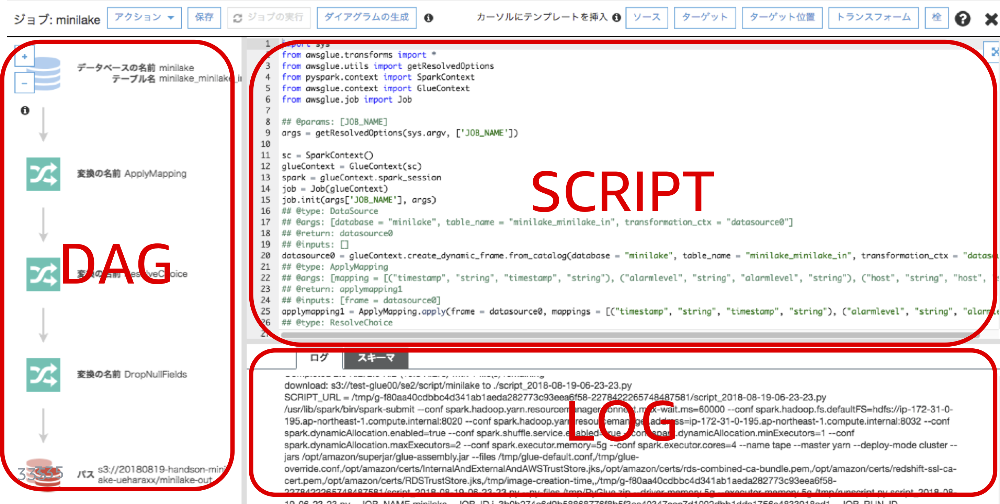

------------------------------------------------------------------------------------
Copyright <first-edit-year> Amazon.com, Inc. or its affiliates. All Rights Reserved.  
SPDX-License-Identifier: MIT-0

------------------------------------------------------------------------------------


# Lab6：サーバーレスでデータのETL処理

ストリームデータを Amazon Kinesis Data Firehose（以降、Kinesis Data Firehose）に送信後、 Amazon S3（以降、S3）にに保存することで長期保存します。その後、 AWS Glue（以下、Glue）を使って、①ファイルフォーマットを Apache Parquet 形式に変換します。②ファイルをパーティショングした配置するための処理、を実行し、その結果を S3 に保存します。その後、 Amazon Athena（以降、Athena）や Amazon Redshift Spectrum（以降、Redshift Spectrum）を用いて、クエリを実行し、 Amazon QuickSight（以降、QuickSight）で可視化します。

## Section1：Glue の ETL 処理
### Step1：IAM ロールにポリシーを追加

作成済の「 **handson-minilake** （任意）」の IAM ロールに以下のようにポリシーを追加します。 

 1. AWS マネジメントコンソールのサービス一覧から **IAM** を選択し、 **[Identity and Access Management (IAM)]** 画面の左ペインから **[ロール]** を選択し、「 **handson-minilake** （任意）」のロール名をクリックします。
 
 2. **[アクセス権限]** タブを選択し、 **[ポリシーのアタッチ]** をクリックします。
 
 3. 検索窓で「 **amazons3** 」と入れ検索し、  **[AmazonS3FullAccess]** にチェックを入れ、 **[ポリシーのアタッチ]** をクリックします。
 
 4. 変更実施したロールの **[アクセス権限]** タブを選択し、 **[AmazonS3FullAccess]** がアタッチされたことを確認します。
 

### Step2：Glue で ETL ジョブ作成と実行

 1. AWS マネジメントコンソールのサービス一覧から **S3** を選択し、今回のハンズオンで作成したバケットを選択します。 **[フォルダの作成]** をクリックし、フォルダ名に「 **minilake-out1** （任意）」と入力し、 **[保存]** をクリックします。

 2. AWS マネジメントコンソールのサービス一覧から **AWS Glue** を選択します。画面左ペインから **[ジョブ]** をクリックし、 **[ジョブの追加]** をクリックします。

 3. **[名前]** に「 **minilake1** （任意）」、 **[IAMロール]** に「 **handson-minilake** （任意）」を入力し、 **[詳細プロパティ]** をクリック、 **[モニタリングオプション]** をクリック、 **[セキュリティ設定、スクリプトライブラリおよびジョブパラメータ（省略可能）]** をクリックします。

 4. **[モニタリングオプション]** セクション内の **[ジョブメトリクス]** にチェックを入れます。    

    **Note：** リソースのモニタリングが可能になります。

 5. **[セキュリティ設定、スクリプトライブラリおよびジョブパラメータ（省略可能）]** セクション内の **[最大容量]** を「 **2** 」と入力し、画面下の **[次へ]** をクリックします。

    **Note：** Maximum capacity（DPU）は Glue の処理能力でデフォルトは10となります。（1DPU = 4vCPU, 16GBメモリ）

 
 6. **[データソースの選択]** の画面で「 **minilake_in** （任意）」にチェックを入れ、 **[次へ]** をクリックします。
 
 7. **[変換タイプを選択します。]** の画面はそのまま **[次へ]** をクリックし進みます。

 8. **[データターゲットの選択]** 画面にて、下記を設定し、 **[次へ]** をクリックします。

	- **[データターゲットでテーブルを作成する]** にチェック
	- **データストア** ： Amazon S3
	- **フォーマット** ： Parquet
	- **ターゲットパス** ：「s3://**[S3 BUCKET NAME]**/minilake-out1（任意）」を選択
	
	**Note：** **[S3 BUCKET NAME]** には、ご自身で作成されたS3バケットの名前を入力ください。
　　　　 
 9. **[ソース列をターゲット列にマッピングします。]** 画面にて、不要なカラムを排除したり、データ型の変更を行うことができます。今回はこのまま **[ジョブを保存してスクリプトを編集する]** をクリックします。

 10. 続いての画面にて、**[ジョブの実行]** をクリックし、ポップアップ画面で **[ジョブの実行]** をクリックします。

 

 11. AWS マネジメントコンソールのサービス一覧から **AWS Glue** を選択し、 **[AWS Glue]** 画面の左ペインから **[ジョブ]** を選択し、今回のジョブ「 **minilake1** （任意）」にチェックを入れます。  10分程かかる場合もありますが、問題がなければ **[実行ステータス]** が **[Succeeded]** となります。 
 
     **Note：** 時間があれば **[メトリクス]** タブでリソースモニタリングも確認してください。表示まで少し時間かかります。**[追加メトリクスの表示]** をクリックすると詳細が見れますが、本ハンズオンでは値が小さすぎて見づらいことが予想されます。

 12. S3の「 s3://**[S3 BUCKET NAME]**/minilake-out1/」にファイルが出力されていることを確認します。

   **Note：** **[S3 BUCKET NAME]** には、ご自身で作成されたS3バケットの名前を入力ください。

### Step3：Glue クローラの作成と実行

Glue で出力データ用のクローラを作成します。  

 1. **[AWS Glue]** 画面の左ペインから **[クローラ]** をクリックし、 **[クローラの追加]** をクリックします。

 2. **[クローラの名前]** に「 **minilake-out1** （任意）」と入力し、 **[次へ]** をクリックします。

 3. 続いての画面もそのまま **[次へ]** をクリックします。

 4. **[データストアの追加]** 画面において、 **[インクルードパス]** に「s3://**[S3 BUCKET NAME]**/minilake-out1（任意） 」を設定し、 **[次へ]** をクリックします。

    **Note：** **[S3 BUCKET NAME]** には、ご自身で作成されたS3バケットの名前を入力ください。

 5. 次の画面もそのままで **[次へ]** をクリックします。

 6. **[既存の IAM ロールを選択]** にチェックを入れ、作成済みロールの「 **handson-minilake** （任意）」を選び、 **[次へ]** をクリックします。

 7. **[このクローラのスケジュールを設定する]** 画面において、 **[オンデマンドで実行]** のままにし、 **[次へ]** をクリックします。

 8. **[データベース]** に「 **minilake** （任意）」を選び 、 **[次へ]** をクリックし、確認画面の内容を確認し、 **[完了]** をクリックします。

 9. 「 **minilake-out1** （任意）」にチェックを入れ、 **[クローラの実行]** をクリックし、クローラを実行します。

 10. 左ペインの **[テーブル]** をクリックし、テーブル名「 **minilake_out1** （任意）」をクリックし、スキーマ情報を確認します。


### Step4：Athena でクエリ比較

   1. 以下のクエリを実行し、入力データと出力データで比較を行います。

      **Asset** 資料：[6-cmd.txt](asset/ap-northeast-1/6-cmd.txt) 

   **[入力データ]** ：CSV形式で日付でパーティション  

   ```
SELECT count(user) FROM "minilake"."minilake_in1" where user='uchida' and timestamp >= '2019-09-27 13%' AND timestamp <= '2019-09-27 21%';
   ```
   
   **Note：** 「uchida（任意）」さんのデータをカウントしているクエリになります。本日のログが出た時間がすべて入るように設定してください。実行結果例は、しばらく時間が経ってデータが溜まった状態のものとなります。上記のクエリ例は、「minilake_out1（任意）」テーブルとの比較のため、 Where 句でパーティションの指定カラムを使用していない例となりますが、パーティションの指定カラムを使用すると、スキャンデータ量が減り、実行時間が短縮することが確認できます。
	
   **実行結果例：**

   ```
(実行時間: 4.3 秒, スキャンしたデータ: 27.01 MB)
   ```

 
  

  **[出力データ]** ：Parquet 形式  

   ```
SELECT count(user) FROM "minilake"."minilake_out1" where user='uchida' and timestamp >= '2019-09-27 13%' AND timestamp <= '2019-09-27 21%';
   ```
   
   **Note：** 入力データ同様、本日のログが出た時間がすべて入るように設定してください。こちらも「uchida（任意）」さんのデータをカウントしているクエリになります。実行結果例は、しばらく時間が経ってデータが溜まった状態のものとなります。
	
   **実行結果例：**

   ```
 (実行時間: 3.09 秒, スキャンしたデータ: 787.93 KB)
   ```

   **Note：**  Parquet 形式の場合、不要なカラムのデータを読み込まない分、スキャン容量を少なくすることができます。補足説明は[こちら](additional_info_lab6.md)を参照ください。    

#### 上記2パターンを比較すると、不要なカラムを読まない分、Parquet形式の方が、スキャン量が少ないことがわかります。

||実行時間|スキャンしたデータ|
|---|:---:|:---:|
|(1) CSVパーティション（日付）| 4.3 秒| 27.01 MB|
|(2) Parquet| 3.09 秒| 787.93 KB|

### Step5：Glue ジョブで Parquet とパーティショニングを実行

 1. AWS マネジメントコンソールのサービス一覧から **S3** を選択し、今回作成したバケットを選択します。 **[フォルダ作成]** をクリックし、フォルダ名に「 **minilake-out2** （任意）」と入力し、 **[保存]** をクリックします。
 
 2. AWS マネジメントコンソールのサービス一覧から **AWS Glue** を選択し、 **[AWS Glue]** の画面の左ペインから **[ジョブ]** を選択し、 **[ジョブ]** 画面から「 **minilake1** （任意）」ジョブにチェックを入れ、 **[アクション]** から **[スクリプトの編集]** をクリックします。

 3. 続いての画面の右側のスクリプト編集箇所で「 **applymapping1** 」と「 **datasink4** 」の2箇所に対して編集を加えます。既存の「 **applymapping1** 」と「 **datasink4** 」の行をコメントアウトし、目印に「###1」の行を入れ、それぞれの行の下にコマンドリファレンスのコードをコピーアンドペーストします。  
 
    **Note：** コードが長いため、必要に応じて **Asset** 資料を参照ください。
   
   **Asset** 資料：[6-cmd.txt](asset/ap-northeast-1/6-cmd.txt)  

  - **applymapping1** ：Partition_0 などはわかりづらいので applymapping 関数で year や month に変換しています。  

 	**[コメントアウト対象]**
 
	 ```
	 #applymapping1 = ApplyMapping.apply(frame = datasource0, mappings = [("timestamp", "string", "timestamp", "string"), ("alarmlevel", "string", "alarmlevel", "string"), ("host", "string", "host", "string"), ("user", "string", "user", "string"), ("number", "string", "number", "string"), ("text", "string", "text", "string")], transformation_ctx = "applymapping1")
	 ```

	 **[追記内容]**
 
	 ```
	 applymapping1 = ApplyMapping.apply(frame = datasource0, mappings = [("timestamp", "string", "timestamp", "string"), ("alarmlevel", "string", "alarmlevel", "string"), ("host", "string", "host", "string"), ("user", "string", "user", "string"), ("number", "string", "number", "string"), ("text", "string", "text", "string"),("partition_0", "string", "year", "string"), ("partition_1", "string", "month", "string"), ("partition_2", "string", "day", "string"), ("partition_3", "string", "hour", "string")], transformation_ctx = "applymapping1")
	 ```

  - **datasink4** ：  
	   - バケット名は、各自の命名に合わせて修正します。
	   - write\_dynamic\_frame のpartitionKeysオプションを使い、パーティション分割して出力指定します。
     

 	**[コメントアウト対象]**
 
	 ```
	 #datasink4 = glueContext.write_dynamic_frame.from_options(frame = dropnullfields3, connection_type = "s3", connection_options = {"path": "s3://[S3 BUCKET NAME]/minilake-out"}, format = "parquet", transformation_ctx = "datasink4")
	 ```
	 

	 **[追記内容]**
	  
	  ```
	 datasink4 = glueContext.write_dynamic_frame.from_options(frame = dropnullfields3, connection_type = "s3", connection_options = {"path": "s3://[S3 BUCKET NAME]/minilake-out2", "partitionKeys": ["user", "year", "month", "day", "hour"]},format = "parquet", transformation_ctx = "datasink4")
	 ```

 4. Glue のジョブの画面の上部にある **[ジョブの実行]** をクリックし、ポップアップした画面で **[ジョブを今すぐ保存して実行]** をクリックし、 **[ジョブの実行]** をクリックします。

 5. AWS マネジメントコンソールのサービス一覧から **AWS Glue** を選択します。**[AWS Glue]** 画面の左ペインから **[クローラ]** を選択し、 **[クローラの追加]** をクリックします。

 6. **[クローラの名前]** に「 **minilake-out2** （任意）」と入力し、 **[次へ]** をクリックします。続いての画面もそのまま **[次へ]** をクリックします。

 7. **[インクルードパス]** に「 s3:// **[S3 BUCKET NAME]** /minilake-out2 （任意）」を設定し、 **[次へ]** をクリックします。

	 **Note：** **[S3 BUCKET NAME]** には、ご自身で作成されたS3バケットの名前を入力ください。

 8. **[別のデータストアの追加]** 画面もそのままとし、 **[次へ]** をクリックします。

 9. **[IAM ロールの選択]** 画面において、 **[既存の IAM ロールを選択]** にチェックを入れ、作成したロールの「 **handson-minilake** （任意）」を選択し、 **[次へ]** をクリックします。

 10. **[このクローラのスケジュールを設定する]** 画面において、 **[オンデマンドで実行]** のままにし、そのまま **[次へ]** をクリックします。

 11. **[データベース]** に「 **minilake** （任意）」を選び、 **[次へ]** をクリックし、続いての画面で内容を確認し、 **[完了]** をクリックします。

 12. **[AWS Glue]** 画面において、左ペインから **[クローラ]** をクリックし、作成したクローラの「 **minilake-out2** （任意）」にチェックを入れ、 **[クローラの実行]** をクリックし、クローラを実行します。

 13. 左ペインの **[テーブル]** をクリックし、テーブル名「 **minilake_out2** （任意）」をクリックし、スキーマ情報を確認します。


### Step6：Athena でクエリ比較

  1. Parquet 形式でパーティション設定したテーブルに対してクエリを実行します。

     **Asset** 資料：[6-cmd.txt](asset/ap-northeast-1/6-cmd.txt)  
   
  **[実行クエリ例]**
  
  ```
  SELECT count(user) FROM "minilake"."minilake_out2" where user='uchida' and timestamp >= '2019-09-27 13%' AND timestamp <= '2019-09-27 21%';
  ```

  **Note：** 本日のログが出た時間がすべて入るように設定してください。

  **[実行結果例]**
  
  ```
  (実行時間: 3.94 秒, スキャンしたデータ: 267.32 KB)
  ```
  
  **Note：** 今回の例では、 Parquet 形式でパーティションを設定した場合において、スキャン量の減少は確認できますが、個々のファイルサイズが小さいこともあり、実行時間の改善は見られないでしょう。補足説明は[こちら](additional_info_lab6.md)を参照ください。

## Section2：まとめ

実行したいクエリに対して最適なデータの形への変換処理をするために、サーバーレスでのETL処理パイプラインを実行しました。

  
  

Lab6は以上です。  

これですべてのハンズオンが終了しました。環境を削除される際は、[こちら](../clean-up/README.md)の手順をご覧ください。
