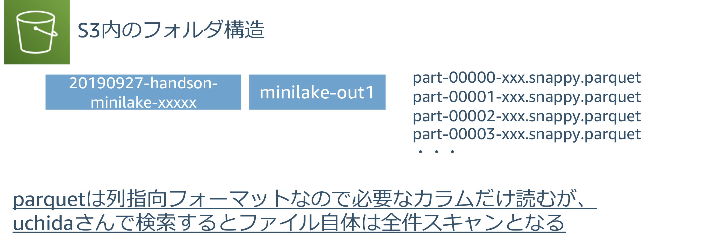
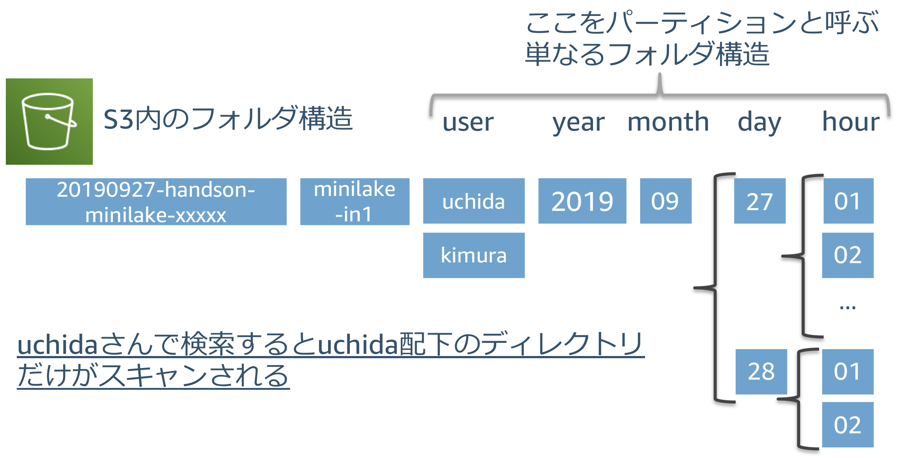

------------------------------------------------------------------------------------
Copyright <first-edit-year> Amazon.com, Inc. or its affiliates. All Rights Reserved.  
SPDX-License-Identifier: MIT-0

------------------------------------------------------------------------------------


# Athena におけるクエリ比較の補足説明
## JSON 形式 vs JSON 形式（パーティション） vs Parquet 形式 vs Parquet 形式（パーティション）

### 1. JSON 形式

  

 **[クエリ例]**
 
 ```
 SELECT count(user) FROM "minilake"."minilake_in1" where user = 'uchida' and timestamp >= '2019-09-27 13%' AND timestamp <= '2019-09-27 21%';
 ```
 
    
### 2. JSON 形式（年・月・日・時間でパーティション）

  

 **[クエリ例]**
 
 ```
 SELECT count(user) FROM "minilake"."minilake_in1" where user = 'uchida' and partition_0 = '2019' AND partition_1 = '09' AND partition_2 = '27' AND partition_3 >= '13' AND partition_3 <= '21';
 ```
 
      
### 3. Parquet 形式

  

  
  **[クエリ例]**
 
 ```
 SELECT count(user) FROM "minilake"."minilake_out1" where user = 'uchida' and timestamp >= '2019-09-27 13%' AND timestamp <= '2019-09-27 21%';
 ```


### 4. Parquet 形式（ユーザー・年・月・日・時間でパーティション）

  
  
  **[クエリ例]**
 
 ```
 SELECT count(user) FROM "minilake"."minilake_out2" where user = 'uchida' and timestamp >= '2019-09-27 13%' AND timestamp <= '2019-09-27 21%';
 ```

**Athena はスキャンしたデータ量による課金であるため、スキャン量がすくなければコストも低く抑えられます。多くの場合、スキャン量が少なければパフォーマンス向上にもつながります。**  
 読み取る量を減らす工夫のために、パーティション、圧縮、カラムナフォーマットを利用します。参考情報は[こちら](https://aws.amazon.com/jp/blogs/news/top-10-performance-tuning-tips-for-amazon-athena/)を参照ください。


